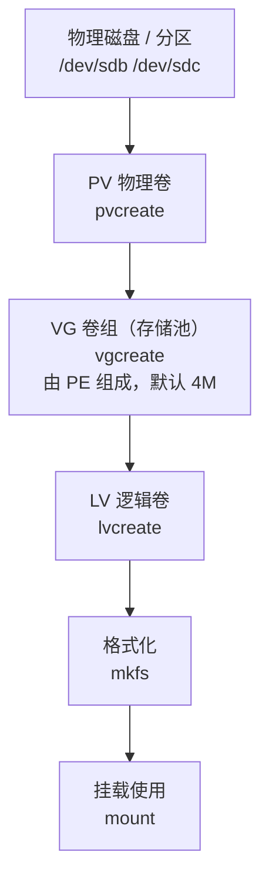
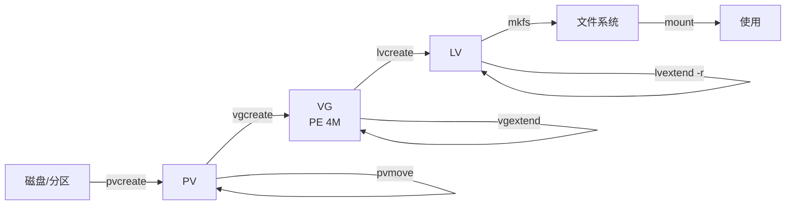

# 挂载和 LVM 逻辑卷管理

# 永久挂载文件系统

## mount 命令回顾

```bash
#查看所有文件系统的挂载情况
mount
```

### 只读挂载

**适用于不让别人编辑文件，但是可以查看和复制里面的文件。**

```bash
mount -r 文件系统路径 挂载点
[root@localhost ~]# mount -r /dev/sdb4 /media
[root@localhost ~]# touch /media/file2
touch: 无法创建 '/media/file2': 只读文件系统
```

### 读写挂载

**默认的挂载选项，经常使用。**

```bash
mount -rw 文件系统路径 挂载点
```

### 指定文件系统类型

```bash
mount -t 文件系统类型 文件系统路径 挂载点
```

### `-o` 指定额外的挂载选项

```bash
#挂载选项
mount -o 选项1,选项2 文件系统路径 挂载点
```

| 选项                    | 含义                                                          |
| :-------------------- | :---------------------------------------------------------- |
| **`async`**           | **异步模式** —> 写的数据先写到内存中，然后从内存中落盘磁盘里面（追求高的写性能，**允许一定的数据丢失**）  |
| **`sync`**            | **同步模式** —> 直接写入到磁盘中（好处在于**数据一致性**，坏处在于写性能较差）               |
| `atime` / `noatime`   | 是否更新 **atime**，包含目录和文件                                      |
| `auto` / `noauto`     | 是否支持**自动挂载**                                                |
| **`exec` / `noexec`** | 是否支持文件系统上的**可执行文件运行**                                       |
| `dev` / `nodev`       | 是否支持在此文件系统上使用**设备文件**                                       |
| `suid` / `nosuid`     | 是否支持 **suid** 的权限                                           |
| `remount`             | **重新挂载**（改选项不用卸载）                                           |
| `ro` / `rw`           | **只读**或者**读写**挂载                                            |
| `user` / `nouser`     | 是否允许**普通用户**挂载此设备 —> 在 `/etc/fstab` 文件中使用的选项                |
| **`defaults`**        | 默认挂载选项，是 `rw, suid, dev, exec, auto, nouser, async` 的**组合** |

#### `noexec` 演示

```bash
[root@localhost ~]# mount | grep sdb4
/dev/sdb4 on /media type xfs (rw,noexec,relatime,seclabel,attr2,inode64,logbufs=8,logbsize=32k,noquota)

[root@localhost ~]# cd /media
[root@localhost media]# ls
demo.sh  file1

[root@localhost media]# ./demo.sh
bash: ./demo.sh: 权限不够

[root@localhost media]# ls -l
总用量 4
-rwxr-xr-x. 1 root root 9 9月  14 09:18 demo.sh
-rw-r--r--. 1 root root 0 9月  14 09:05 file1
```

> [!info] 注意看这个现象
> `demo.sh` 明明有 **`x` 权限**（`-rwxr-xr-x`），执行却报**"权限不够"**。
>
> **原因就是挂载选项里的 `noexec`** —— 文件系统级别禁止执行。
>
> **这也说明挂载选项的优先级高于文件权限。**

> [!tip] `noexec` 的安全用途
> 挂载 `/tmp`、`/var/tmp`、上传目录时加上 `noexec` —— 攻击者即使上传了恶意程序也**执行不了**。
>
> ```bash
> /dev/sdb4 /tmp xfs defaults,noexec,nosuid,nodev 0 0
> ```

> [!info] 忘记选项怎么办
> 如果你忘记了 mount 命令的挂载选项，可以借助 **`man mount`** 去 man 手册中进行查询。
> 每一个选项的使用和描述信息都有。

---

## 为什么要永久挂载

```bash
[root@localhost ~]# mount /dev/sdb4 /media
```

—> **临时挂载，一旦重启则文件系统没有挂载了**

**为什么需要永久挂载呢？**

> App 程序软件产生的**所有的数据都在这个文件系统中** —> 挂载点就是 `/media`
>
> 如果重启后没挂载上，程序读写数据就会**写到根分区的同名目录里**，而不是原来的磁盘 —— **数据"凭空消失"，或者把根分区撑爆**。

---

## 实现文件系统的永久挂载

**一定要写入到 `/etc/fstab` 文件中。**

### fstab 六个字段详解

```text
/dev/sdb4   /media   xfs   defaults   0   0
   ①          ②       ③       ④       ⑤   ⑥
```

| 字段 | 名称 | 说明 |
| :--- | :--- | :--- |
| **①** | **文件系统** | 可用三种写法（见下） |
| **②** | **挂载点** | 挂到哪个目录 |
| **③** | **文件系统类型** | `xfs` / `ext4` / `swap` / `nfs` / `cifs`... |
| **④** | **文件系统的挂载选项** | `defaults` 或自定义组合 |
| **⑤** | **是否要备份文件系统** | 基于 `dump` 命令备份的，`0` = 不备份 |
| **⑥** | **开机是否使用 fsck 检查文件系统** | 见下方详解 |

#### 第一个字段的三种写法

| 写法 | 示例 | 特点 |
| :--- | :--- | :--- |
| **设备路径** | `/dev/sdb4` | 直观，但**盘序变化可能失效** |
| **UUID**（推荐） | `UUID=9fffc28c-7b12-4d51-b508-8993c67a6012` | **最可靠**，不随盘序变 |
| **卷标 LABEL** | `LABEL=DATA` | 可读性好，需要先设置标签 |

> [!tip] 怎么查 UUID
> ```bash
> blkid                       # 列出所有块设备的 UUID 和类型
> blkid /dev/sdb4             # 只看某个设备
> ```

#### 第六个字段详解

**`fsck` 可以检查文件系统，如果文件系统有错误可以自动修复文件系统。**

> [!warning] 对 xfs 无意义
> `fsck` **只对 ext 系列文件系统有效果**，所以如果文件系统类型是 **xfs 之类的，这个东西没有意义**（xfs 的检查修复要用 `xfs_repair`）。

| 值 | 含义 |
| :--- | :--- |
| **`0`** | **不检查** |
| **`1`** | **检查** —> 建议给 **ext 类型的根文件系统**使用，**1 的检查优先级高** |
| **`2`** | **检查** —> 优先级低于 1（用于非根文件系统） |


### 需求：`/dev/sdb4` 开机永久挂载到 `/media` 目录

```text
/dev/sdb4       /media  xfs defaults 0 0
```

> [!important] 写完文件不会立即挂载
> **编写完成文件之后，不会立即挂载，你需要自己挂载才可以**：
> 1. 要么就执行 `mount /dev/sdb4 /media` 去挂载
> 2. 要么就执行 **`mount -a`** 来自动挂载

```bash
mount -a
```

> **`mount -a`**：挂载 `/etc/fstab` 文件中**所有的**文件系统条目。
> - 如果这个文件系统**已经挂载上了也不会报错**
> - 如果文件系统**没有挂载那么这条命令将会挂载起来**

> [!important] 开机自动挂载的原理（记住）
> **开机的时候，系统会自动读取 `/etc/fstab` 文件，将其文件中的文件系统条目挂载上。**

---

## 开机挂载失败 → 紧急模式处理


如果你开机的时候遇到了上面的报错信息，大概率是因为**开机的时候挂载 `/etc/fstab` 文件中，发现有文件系统无法挂载**。

> [!warning] 关键判断
> **只要开机的时候有文件系统挂载不起来，你都会看到上面的报错！**


**上面的问题报错原因**：`fstab` 文件有条目无法挂载，所以开机就进入了这样的页面（**紧急模式 emergency mode**）。

### 处理办法（四步）

> [!important] 紧急模式恢复流程（记住）
> **1.** 输入 **root 密码**得到 shell 环境 —> 看到命令提示符
> **2.** 执行 **`mount -a`** 命令，你就能知道到底是哪个文件系统挂载失败了
> **3.** 打开 **`/etc/fstab`** 文件，找到错误的文件系统条目，要么就**注释掉**，要么就**写正确**
> **4.** 执行 **`exit`**，让其继续引导进入系统

> [!tip] 为什么用 `mount -a` 能定位问题
> 它会把每个条目挨个挂一遍，**报错的那一条会明确打印出来**（设备名 + 挂载点 + 错误原因）。
>
> 常见原因：
> | 报错 | 原因 |
> | :--- | :--- |
> | `can't find UUID=xxx` | UUID 写错 / 磁盘没插 / 被换过 |
> | `wrong fs type` | 文件系统类型写错 / 没格式化 |
> | `special device does not exist` | 设备路径不存在（如 `/dev/sdb4` 变 `/dev/sdc4`） |
> | `mount point does not exist` | 挂载点目录没建 |

> [!warning] 紧急模式的快捷键提示
> 屏幕提示中 `journalctl -xb` 可以看日志，`systemctl default` 可以尝试继续启动。
> 但如果 fstab 条目本身是错的，**必须先修好文件再 `exit`**，否则会再次进入紧急模式。

---

## 文件系统永久挂载和修复实战

### 准备工作

给你自己的 Linux 虚拟机**额外添加一块 SCSI 的 20GB 磁盘**，要求**直接对整块磁盘进行格式化**，文件系统类型为 **xfs**，要求**开机自动挂载到 `/data` 目录**。

### 故障模拟

上一个要求做完之后，请在 `/etc/fstab` 文件中添加以下内容：

```text
/dev/sda /media xfs default 0 0
```

请你**重启系统，进行文件系统故障修复**，要求修复之后可以正常进入操作系统。

> [!warning] 注意这个演示里的两个错误
> 1. **`default` 少了个 `s`** —— 正确是 **`defaults`**，写错会导致挂载失败
> 2. **`/dev/sda` 是系统盘** —— 挂到 `/media` 上会**把根分区的设备也挂一遍**，非常危险
>
> 这个练习的目的是**故意制造一个挂载失败的条目，练习紧急模式恢复**。

---

# 卸载文件系统

```bash
umount 文件系统路径/挂载点
```

**只有文件系统没有在使用的情况下，才可以卸载。**

```bash
[root@localhost data]# umount /data
umount: /data: target is busy.
```

> [!warning] `target is busy` 的两种原因
> - **可能有人正在这个挂载点中**（比如某个 shell 的 cwd 在这里）
> - **可能有程序正在使用这个挂载点**（比如进程打开了里面的文件、日志正在写入）

## fuser 命令 — 列出正在使用挂载点的进程

```bash
[root@localhost ~]# fuser -v /data
                     用户     进程号 权限   命令
/data:               root     kernel mount /data
                     root       2363 ..c.. bash
```

**解决办法**：你手动执行 `kill` 结束掉这些进程，或者使用 `fuser` 命令来结束这个挂载点的所有进程。

```bash
[root@localhost ~]# fuser -km /data
/data:                2363c
```

| 选项 | 作用 |
| :--- | :--- |
| **`-v`** | **详细模式**，显示用户、PID、权限、命令名 |
| **`-k`** | **kill** —— 结束使用该文件的进程 |
| **`-m`** | 指定的是**挂载点**（否则 fuser 会以为你给的是普通文件） |
| `-u` | 显示用户名 |

> [!tip] 权限列的含义
> `fuser -v` 的"权限"列是一组标志位：
> | 标志 | 含义 |
> | :--- | :--- |
> | `c` | 当前目录（current directory） |
> | `e` | 正在执行的程序（executable） |
> | `f` | 打开的文件（open file） |
> | `r` | 根目录 |
> | `m` | mmap 映射的文件 |
>
> 上面 `..c..` 表示 **bash 进程把 `/data` 当成了工作目录** —— 这也是最常见的 busy 原因（`cd` 进去过忘了出来）。

> [!important] 实用场景（记住）
> **当你手动执行 `umount` 卸载的时候，发现一直提示 busy 状态，但是你又不知道是谁正在使用，这个时候你就可以通过 `fuser` 命令去列出正在使用这个挂载点的进程。**

> [!tip] 另一个查占用进程的工具
> ```bash
> lsof /data          # 列出打开该目录下文件的进程
> ```
> 另外**网络文件系统（NFS）**卡住时，`umount` 可以用 `umount -l /data`（lazy umount，延迟卸载）或 `umount -f`（强制）。

---

# swap 分区

## swap 是什么

**swap：交换分区。**

- **swap 占据的其实是磁盘的空间**，作用就是**允许你的计算机运行更多的程序**
- **swap 其实就是把磁盘空间当作内存空间使用**


### 解决内存不足的问题

| 方案 | 特点 |
| :--- | :--- |
| **直接升级内存空间** | **永久有效，效率最好** |
| **采用 swap 交换分区** | **效率一般，节省成本** |


> [!info] 各系统叫法
> | 系统 | 叫法 |
> | :--- | :--- |
> | **Linux** | **swap 分区 / 交换分区** |
> | **Windows** | **虚拟内存** |
>
> 本质是同一个东西：**用磁盘空间模拟内存**。


> [!warning] swap 的性能代价
> 磁盘（尤其机械盘）的读写速度比内存**慢几个数量级**。
> 系统一旦频繁使用 swap，会明显卡顿（俗称"**swap 抖动 / thrashing**"）。
>
> **swap 是兜底方案，不是性能方案。** 真正内存不够应该加内存。

---

## 查看 swap 分区

**`swapon` 命令可以看到具体是哪个分区是 swap。**

```bash
[root@localhost ~]# lsblk
NAME   MAJ:MIN RM  SIZE RO TYPE MOUNTPOINT
sda      8:0    0   50G  0 disk
├─sda1   8:1    0  512M  0 part /boot
├─sda2   8:2    0    2G  0 part [SWAP]
└─sda3   8:3    0 47.5G  0 part /
sdb      8:16   0   20G  0 disk /data
sr0     11:0    1  9.2G  0 rom  /run/media/root/Rocky-8-4-x86_64-dvd

[root@localhost ~]# swapon -s
文件名                 类型        大小      已用     权限
/dev/sda2            partition  2097148  13848      -2
```

| 列 | 含义 |
| :--- | :--- |
| **文件名** | swap 的位置（分区或文件） |
| **类型** | **`partition`**（分区）/ **`file`**（文件） |
| **大小** | KB 为单位 |
| **已用** | 已使用的 swap 量 |
| **权限（优先级）** | **数字越大，优先级越高** |

### 三种 swap 形态

| 形态 | 说明 |
| :--- | :--- |
| **整个磁盘**当作 swap | 少见 |
| **磁盘的某个分区**当作 swap | **最常用** |
| **文件**当作 swap | 磁盘没有多余空间划分分区时使用 |

> [!info] 优先级的规则
> **优先级越高的 swap，系统优先使用这个 swap 分区空间。**
>
> **如果所有的 swap 分区优先级是一样的，则采用轮询方式。**
>
> 优先级范围：**-1 ~ 32767**。可以在 fstab 第 4 字段指定：
> ```text
> /dev/sdb1 none swap defaults,pri=10 0 0
> ```

**`free -m` 看到的是所有的 swap 分区总大小。**

```bash
[root@localhost ~]# free -m
              total        used        free      shared  buff/cache   available
Mem:           1950        1305          86          24         558         475
Swap:          2047          13        2034
```

> [!tip] 重点看 `available` 而不是 `free`
> `free` 只是**完全没被用**的内存，`buff/cache` 里的内存**随时可以回收**给应用用。
>
> **判断"内存够不够"要看 `available`。**

---

## swap 分区划分多大

**生产环境中，swap 分区划分多大？**

| 物理内存 | 建议 swap 大小 |
| :--- | :--- |
| **小于 2GB** | **内存大小的 2 倍** |
| **2GB ~ 8GB 之间** | **和内存同等大小** |
| **大于 8GB** | **4GB** |

> [!info] 上面的只是建议的值
> 真正划分多大还是得看你怎么分配。
>
> **补充几条实用原则**：
> - 有 **挂起到磁盘（hibernate）** 需求的，swap 必须 **≥ 内存大小**
> - **数据库服务器**通常把 swap 设小（甚至禁用），避免性能抖动
> - **Kubernetes 节点**默认要求**禁用 swap**（`swapoff -a`）
> - 云主机通常**根本不给 swap**，需要自己加

> [!tip] 控制 swap 使用倾向：`vm.swappiness`
> ```bash
> cat /proc/sys/vm/swappiness     # 默认 30（RH 系）/ 60（Debian 系）
> sysctl -w vm.swappiness=10      # 临时降低，尽量不用 swap
> echo 'vm.swappiness=10' >> /etc/sysctl.conf   # 永久
> ```
> 值越大越倾向用 swap，越小越倾向保留内存里的数据。

---

## 实战：划分一个 2GB 分区作为 swap

**我现在有一块多余的磁盘 `/dev/sdb`**，那么我就使用这个磁盘划分一个 2GB 的分区，然后将这个分区创建为 swap 进行使用。

### 1. 划分分区

```bash
[root@localhost ~]# lsblk
NAME   MAJ:MIN RM  SIZE RO TYPE MOUNTPOINT
sda      8:0    0   50G  0 disk
├─sda1   8:1    0  512M  0 part /boot
├─sda2   8:2    0    2G  0 part [SWAP]
└─sda3   8:3    0 47.5G  0 part /
sdb      8:16   0   20G  0 disk
└─sdb1   8:17   0    2G  0 part
sr0     11:0    1  9.2G  0 rom  /run/media/root/Rocky-8-4-x86_64-dvd
```

> [!tip] 分区类型建议改为 `82`
> 用 `fdisk` 建分区时，把类型改成 **`82`（Linux swap / Solaris）**，语义更清晰：
> ```bash
> fdisk /dev/sdb
> # n 建分区 → t 改类型 → 82 (Linux swap) → w 保存
> ```

### 2. 格式化为 swap

```bash
[root@localhost ~]# mkswap /dev/sdb1
正在设置交换空间版本 1，大小 = 2 GiB (2147479552  个字节)
无标签，UUID=dc89b485-7017-4ae4-bd27-93fcd39c80cf

[root@localhost ~]# blkid | grep sdb1
/dev/sdb1: UUID="dc89b485-7017-4ae4-bd27-93fcd39c80cf" TYPE="swap" PARTUUID="7c0ea9b5-01"
```

### 3. 挂载 swap 分区

**临时挂载**：

```bash
[root@localhost ~]# swapon /dev/sdb1
[root@localhost ~]# lsblk
NAME   MAJ:MIN RM  SIZE RO TYPE MOUNTPOINT
sda      8:0    0   50G  0 disk
├─sda1   8:1    0  512M  0 part /boot
├─sda2   8:2    0    2G  0 part [SWAP]
└─sda3   8:3    0 47.5G  0 part /
sdb      8:16   0   20G  0 disk
└─sdb1   8:17   0    2G  0 part [SWAP]
sr0     11:0    1  9.2G  0 rom  /run/media/root/Rocky-8-4-x86_64-dvd

[root@localhost ~]# swapon -s
文件名        类型    大小  已用  权限
/dev/sda2     partition  2097148  30420  -2
/dev/sdb1     partition  2097148  0      -3

[root@localhost ~]# free -m
              total        used        free      shared  buff/cache   available
Mem:           1950        1295          98          21         556         488
Swap:          4095          29        4066
```

> [!important] swap 总量变成了 4095
> 原来是 2047，加了 2G（2048）后是 **4095** —— 证明两个 swap 分区**同时生效**，`free` 显示的是**总大小**。

**永久挂载 —— 写入 `/etc/fstab` 文件**：

```text
#在文件中添加下面一行内容，因为swap分区不具备挂载点，所以文件中的挂载点你可以写成none或者swap
/dev/sdb1 none swap defaults 0 0
```

> [!important] swap 在 fstab 里的特殊之处（记住）
> | 字段 | swap 的写法 |
> | :--- | :--- |
> | 挂载点（②） | **`none`** 或 **`swap`**（swap 没有挂载点） |
> | 类型（③） | **`swap`** |
> | 选项（④） | 常用 `defaults`，可加 `pri=N` 指定优先级 |
>
> **挂载命令也不一样** —— 不是 `mount -a`，而是 **`swapon -a`**：
> ```bash
> swapon -a    # 挂载 /etc/fstab 文件中所有的 swap 文件系统
> ```

---

## swap 相关命令

```text
swapon命令：
  swapon -s 列出所有的swap分区
  swapon -a 挂载/etc/fstab文件中所有的swap文件系统
  swapon swap分区 挂载swap分区

swapoff：
  swapoff swap分区 卸载swap分区
  swapoff -a 卸载/etc/fstab文件中所有的swap分区
```

> [!warning] swapoff 很慢，要等
> `swapoff` 会把 swap 里的数据**全部读回内存**，如果 swap 用得多、内存又不够，这个过程可能非常慢甚至失败。
>
> 生产上关闭 swap 前先确认内存余量充足。

---

## 用文件的方式做 swap 分区

**有这么一类场景，你没有多余的空间，但是必须要求划分 swap 分区** —> 采用**文件**的方式来使用 swap 分区。

**把文件格式化为 swap 分区**：比如你创建了一个 1GB 大小的文件 `/swap-file`，那么未来你把这个文件格式化为 swap 类型，那么 swap 分区的大小就是 1GB。

```bash
#创建指定大小的 文件
[root@localhost ~]# dd if=/dev/zero of=/swap-file bs=1M count=1024
记录了1024+0 的读入
记录了1024+0 的写出
1073741824 bytes (1.1 GB, 1.0 GiB) copied, 0.776022 s, 1.4 GB/s

#对文件进行格式化
[root@localhost ~]# mkswap /swap-file
mkswap: /swap-file：不安全的权限 0644，建议使用 0600。
正在设置交换空间版本 1，大小 = 1024 MiB (1073737728  个字节)
无标签，UUID=1a916164-62a7-4f6e-b675-d9ec861c7fa1

[root@localhost ~]# chmod 600 /swap-file
[root@localhost ~]# mkswap /swap-file
mkswap: /swap-file：警告，将擦除旧的 swap 签名。
正在设置交换空间版本 1，大小 = 1024 MiB (1073737728  个字节)
无标签，UUID=cf28bcba-6a47-4570-bdb7-26ebb8ab440c

#挂载swap
[root@localhost ~]# swapon /swap-file
[root@localhost ~]# swapon -s
文件名        类型    大小  已用  权限
/dev/sda2     partition  2097148  40520  -2
/dev/sdb1     partition  2097148  40432  3
/swap-file    file       1048572  0      -3
```

> [!important] 两处细节（记住）
> 1. **`chmod 600`** —— `mkswap` 会警告权限过大，**swap 文件必须 0600**（只有 root 可读写），否则其他用户可能读到内存数据
> 2. **`mkswap` 第二次执行会提示"擦除旧的 swap 签名"** —— 这是正常的，因为改了权限后要重新格式化

> [!warning] dd 创建的文件可能稀疏，有坑
> 用 `dd if=/dev/zero` 是**真实写入** 1GB，**实际占盘 1GB**。
>
> 如果图快用 `dd if=/dev/zero ... seek=1024` 造稀疏文件，文件系统会当成空洞 —— **swap 用的时候会突然报错**。做 swap 文件**老老实实写满**。

### 永久挂载 swap 文件

```text
/swap-file none swap defaults 0 0
```

```bash
swapon -a
```

> [!tip] swap 文件的适用场景
> | 场景 | 说明 |
> | :--- | :--- |
> | **云主机临时加 swap** | 磁盘分区不好调，加个文件最快 |
> | **磁盘已无空闲分区** | 分区表动不了，只能上文件 |
> | **临时应急扩容** | 业务高峰期临时顶一下 |
>
> 缺点：比分区 swap **略慢**（多一层文件系统），且**不能用于挂起**。

---

# 修复文件系统

## superblock 故障原理

### 模拟 xfs 的 superblock 故障

```bash
[root@localhost ~]# dd if=/dev/zero of=/dev/sdb1 bs=666 count=1
记录了1+0 的读入
记录了1+0 的写出
666 bytes copied, 0.0015165 s, 439 kB/s

[root@localhost ~]# mount /dev/sdb1 /data
mount: /data: wrong fs type, bad option, bad superblock on /dev/sdb1, missing codepage or helper program, or other error.
```

> [!info] superblock 是什么
> **superblock（超级块）**记录了整个文件系统的**元信息**：大小、块大小、inode 数量、空闲块位置...
>
> **它坏了，整个文件系统就认不出来了** —— 就像书的目录页被撕了。

> [!warning] 这个 `dd` 命令是破坏性操作
> ```bash
> dd if=/dev/zero of=/dev/sdb1 bs=666 count=1
> ```
> 往磁盘**开头写 666 字节的 0**，正好覆盖 superblock。
>
> **只能在实验虚拟机里做，绝不能在生产环境执行。** 一个字母写错设备名就可能毁掉系统盘。

---

## 修复 xfs 文件系统

对于 xfs 文件系统来说，修复文件系统的 superblock 命令：**`xfs_repair`**

**主超级块 / 备份超级块** —— xfs 会**在多个位置保存备份 superblock**，主块坏了就用备份还原。

```bash
[root@localhost ~]# xfs_repair /dev/sdb1
Phase 1 - find and verify superblock...
bad primary superblock - bad magic number !!!

attempting to find secondary superblock...
.found candidate secondary superblock...
verified secondary superblock...
writing modified primary superblock
sb realtime bitmap inode 18446744073709551615 (NULLFSINO) inconsistent with calculated value 129
resetting superblock realtime bitmap ino pointer to 129
sb realtime summary inode 18446744073709551615 (NULLFSINO) inconsistent with calculated value 130
resetting superblock realtime summary ino pointer to 130
Phase 2 - using internal log
        - zero log...
        - scan filesystem freespace and inode maps...
Metadata CRC error detected at 0x55cfff5eb1d2, xfs_agf block 0x1/0x200
bad magic # 0x0 for agf 0
bad version # 0 for agf 0
bad length 0 for agf 0, should be 131072
bad uuid 00000000-0000-0000-0000-000000000000 for agf 0
reset bad agf for ag 0
bad agbno 0 for btbno root, agno 0
bad agbno 0 for btbcnt root, agno 0
bad agbno 0 for refcntbt root, agno 0
sb_icount 0, counted 64
sb_ifree 0, counted 61
sb_fdblocks 521704, counted 390638
        - found root inode chunk
Phase 3 - for each AG...
        - scan and clear agi unlinked lists...
        - process known inodes and perform inode discovery...
        - agno = 0
        - agno = 1
        - agno = 2
        - agno = 3
        - process newly discovered inodes...
Phase 4 - check for duplicate blocks...
        - setting up duplicate extent list...
        - check for inodes claiming duplicate blocks...
        - agno = 0
        - agno = 1
        - agno = 2
        - agno = 3
Phase 5 - rebuild AG headers and trees...
        - reset superblock...
Phase 6 - check inode connectivity...
        - resetting contents of realtime bitmap and summary inodes
        - traversing filesystem ...
        - traversal finished ...
        - moving disconnected inodes to lost+found ...
Phase 7 - verify and correct link counts...
Note - stripe unit (0) and width (0) were copied from a backup superblock.
Please reset with mount -o sunit=<value>,swidth=<value> if necessary
done
```

> [!important] 关键的两行（记住）
> ```text
> bad primary superblock - bad magic number !!!
> attempting to find secondary superblock...
> .found candidate secondary superblock...
> verified secondary superblock...
> writing modified primary superblock
> ```
> **主超级块坏了 → 找到备份超级块 → 校验通过 → 用备份写回主超级块。**

### xfs_repair 七个阶段

| Phase | 做什么 |
| :--- | :--- |
| **1** | **查找并校验 superblock**（找不到主块就用备份） |
| 2 | 使用内部日志，扫描空闲空间和 inode 映射 |
| 3 | 遍历每个 AG（分配组），处理 inode |
| 4 | 检查重复块 |
| 5 | **重建 AG 头和 B 树**（B+ 树索引） |
| 6 | 检查 inode 连通性，**把断开的 inode 移到 `lost+found`** |
| 7 | 校验并修正链接计数 |

> [!warning] xfs_repair 的两个必知事项
> 1. **必须先卸载文件系统** —— 对已挂载的文件系统运行 `xfs_repair` 会**拒绝执行**（防止二次破坏）
> 2. **`-L` 选项要慎用** —— `xfs_repair -L` 会**清空日志**，日志里有未落盘的数据就会**永久丢失**。只在日志损坏、常规修复失败时才用

---

## 修复 ext 系列文件系统

### 模拟 ext4 的 superblock 故障

```bash
[root@localhost ~]# dd if=/dev/zero of=/dev/sdb2 bs=666 count=1
记录了1+0 的读入
记录了1+0 的写出
666 bytes copied, 0.000504418 s, 1.3 MB/s

[root@localhost ~]# mount /dev/sdb2 /media
mount: /media: wrong fs type, bad option, bad superblock on /dev/sdb2, missing codepage or helper program, or other error.
```

### 修复命令

**对于 ext 系列文件系统，检查和修复命令使用：`fsck` / `e2fsck`**

```bash
[root@localhost ~]# e2fsck -y /dev/sdb2

[root@localhost ~]# fsck -y /dev/sdb2
```

> **这里的 `-y` 选项表示会自动输入 yes**，不然的话每一次修复你都要手动输入 yes。

| 命令 | 说明 |
| :--- | :--- |
| **`fsck`** | **通用前端**，自动识别文件系统类型并调用对应工具 |
| **`e2fsck`** | **ext2/3/4 专用**（family 工具）|
| `-y` | 所有问题自动回答 **yes** |
| `-f` | **强制检查**（即使标记为 clean 也检查） |
| `-n` | 只回答 no，**只读检查不修改**（安全预览） |
| `-p` | 自动修复（等同于 `-a`） |

> [!important] xfs 与 ext4 修复命令对照（记住）
> | 文件系统 | 检查修复命令 | 依赖备份 superblock |
> | :--- | :--- | :--- |
> | **ext2/3/4** | **`fsck` / `e2fsck`** | ✅ |
> | **xfs** | **`xfs_repair`** | ✅ |
> | `btrfs` | `btrfs check` | — |
> | `f2fs` | `fsck.f2fs` | — |

---

## 修复文件系统的三条铁律

> [!important] 铁律（记住）
> **如果遇到了文件系统的故障，记住 —> 一定一定一定要先卸载掉，再去修复！**


> [!important] 修复的本质原理（记住）
> **修复文件系统的本质原理：就是通过文件系统的备份 superblock 进行还原。**
>
> 所以能修复的前提是：**备份 superblock 没有被破坏**。
> 如果主备 superblock 都被覆盖了，数据就真的回不来了 —— **这就是备份的意义。**

> [!warning] 修复前一定要先备份
> 修复工具本身也可能造成进一步损坏。生产环境修复前先：
> ```bash
> dd if=/dev/sdb1 of=/backup/sdb1.img bs=1M    # 先整盘镜像备份
> ```
> 有镜像在手，修复失败还能重来。

---

## swap 分区和文件系统修复案例

1. 在磁盘上划分一个 **1GB** 大小的分区，将其格式化为 **swap 文件系统**，并且将其挂载上，通过 `swapon -s` 可以看到这个 swap 分区
2. 创建一个 **1G 大小的文件 `/swap-file`**，要求将其格式化为 swap 文件系统，将其**永久挂载**
3. 再创建一个 **1GB 大小的分区**，格式化为 **ext4**，并且通过 `dd` 命令将其文件系统的 **superblock 摧毁掉**，借助文件系统修复命令将其修复，能够实现正常挂载

> [!tip] 解题思路
> ```bash
> # ① 分区 + swap
> fdisk /dev/sdb     # n → +1G → t → 82 → w
> mkswap /dev/sdb1 && swapon /dev/sdb1
> swapon -s
>
> # ② swap 文件 + 永久
> dd if=/dev/zero of=/swap-file bs=1M count=1024
> chmod 600 /swap-file
> mkswap /swap-file && swapon /swap-file
> echo '/swap-file none swap defaults 0 0' >> /etc/fstab
> swapon -a
>
> # ③ ext4 修复
> fdisk /dev/sdc     # n → +1G → w
> mkfs.ext4 /dev/sdc1
> dd if=/dev/zero of=/dev/sdc1 bs=666 count=1     # 摧毁 superblock
> mount /dev/sdc1 /mnt        # 确认报错
> fsck -y /dev/sdc1           # 修复
> mount /dev/sdc1 /mnt        # 验证能挂上
> ```

---

# LVM 逻辑卷管理

## LVM 出现的背景

**LVM：Logical Volume Management 逻辑卷管理。**

**LVM 的出现就是为了解决普通分区的问题 —> 普通分区扩容难的问题。**


### 普通分区扩容难在哪里

> [!warning] 两个致命问题
> **1.** 要么就**买一个更大的硬盘**，然后把原有的硬盘中的数据拷贝到新的硬盘上 —> 这种方式**需要中断业务**，简单来说就是**需要重启系统**
>
> **2.** 要么就把磁盘上**其他的分区删除掉**，然后重新进行分区，把多余的空间给到新的分区 —> **整个磁盘空间有限 / 扩容也只能给最后一个分区扩容**

于是为了解决上面的两个问题，**LVM 就出现了**。

### LVM 的优势

**LVM 扩容特别简单**，不管是新增加的磁盘，还是没有新增磁盘，只要有空间，无论是什么分区，**都可以直接扩容**。

**将新增加的磁盘空间扩容给 `/`**


> [!important] LVM 三大好处（记住）
> | 好处 | 说明 |
> | :--- | :--- |
> | **在线扩容** | **不卸载、不重启、不中断业务** |
> | **跨磁盘** | 空间来自多个 PV，不受单盘限制 |
> | **快照** | 支持快照，可做备份/回滚（第14天详述） |

---

## LVM 的核心概念

| 概念     | 全称                      | 说明                                                     |
| :----- | :---------------------- | :----------------------------------------------------- |
| **pv** | Physical Volume **物理卷** | **一个 pv 对应一个设备**，这个设备可以是磁盘、可以是分区、可以是其他的存储设备            |
| **vg** | Volume Group **卷组**     | **虚拟出来的存储池**，空间来自于底层的 pv 物理卷                           |
| **lv** | Logical Volume **逻辑卷**  | **在 vg 上面创建的**，我们系统使用的空间就是它，你需要针对它进行**格式化和挂载**才能使用存储空间 |
| **pe** | Physical Extent         | **pe 是组成 vg 卷组的最小单位，默认是 4M**                           |
| **le** | Logical Extent          | **le 是 lv 逻辑卷中最小的寻址单元，默认一个 le 对应一个 pe**                |

> [!important] pe 和 le 的关系（记住）
> **默认一个 le 对应一个 pe。**
>
> **如果一个 le 对应 2 个 pe 的话，那么相当于你在逻辑卷中写一个文件，底层会存储 2 份** —— 这就是 **LVM 的镜像（mirror）功能**。

### 层次结构图



> [!tip] 一句话理解 LVM
> **PV 是"砖"，VG 是"砖堆成的一堵墙"，LV 是从墙上"抠下来的一块"。**
>
> 墙上的砖可以随时加（`vgextend`），抠下来的那块也可以随时变大（`lvextend`）。

---

## 创建和使用 LV 逻辑卷


**个人虚拟机额外添加了 3 块硬盘。**

**创建 LV 的流程：从下往上创建**（PV → VG → LV → 格式化 → 挂载）

```bash
[root@localhost ~]# lsblk
NAME   MAJ:MIN RM  SIZE RO TYPE MOUNTPOINT
sda      8:0    0   50G  0 disk
├─sda1   8:1    0  512M  0 part /boot
├─sda2   8:2    0    2G  0 part [SWAP]
└─sda3   8:3    0 47.5G  0 part /
sdb      8:16   0   20G  0 disk
sdc      8:32   0   20G  0 disk
sdd      8:48   0   30G  0 disk
sr0     11:0    1  9.2G  0 rom  /run/media/root/Rocky-8-4-x86_64-dvd
```

**上面的三块磁盘我们未来要作为 pv 使用。**

### 1. 创建 pv — 把磁盘或分区制作为 PV 物理卷

```bash
pvcreate

#创建pv
[root@localhost ~]# pvcreate /dev/sdb /dev/sdc /dev/sdd
  Physical volume "/dev/sdb" successfully created.
  Physical volume "/dev/sdc" successfully created.
  Physical volume "/dev/sdd" successfully created.

#列出pv
#可以看到pv有哪些，有没有加入到哪个vg，pv总大小是多少，还可以分配多少
[root@localhost ~]# pvs
  PV         VG Fmt  Attr PSize  PFree
  /dev/sdb      lvm2 ---  20.00g 20.00g
  /dev/sdc      lvm2 ---  20.00g 20.00g
  /dev/sdd      lvm2 ---  30.00g 30.00g

#pvdisplay，查看pv的详细信息，包含PE的大小，PE的数量，已经分配出去的PE数量
#这里的PE是0，是因为我还没有把PV加入到卷组中，在创建卷组的时候才能指定PE大小的
[root@localhost ~]# pvdisplay
  "/dev/sdb" is a new physical volume of "20.00 GiB"
  --- NEW Physical volume ---
  PV Name               /dev/sdb
  VG Name
  PV Size               20.00 GiB
  Allocatable           NO
  PE Size               0
  Total PE              0
  Free PE               0
  Allocated PE          0
  PV UUID               CWUCpK-Kaqo-4pzh-dBFb-9W29-q4pd-pLEnXo
```

> [!important] 为什么 PE Size 是 0（记住）
> **PE 大小是在创建卷组（`vgcreate`）的时候才指定的。**
>
> PV 单独存在时还不知道属于哪个 VG，所以 PE Size = 0、Allocatable = NO —— 这是**正常现象**。

> [!warning] 创建 pv 会抹掉磁盘签名
> `pvcreate` 会在设备开头写入 LVM 元数据，**原有数据会丢失**。
> 如果设备上已有文件系统，会提示确认：
> ```text
> WARNING: ext4 signature detected on /dev/sdb at offset 1080. Wipe it? [y/n]
> ```

### 2. 创建 vg — 把制作好的 pv 物理卷加入到一个 vg 卷组中

```bash
vgcreate

#创建vg卷组，命名为rockylinux
[root@localhost ~]# vgcreate rockylinux /dev/sdb /dev/sdc /dev/sdd
  Volume group "rockylinux" successfully created

##扩展：如果创建vg的时候要指定单个PE大小，需要使用-s选项

#列出有哪些卷组
[root@localhost ~]# vgs
  VG         #PV #LV #SN Attr   VSize   VFree
  rockylinux   3   0   0 wz--n- <69.99g <69.99g

#显示卷组详细信息
[root@localhost ~]# vgdisplay
  --- Volume group ---
  VG Name               rockylinux
  System ID
  Format                lvm2
  Metadata Areas        3
  Metadata Sequence No  1
  VG Access             read/write
  VG Status             resizable
  MAX LV                0
  Cur LV                0
  Open LV               0
  Max PV                0
  Cur PV                3
  Act PV                3
  VG Size               <69.99 GiB
  PE Size               4.00 MiB
  Total PE              17917
  Alloc PE / Size       0 / 0
  Free  PE / Size       17917 / <69.99 GiB
  VG UUID               FcdU8A-Gmtq-6NGk-xvBg-YZe1-BH65-EFMWlN
```

> [!info] 为什么是 69.99G 而不是 70G
> 3 块盘 20+20+30 = **70G**，但显示 **<69.99 GiB** —— 差的这部分是 **LVM 元数据**占用的空间。
>
> **每个 PV 开头会写 1MB 左右的 LVM 标签/元数据**，所以可用空间略小于原始容量。

> [!tip] 指定 PE 大小：`-s` 选项
> ```bash
> vgcreate -s 8M myvg /dev/sdb /dev/sdc    # PE 大小设为 8M
> ```
> PE 越小 → 空间利用越精细，但**元数据开销越大**。
> **默认 4M 对绝大多数场景都合适。**

### 3. 创建 lv — 从创建好的 vg 卷组中划分对应大小的 lv 逻辑卷

**需求**：创建一个名为 `ext4-lv` 的逻辑卷，创建一个名为 `xfs-lv` 的逻辑卷，大小分别是 **10G** 和 **20G**。

```bash
lvcreate

#创建lv逻辑卷
#  -n 指定lv的名字
#  -L 指定lv的大小
#  -l 指定pe的数量  -l 80
[root@localhost ~]# lvcreate -n ext4-lv -L 10G rockylinux
  Logical volume "ext4-lv" created.
[root@localhost ~]# lvcreate -n xfs-lv -L 20G rockylinux
  Logical volume "xfs-lv" created.

#列出lv
[root@localhost ~]# lvs
  LV      VG         Attr       LSize  Pool Origin Data%  Meta%  Move Log Cpy%Sync Convert
  ext4-lv rockylinux -wi-a----- 10.00g
  xfs-lv  rockylinux -wi-a----- 20.00g

#查看lv的详细信息
[root@localhost ~]# lvdisplay
  --- Logical volume ---
  LV Path                /dev/rockylinux/ext4-lv -->lv的路径，命名规则/dev/卷组名/逻辑卷名字
                                                 -->命名规则/dev/mapper/卷组名-逻辑卷名
  LV Name                ext4-lv
  VG Name                rockylinux
  LV UUID                R8jJrs-y2nI-FQs5-Lqqg-mvFG-SKiz-dMThmK
  LV Write Access        read/write
  LV Creation host, time localhost.localdomain, 2026-09-14 15:00:43 +0800
  LV Status              available
  # open                 0
  LV Size                10.00 GiB
  Current LE             2560
  Segments               1
  Allocation             inherit
  Read ahead sectors     auto
  - currently set to     8192
  Block device           253:0
```


> [!important] LV 的两种路径写法（记住）
> | 写法 | 示例 |
> | :--- | :--- |
> | **`/dev/卷组名/逻辑卷名`** | `/dev/rockylinux/ext4-lv` |
> | **`/dev/mapper/卷组名-逻辑卷名`** | `/dev/mapper/rockylinux-ext4--lv` |
>
> ⚠️ **注意第二种写法里，逻辑卷名中的 `-` 会变成 `--`**（因为 `-` 是卷组名和逻辑卷名的分隔符）。
>
> `/dev/mapper/` 下是 **device-mapper 设备**，两种路径**指向同一个设备**，随便用哪个都行。
>
> **推荐用 `/dev/mapper/` 这种** —— 它在 `/etc/fstab` 里更稳妥（`/dev/卷组/卷` 是符号链接）。

> [!tip] `lvs` 输出里的 Attr 怎么看
> `-wi-a-----` 逐位含义：
> | 位 | 值 | 含义 |
> | :--- | :--- | :--- |
> | 1 | `-` | 卷类型（`-` = 普通 LV，`o`/`s` = 快照相关） |
> | 2 | `w` | **可写**（`r` = 只读） |
> | 3 | `i` | **分配策略**（`i` = inherit 继承） |
> | 4 | `-` | 设备是否打开（`o` = open） |
> | 5 | `a` | **激活状态**（`a` = active） |

> [!tip] 按 PE 数量创建：`-l`
> ```bash
> lvcreate -n lv1 -l 2560 rockylinux    # 2560 个 PE × 4M = 10G
> lvcreate -n lv1 -l 50%FREE rockylinux # 用一半剩余空间
> lvcreate -n lv1 -l 100%FREE rockylinux # 用光剩余空间
> ```

### 4. 格式化 — 对 lv 逻辑卷进行创建文件系统

**需求**：

- 给 `ext4-lv` 创建 **ext4** 文件系统
- 给 `xfs-lv` 创建 **xfs** 文件系统
- 分别挂载到 `/ext4-lv` 和 `/xfs-lv` 目录下

```bash
mkfs

[root@localhost ~]# mkfs -t ext4 /dev/mapper/rockylinux-ext4--lv
mke2fs 1.45.6 (20-Mar-2020)
创建含有 2621440 个块（每块 4k）和 655360 个inode的文件系统
文件系统UUID：b3778f17-34a1-4a10-9f9e-be39be9c9ba3
超级块的备份存储于下列块：
        32768, 98304, 163840, 229376, 294912, 819200, 884736, 1605632

正在分配组表： 完成
正在写入inode表： 完成
创建日志（16384 个块）完成
写入超级块和文件系统账户统计信息： 已完成

[root@localhost ~]# mkfs -t xfs /dev/mapper/rockylinux-xfs--lv
meta-data=/dev/mapper/rockylinux-xfs--lv isize=512    agcount=4, agsize=1310720 blks
         =                       sectsz=512   attr=2, projid32bit=1
         =                       crc=1        finobt=1, sparse=1, rmapbt=0
         =                       reflink=1
data     =                       bsize=4096   blocks=5242880, imaxpct=25
         =                       sunit=0      swidth=0 blks
naming   =version 2              bsize=4096   ascii-ci=0, ftype=1
log      =internal log           bsize=4096   blocks=2560, version=2
         =                       sectsz=512   sunit=0 blks, lazy-count=1
realtime =none                   extsz=4096   blocks=0, rtextents=0

[root@localhost ~]# mkdir /ext4-lv
[root@localhost ~]# mkdir /xfs-lv
```

> [!info] ext4 的"超级块的备份存储于下列块"
> 输出里列出的 `32768, 98304, 163840, ...` 就是 **ext4 备份 superblock 的位置**。
>
> **这正是文件系统修复能成功的原因** —— 主 superblock 坏了，可以从这些位置找备份。
> （对应上面"修复文件系统的本质原理"那句话。）

> [!warning] `mkfs` 前一定要确认设备名
> `mkfs` 会**彻底清空**目标设备。LVM 的 LV 名字很容易看错（`xfs-lv` vs `xfs-lv2`），
> **执行前用 `lvdisplay` 或 `lsblk` 再确认一次**。

### 5. 挂载使用 — 将文件系统挂载

```bash
mount

[root@localhost ~]# mount /dev/mapper/rockylinux-ext4--lv /ext4-lv/
[root@localhost ~]# mount /dev/mapper/rockylinux-xfs--lv /xfs-lv/

[root@localhost ~]# df -Th
文件系统                        类型      容量  已用  可用 已用% 挂载点
devtmpfs                        devtmpfs  948M     0  948M    0% /dev
tmpfs                           tmpfs     976M     0  976M    0% /dev/shm
tmpfs                           tmpfs     976M   18M  958M    2% /run
tmpfs                           tmpfs     976M     0  976M    0% /sys/fs/cgroup
/dev/sda3                       xfs        48G   18G   31G   36% /
/dev/sda1                       xfs       507M  214M  294M   43% /boot
tmpfs                           tmpfs     196M   5.7M  190M    3% /run/user/0
/dev/sr0                        iso9660   9.3G  9.3G     0  100% /run/media/root/Rocky-8-4-x86_64-dvd
/dev/mapper/rockylinux-ext4--lv ext4      9.8G   37M  9.3G    1% /ext4-lv
/dev/mapper/rockylinux-xfs--lv  xfs        20G  175M   20G    1% /xfs-lv
```

### 综合需求

**添加 3 个 20GB 磁盘，创建卷组 `vg0`，创建 2 个 lv 逻辑卷，名字分别为 `lv1` 和 `lv2`，要求 `lv1` 的大小是 15G，`lv2` 的大小是 20G，分别挂载到 `/lv1` 和 `/lv2`，文件系统类型分别是 ext4 和 xfs，并且要求永久挂载。**

> [!tip] 解题思路
> ```bash
> pvcreate /dev/sdb /dev/sdc /dev/sdd
> vgcreate vg0 /dev/sdb /dev/sdc /dev/sdd
> lvcreate -n lv1 -L 15G vg0
> lvcreate -n lv2 -L 20G vg0
> mkfs.ext4 /dev/vg0/lv1
> mkfs.xfs  /dev/vg0/lv2
> mkdir /lv1 /lv2
> mount /dev/vg0/lv1 /lv1 && mount /dev/vg0/lv2 /lv2
>
> # 永久挂载
> blkid /dev/vg0/lv1 /dev/vg0/lv2      # 拿 UUID
> cat >> /etc/fstab <<EOF
> /dev/mapper/vg0-lv1 /lv1 ext4 defaults 0 0
> /dev/mapper/vg0-lv2 /lv2 xfs  defaults 0 0
> EOF
> mount -a && df -Th
> ```

---

## 删除 LV 逻辑卷

**从上往下删除：**

> [!important] 删除顺序（记住，与创建相反）
> **1.** 有文件系统挂载要**先卸载掉**
> **2.** 删除 **lv** 逻辑卷
> **3.** 删除 **vg** 卷组
> **4.** 删除 **pv** 物理卷

```bash
# 1. 卸载
[root@localhost ~]# umount /lv1
[root@localhost ~]# umount /lv2

# 2. 删 lv
[root@localhost ~]# lvremove /dev/vg0/lv1
Do you really want to remove active logical volume vg0/lv1? [y/n]: y
  Logical volume "lv1" successfully removed
[root@localhost ~]# lvremove /dev/vg0/lv2 -y
  Logical volume "lv2" successfully removed

# 3. 删 vg
[root@localhost ~]# vgremove vg0
  Volume group "vg0" successfully removed

# 4. 删 pv
[root@localhost ~]# pvremove /dev/sdb /dev/sdc /dev/sdd
  Labels on physical volume "/dev/sdb" successfully wiped.
  Labels on physical volume "/dev/sdc" successfully wiped.
  Labels on physical volume "/dev/sdd" successfully wiped.
```

> [!warning] 删之前务必确认
> - **`lvremove` 会连数据一起删掉**，且**不可恢复**
> - 加 `-y` 会**跳过确认**，脚本里用可以，手工操作时**容易误删**
> - 生产环境删除前先确认**没有 fstab 条目引用**，否则下次开机进紧急模式
> - 删 pv 前必须**先从 vg 里移除**（`vgreduce`），否则 `pvremove` 会拒绝

---

## LV 逻辑卷的扩容操作

> 大部分场景下，随着数据量越来越大，存储空间只会是越来越小，此时扩容的需求急需跟进。
>
> **逻辑卷是 10G，你的逻辑卷上面的文件系统就不可能超过 10G。**

**逻辑卷的空间是来自于 vg 卷组的，所以针对于逻辑卷扩容要考虑 2 种情况**：

| 情况 | 操作 |
| :--- | :--- |
| **1. 如果 vg 卷组空间足够** | **直接给 lv 扩容** |
| **2. 如果 vg 卷组空间不够** | **先要给 vg 卷组扩容**，再给 lv 扩容 |

> [!important] 两个核心结论（记住）
> **1. 逻辑卷的扩容只看一个条件 —> 就是卷组空间是否足够**
>
> **2. 逻辑卷扩容的时候是支持在线扩容 —> 上层文件系统可以不需要卸载，正在写文件到文件系统**

### 场景一：vg 卷组空间足够，来给 lv 扩容

**先给 lv 扩容，再扩容文件系统。**

```bash
[root@localhost ~]# lvextend -L 20G /dev/vg0/lv1
  Size of logical volume vg0/lv1 changed from 10.00 GiB (2560 extents) to 20.00 GiB (5120 extents).
  Logical volume vg0/lv1 successfully resized.
  
[root@localhost ~]# lvextend -L 20G -r /dev/vg0/lv1
#将上-r选项表示扩容lv并拉伸文件系统
```

> [!warning] 千万不要使用 mkfs
> **千万不要使用 `mkfs` —> 重新创建一个新的文件系统！**
>
> `mkfs` 会**清空整个分区**，数据全没。扩容是"**拉伸**"，用 `resize2fs` / `xfs_growfs`。

**针对不同文件系统类型：扩容文件系统的命令不一样**

| 文件系统 | 扩容命令 |
| :--- | :--- |
| **ext 系列** | **`resize2fs`** |
| **xfs** | **`xfs_growfs`** |

#### ext 系列：resize2fs

```bash
[root@localhost ~]# resize2fs /dev/vg0/lv1
resize2fs 1.45.6 (20-Mar-2020)
/dev/vg0/lv1 上的文件系统已被挂载于 /lv1；需要进行在线调整大小

old_desc_blocks = 2, new_desc_blocks = 3
/dev/vg0/lv1 上的文件系统现在为 5242880 个块（每块 4k）。

[root@localhost ~]# df -Th
文件系统            类型      容量  已用  可用 已用% 挂载点
/dev/mapper/vg0-lv1 ext4       20G   44M   19G    1% /lv1
/dev/mapper/vg0-lv2 xfs        10G  104M  9.9G    2% /lv2
```

#### xfs：xfs_growfs

```bash
[root@localhost ~]# xfs_growfs /dev/vg0/lv2
meta-data=/dev/mapper/vg0-lv2    isize=512    agcount=4, agsize=655360 blks
         =                       sectsz=512   attr=2, projid32bit=1
         =                       crc=1        finobt=1, sparse=1, rmapbt=0
         =                       reflink=1
data     =                       bsize=4096   blocks=2621440, imaxpct=25
         =                       sunit=0      swidth=0 blks
naming   =version 2              bsize=4096   ascii-ci=0, ftype=1
log      =internal log           bsize=4096   blocks=2560, version=2
         =                       sectsz=512   sunit=0 blks, lazy-count=1
realtime =none                   extsz=4096   blocks=0, rtextents=0
data blocks changed from 2621440 to 5242880
```

#### `-r` 一步到位（推荐）

**每次扩容都需要执行 2 条命令**，而 `lvextend` 提供了一个选项 **`-r`** —> **在扩容 lv 的同时去拉伸文件系统**。

> **`-r` = `--resizefs` 的缩写**：会自动调用对应的文件系统拉伸工具来实现文件系统的拉伸，**前提是你的操作系统具备这个拉伸工具**。

```bash
[root@localhost ~]# lvextend -L 30G -r /dev/vg0/lv2
  Size of logical volume vg0/lv2 changed from 20.00 GiB (5120 extents) to 30.00 GiB (7680 extents).
  Logical volume vg0/lv2 successfully resized.
meta-data=/dev/mapper/vg0-lv2    isize=512    agcount=8, agsize=655360 blks
         =                       sectsz=512   attr=2, projid32bit=1
         =                       crc=1        finobt=1, sparse=1, rmapbt=0
         =                       reflink=1
data     =                       bsize=4096   blocks=5242880, imaxpct=25
         =                       sunit=0      swidth=0 blks
naming   =version 2              bsize=4096   ascii-ci=0, ftype=1
log      =internal log           bsize=4096   blocks=2560, version=2
         =                       sectsz=512   sunit=0 blks, lazy-count=1
realtime =none                   extsz=4096   blocks=0, rtextents=0
data blocks changed from 5242880 to 7864320
```

#### 用光剩余空间：`-l +100%FREE`

```bash
[root@localhost ~]# lvextend -l +100%FREE -r /dev/vg0/lv1
  Size of logical volume vg0/lv1 changed from 20.00 GiB (5120 extents) to <29.99 GiB (7677 extents).
  Logical volume vg0/lv1 successfully resized.
resize2fs 1.45.6 (20-Mar-2020)
/dev/mapper/vg0-lv1 上的文件系统已被挂载于 /lv1；需要进行在线调整大小

old_desc_blocks = 3, new_desc_blocks = 4
/dev/vg0/lv1 上的文件系统现在为 7861248 个块（每块 4k）。
```

> **`-l +100%FREE` 表示将卷组剩下所有的空间都给到 lv 逻辑卷。**

> [!tip] `-L` 和 `-l` 的区别
> | 选项 | 含义 | 示例 |
> | :--- | :--- | :--- |
> | **`-L`** | **按大小** | `-L 20G`（加到 20G） |
> | **`-l`** | **按 PE 数量或百分比** | `-l +100%FREE`、`-l 5120` |
>
> ⚠️ **`-L 20G` 是"加到 20G"，不是"加 20G"**。
> 要**追加** 20G 用 **`-L +20G`**（带加号）。

### 场景二：先给 vg 卷组扩容，再给上面的 lv 和文件系统扩容

**给卷组扩容，相当于把新的 pv 物理卷加入到 vg 卷组中。**

```bash
#扩容卷组 vgextend
[root@localhost ~]# pvcreate /dev/sde
  Physical volume "/dev/sde" successfully created.
[root@localhost ~]# vgextend vg0 /dev/sde
  Volume group "vg0" successfully extended
[root@localhost ~]# vgs
  VG  #PV #LV #SN Attr   VSize  VFree
  vg0   4   2   0 wz--n- 79.98g <20.00g
```

### LVM 命令速查表

| 操作 | PV | VG | LV |
| :--- | :--- | :--- | :--- |
| **创建** | `pvcreate` | `vgcreate` | `lvcreate` |
| **查看** | `pvs` / `pvdisplay` | `vgs` / `vgdisplay` | `lvs` / `lvdisplay` |
| **扫描** | `pvscan` | `vgscan` | `lvscan` |
| **扩容** | — | **`vgextend`** | **`lvextend`** |
| **缩容** | — | `vgreduce` | `lvreduce` |
| **删除** | `pvremove` | `vgremove` | `lvremove` |
| **移除成员** | — | `vgreduce` | — |
| **数据迁移** | **`pvmove`** | — | `pvmove` |

> [!important] 命令命名规律（记住）
> **前缀 = 对象（p/v/l），后缀 = 动作（create/extend/reduce/remove）**
>
> - **`p`** = Physical（物理卷）
> - **`v`** = Volume group（卷组）
> - **`l`** = Logical（逻辑卷）
>
> 所以 `lvextend` = **l**ogical **v**olume **extend** = 扩容逻辑卷。
> 记住这条规律，**三组命令不用背**。

---

## PV 数据迁移和卷组的缩容操作


**背景**：现在需要将服务器设备上的一块磁盘拔出来做其他用处。此时你需要将这个磁盘上的所有的数据**迁移到其他的 PV 物理卷**中，然后**从卷组中把这个物理卷移除出去**。

> [!important] 两步走（记住，顺序不能反）
> **1. 先做 pv 的数据迁移**（`pvmove`）
> **2. 缩容卷组**（`vgreduce`）

```bash
# 1. 数据迁移
[root@localhost ~]# pvmove /dev/sde /dev/sdc
  /dev/sde: Moved: 2.11%
  /dev/sde: Moved: 99.80%
  /dev/sde: Moved: 100.00%

# 2. 从卷组中移除该 pv
[root@localhost ~]# vgreduce vg0 /dev/sde
  Removed "/dev/sde" from volume group "vg0"

# 3. 清除 pv 标签
[root@localhost ~]# pvremove /dev/sde
  Labels on physical volume "/dev/sde" successfully wiped.
```

> [!warning] 必须先 pvmove 再 vgreduce
> 如果直接 `vgreduce`，LVM 会**拒绝**并报错：
> ```text
> Physical volume "/dev/sde" still in use by 1 logical volume(s)
> ```
> 因为它上面**还有数据**。必须先 `pvmove` 把数据搬到别的 PV 上。

> [!tip] `pvmove` 可以在线执行
> **不需要卸载文件系统，不影响业务**。这正是 LVM 的核心价值之一 —— **可以不停机换盘**。
>
> ```bash
> pvmove /dev/sde              # 不带目标，自动迁移到其他有空闲的 PV
> pvmove /dev/sde /dev/sdc     # 指定迁移到 sdc
> pvmove -b /dev/sde           # 后台执行
> ```
> 迁移大容量 PV 可能耗时较长，用 `-b` 后台跑更合适，用 `pvmove --abort` 可取消。

> [!tip] `pvremove` 报错怎么办
> 如果提示 `Device /dev/sde not found` 或 `PV ... is not in a VG`，可能是它已不在任何 VG 里但标签还在。
> 用 **`pvremove -ff /dev/sde`**（双 f 强制）或 **`wipefs -a /dev/sde`** 清除。

---

## 综合案例需求

**准备工作：关机添加 4 块 20GB 的磁盘**

> [!question] 六步需求
> **1.** 给第一块磁盘划分 3 个分区，大小分别为 **1G、5G、10G**，要求第一个分区作为 **swap** 分区并且**永久生效**，第二个和第三个分区格式化为 **xfs**，将其**临时挂载**到 `/xfs1` 和 `/xfs2` 上，请将 `/etc/passwd` 和 `/etc/group` 文件**备份**到这俩个目录下
>
> **2.** 将剩下的 **3 个磁盘**作为 PV 物理卷加入到 `rockylinux` 卷组中，要求在卷组上创建一个名为 **`data`** 的 lv 逻辑卷，大小为 **25GB**，将其格式化为 **ext4** 并且临时挂载到 **`/data-ext4`** 下
>
> **3.** 将 `data` 逻辑卷**扩容到 30G**，并且是**在线扩容**
>
> **4.** **删除** `data` 逻辑卷，从 `rockylinux` 卷组中将**第三个物理卷移除**出去
>
> **5.** 基于现有的卷组再创建一个名为 **`move`** 的逻辑卷，格式化为 **xfs** 并且将其临时挂载给 **`/move`**
>
> **6.** 将其中**正在使用的 pv 物理卷的数据迁移到另外一个 pv 物理卷**中，随后将这个 pv 物理卷从卷组中移除出去

> [!tip] 完整解题思路
> ```bash
> # ===== ① 分区 + swap + xfs =====
> fdisk /dev/sdb
> #   n → +1G  → t → 82 (swap)
> #   n → +5G  → t → 83 (linux)
> #   n → +10G → t → 83
> #   w
> mkswap /dev/sdb1 && swapon /dev/sdb1
> echo '/dev/sdb1 none swap defaults 0 0' >> /etc/fstab
> swapon -a && swapon -s            # 验证永久生效
>
> mkfs.xfs /dev/sdb2 && mkfs.xfs /dev/sdb3
> mkdir /xfs1 /xfs2
> mount /dev/sdb2 /xfs1 && mount /dev/sdb3 /xfs2
> cp -a /etc/passwd /etc/group /xfs1/
> cp -a /etc/passwd /etc/group /xfs2/
> ls -l /xfs1 /xfs2                 # 验证
>
> # ===== ② 3 块盘建 PV/VG/LV =====
> pvcreate /dev/sdc /dev/sdd /dev/sde
> vgcreate rockylinux /dev/sdc /dev/sdd /dev/sde
> lvcreate -n data -L 25G rockylinux
> mkfs.ext4 /dev/mapper/rockylinux-data
> mkdir /data-ext4
> mount /dev/mapper/rockylinux-data /data-ext4
> df -Th | grep data-ext4
>
> # ===== ③ 在线扩容到 30G =====
> lvextend -L 30G -r /dev/mapper/rockylinux-data
> df -Th | grep data-ext4           # 应显示 30G
>
> # ===== ④ 删 LV + 移除第三个 PV =====
> umount /data-ext4
> lvremove /dev/rockylinux/data -y
> pvmove /dev/sde                   # 先迁移 sde 上的数据
> vgreduce rockylinux /dev/sde      # 再移除
> vgs                               # 应显示 2 个 PV
>
> # ===== ⑤ 新建 move 逻辑卷 =====
> lvcreate -n move -L 10G rockylinux
> mkfs.xfs /dev/mapper/rockylinux-move
> mkdir /move
> mount /dev/mapper/rockylinux-move /move
> df -Th | grep move
>
> # ===== ⑥ 迁移 PV 数据并移除 =====
> pvmove /dev/sdc /dev/sdd          # sdc 的数据搬到 sdd
> vgreduce rockylinux /dev/sdc
> pvremove /dev/sdc
> vgs && pvs                        # 最终只剩 1 个 PV
> ```

---

# 补充：本篇核心知识点速查

## fstab 六字段记忆卡

```text
设备        挂载点   类型    选项        备份  fsck
/dev/sdb4   /media   xfs     defaults    0     0
```

| 字段 | 提示 |
| :--- | :--- |
| ① 设备 | **优先用 `UUID=`** |
| ② 挂载点 | **swap 写 `none`** |
| ③ 类型 | xfs / ext4 / swap / nfs |
| ④ 选项 | `defaults` 最常用；`noexec` 保安全 |
| ⑤ 备份 | 几乎总是 `0` |
| ⑥ fsck | **ext 根分区写 `1`，其他 `2` 或 `0`；xfs 无意义** |

## 三种"挂载"命令的区别

| 对象 | 挂载命令 | fstab 里怎么豁免 |
| :--- | :--- | :--- |
| **普通文件系统** | `mount -a` | 选项加 `noauto` |
| **swap** | **`swapon -a`** | — |
| **NFS/CIFS** | `mount -a` | 加 `_netdev`（CIFS 必需） |

## 修复命令对照

| 文件系统 | 修复工具 | 关键选项 |
| :--- | :--- | :--- |
| **ext2/3/4** | `fsck` / `e2fsck` | `-y` 自动 yes，`-f` 强制 |
| **xfs** | `xfs_repair` | `-L` 清日志（**慎用**） |
| 通用诊断 | `dumpe2fs -h` / `xfs_info` | 查看 superblock 信息 |

## LVM 全流程一图



## 常见坑

> [!warning] 实操最容易踩的
> 1. **fstab 写错就进紧急模式** —— 改完先 `mount -a` 验证，**再重启**
> 2. **`defaults` 写成 `default`** —— 少个 s 就挂不上
> 3. **fstab 用设备路径而非 UUID** —— 加盘后盘序变了就挂错/挂不上
> 4. **`umount` 报 busy 不知道谁占着** —— 用 `fuser -v /挂载点`
> 5. **swap 忘了 `swapon -a`** —— fstab 写了但没生效
> 6. **swap 文件权限不为 600** —— `mkswap` 会警告，有安全风险
> 7. **修复文件系统前没卸载** —— 工具会拒绝，强来会加重损坏
> 8. **`xfs_repair -L` 随便用** —— 会丢日志里的数据
> 9. **扩容用 `mkfs`** —— **数据全丢**！必须用 `resize2fs`/`xfs_growfs`
> 10. **`-L 20G` 当成了"加 20G"** —— 它是"**加到** 20G"，追加要用 `+20G`
> 11. **`vgreduce` 前没 `pvmove`** —— 会报 still in use
> 12. **删除顺序搞反** —— 必须 **umount → lv → vg → pv**
