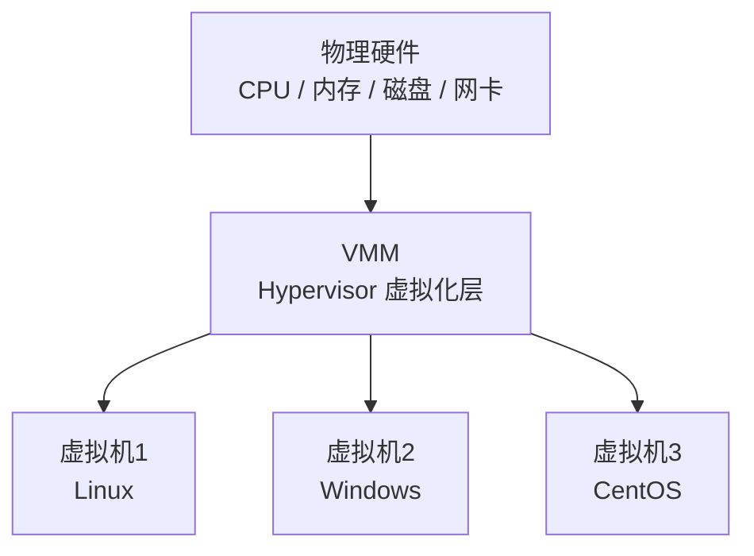
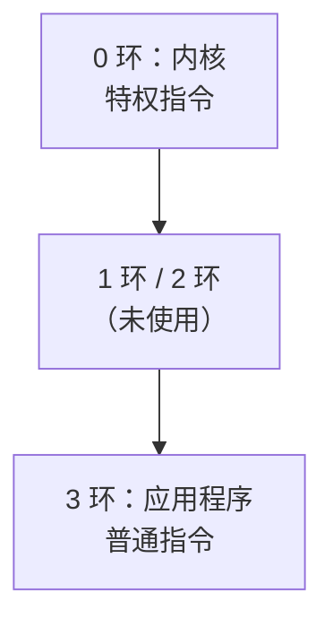
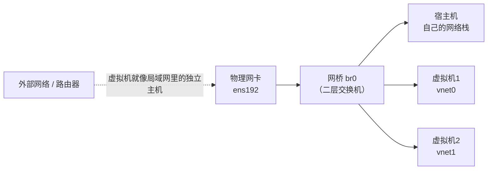
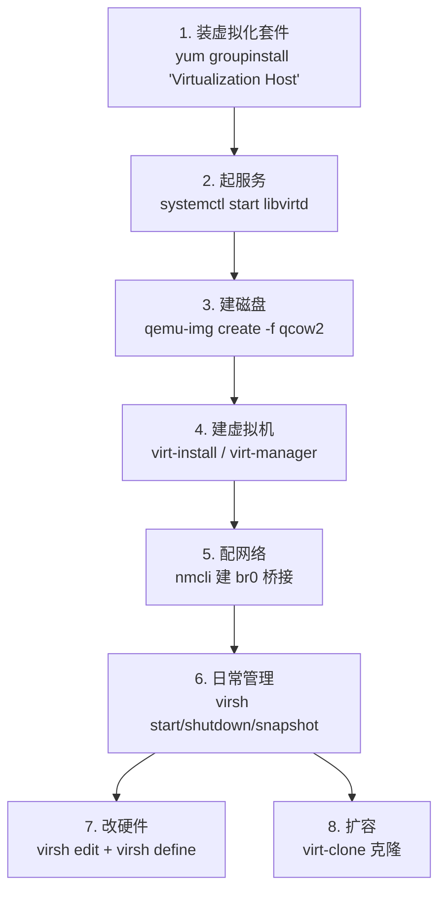

# KVM 虚拟化技术

## 虚拟化是什么

**虚拟化 —> 虚拟化技术**：可以在一台物理主机上创建多台虚拟机，每个虚拟机的**硬件可以不一样**，还可以安装**不同的操作系统**。

### 虚拟化的目的

| 目的 | 说明 |
| :--- | :--- |
| **1. 节省成本** | 充分利用物理主机的资源（一台物理机跑多个业务，不用买多台） |
| **2. 资源隔离** | 防止资源冲突（一个业务崩了不影响其他业务） |

> [!tip] 补充：虚拟化的其他价值
> - **快速部署** —— 克隆/模板，几分钟出一台机器
> - **快照回滚** —— 测试环境随便折腾，坏了秒回
> - **迁移** —— 在线迁移（live migration），业务不中断换硬件
> - **环境一致性** —— 开发/测试/生产环境统一

---

## VMM / Hypervisor

**VMM（Hypervisor）虚拟机监视器**，所有的虚拟机都是被 VMM 接管的，**没有 VMM 就无法创建虚拟机** —> 虚拟化层。



### 虚拟化技术的分类

#### 1 型虚拟化（宿主型 / 裸金属型虚拟化）

**操作系统本身就是 VMM。**

- **KVM 虚拟化**（本质上就是 **Linux 内核的功能**）


#### 2 型虚拟化（寄居型虚拟化）

**VMware Workstation**（VMware 公司的虚拟化技术）。

- 这种虚拟化**必须要依托于操作系统**，先有了操作系统才可以通过虚拟化技术来创建虚拟机
- `Windows 11` —> `VMware Workstation` 软件（VMM Hypervisor 虚拟化层）—> 创建和管理 vm 虚拟机


### 1 型 vs 2 型对比

| 维度 | 1 型（裸金属） | 2 型（寄居型） |
| :--- | :--- | :--- |
| VMM 在哪里 | **直接在硬件上**（操作系统即 VMM） | **跑在操作系统之上** |
| 性能 | **高**（少一层） | 较低（多一层操作系统） |
| 典型产品 | **KVM**、Xen、ESXi | VMware Workstation、VirtualBox |
| 用途 | **生产环境 / 服务器** | **个人学习 / 桌面测试** |
| 启动顺序 | 硬件 → VMM → 虚拟机 | 硬件 → 操作系统 → VMM → 虚拟机 |

> [!info] 记忆法
> **1 型**：先把机器"交给"虚拟化层，操作系统只是被管理的一个客人
> **2 型**：先装好操作系统，再在系统里"寄居"一个虚拟化软件

---

## 虚拟化的发展历史

虚拟化的范畴包括：**CPU 虚拟化、内存虚拟化、设备虚拟化...**

- 直到 **VMware** 的诞生，**99 年**推出了第一款面向 x86 主机的产品 —> **VMware Workstation**
- 虚拟化是 VMware 虚拟化，属于**闭源**虚拟化技术
- **01 年**，**XEN** 虚拟化出现了 —> **开源**虚拟化技术
- **03 年** XEN 虚拟化开源了，后面被一家公司**思杰 Citrix** 收购了
- **06 年 KVM 虚拟化诞生了，08 年被红帽收购了**
  - 基于内核的虚拟机（**K**ernel-based **V**irtual **M**achine）
  - **OpenStack 项目**的出现 —— 因为 OpenStack 项目火热

| 年份 | 事件 |
| :--- | :--- |
| 1999 | VMware Workstation 发布（闭源，2 型） |
| 2001 | XEN 出现（开源） |
| 2003 | XEN 开源，被 Citrix 收购 |
| **2006** | **KVM 诞生** |
| **2008** | **KVM 被红帽收购** |

### XEN vs KVM

| 维度 | XEN | KVM |
| :--- | :--- | :--- |
| 类型 | **半虚拟化**技术 | 内建于 **Linux 内核** |
| 内核 | 一台主机上存在**一个正常内核 + 一个 XEN 虚拟化的内核** | **只需要唯一一套内核** |
| 维护 | 比较麻烦 | 简单（就是内核功能） |

> [!important] KVM 与 QEMU 的关系（记住）
> **KVM 虚拟化仅仅实现 CPU 和内存虚拟化**，硬件相关的虚拟**不是它做的** —— 比如你的硬盘、你的光驱设备、你的网卡等设备**不是 KVM 做的**。
>
> 你现在看到的 **KVM 全称其实是 KVM + QEMU**。
>
> - **KVM** — 负责 **CPU 和内存**的虚拟化
> - **QEMU** — 负责**硬件层面**的虚拟化（磁盘、网卡、光驱等设备模拟）
>
> QEMU 也是一种虚拟化技术——它本身是纯软件模拟，性能差；**配合 KVM 后，CPU/内存走硬件加速，只有设备模拟用 QEMU，性能大幅提升**。

### KVM / QEMU / Libvirt 三者关系

| 组件 | 角色 | 说明 |
| :--- | :--- | :--- |
| **KVM** | 内核模块 | 提供 CPU/内存虚拟化（`/dev/kvm`） |
| **QEMU** | 用户态程序 | 模拟硬件设备，是实际"跑虚拟机"的进程 |
| **Libvirt** | 管理工具 | 统一管理接口（`virsh`/`virt-install`/`virt-manager`） |
| **virtio** | 半虚拟化驱动 | 虚拟机内装的"加速驱动"，大幅提升 I/O 性能 |

---

## CPU 虚拟化的三种类型

本身 CPU、内存、硬件等虚拟化好好的，但是**在 x86 架构中，CPU 虚拟化是存在问题的**，为了解决这个问题，所以才出现全虚拟化、半虚拟化、硬件辅助虚拟化。

### CPU 虚拟化遇到了什么问题？

**补充一下关于 CPU 指令环的知识内容。**

#### CPU 指令环：0 1 2 3

| 环 | 运行内容 | 权限 |
| :--- | :--- | :--- |
| **0 环** | **内核** | 对于操作系统来说，内核拥有**完全控制权限** |
| 1、2 环 | （未使用） | — |
| **3 环** | 桌面上运行的**应用程序** | 受限 |



#### 问题所在

出现了虚拟化技术，对于你的虚拟机来说，**虚拟机里面的操作系统是不是应该要运行在 0 环中？**

> [!warning] 关键矛盾
> **VMM 是运行在 0 环，虚拟机里面的操作系统实际上是运行到 3 环中。**
>
> 但问题是：**虚拟机里的操作系统以为自己在 0 环** —— 它执行的"特权指令"实际上在 3 环，会**报错或被忽略**。

#### 敏感指令的问题

指令当中还分为**特权指令**、**普通指令**。

虚拟化中，存在一类指令 —> **敏感指令**，作用**等价于特权指令，但是属于普通指令**。

> [!warning] 核心问题
> 这类指令，**肯定不能让它在 3 环直接执行** —— 否则虚拟机就能绕过 VMM 直接操作硬件。
>
> **只有 x86 架构中才会出现这种问题**（x86 早期设计时没考虑虚拟化）。
>
> **最好的解决办法 —> 所有的敏感指令都是属于特权指令**（这正是后来硬件辅助虚拟化做的事）。

### 三种虚拟化类型

| 类型 | 原理 | 优点 | 缺点 |
| :--- | :--- | :--- | :--- |
| **全虚拟化** | VMM 层**主动去查找**虚拟机中哪些指令属于敏感指令，找到之后会进行**翻译**，由 VMM **捕获**这类指令然后做翻译，返回虚拟机 | 虚拟机 OS **无需修改** | VMM **需要主动捕获查询**，性能损耗大 |
| **半虚拟化** | **修改虚拟机的操作系统源码**，主动配合 VMM 层，虚拟机发送这类特殊的敏感指令 —> **直接找 VMM** | 性能好（不用捕获） | **必须改 OS 源码**，**Windows 不适合** |
| **硬件辅助虚拟化** | 通过**物理 CPU 硬件**来实现虚拟化能力 —> 由**物理 CPU 硬件捕获**，交给 VMM 进行翻译返回 | **性能最好**，OS 无需修改 | 需要 **CPU 支持** |

> [!info] 半虚拟化的一个现象
> 在半虚拟化中，**你看不到 Windows 系统** —— 因为 Windows 是闭源的，你没法改它的源码。

### 现在说的"全虚拟化"其实就是硬件辅助虚拟化

**如果要支持硬件辅助虚拟化的话 —> CPU 必须要支持，开启 CPU 虚拟化功能。**

**进入 BIOS 中开启。**


> [!tip] BIOS 里的名字
> | CPU 厂商 | BIOS 开关名称 |
> | :--- | :--- |
> | **Intel** | **Intel Virtualization Technology** / `VT-x` |
> | **AMD** | **SVM Mode** / `AMD-V` |

> [!warning] Windows 上的干扰
> Windows 的 **Hyper-V / VBS（基于虚拟化的安全）** 会**独占**虚拟化能力，导致 VMware/VirtualBox 无法启动。
> 参考解决方案：https://oss.bwihz.cn/%20PicGo/20260929171439608.png

> [!tip] 补充：如何确认 Linux 主机是否已开启
> ```bash
> # 有输出说明 CPU 支持虚拟化
> grep -E 'vmx|svm' /proc/cpuinfo
>
> # 用 virt-host-validate 做完整检查
> virt-host-validate
> ```

---

## KVM 虚拟化套件

**KVM 本身就是 Linux 内核的代码**，所以它是集成在 Linux 内核中的。

如果想要支持 KVM 虚拟化，必须要**加载一个 `kvm.ko` 的内核模块**到内核中。

但是这个内核模块**默认没有**，你需要**自己安装软件包**才可以得到这个内核模块，那么你的 Linux 主机才可以支持创建 KVM 虚拟机。


### 宿主机的配置要求

**最少是 4 颗 U、4GB 内存，磁盘尽量大一点，最少大于 50G**


> [!warning] 实验环境要考虑的
> 上面是**最低要求**。实际实验中，如果要在宿主机里跑 2-3 台虚拟机：
> - **内存**要留够（每台 VM 1-2G，宿主机自己还要 1-2G）
> - **磁盘**按 `虚拟机数量 × 单机磁盘大小` 再留余量
> - **CPU 要开启虚拟化**（BIOS）
> - 嵌套虚拟化场景（VMware 里装 KVM）需要在 **VMware 虚拟机设置里勾选"虚拟化 Intel VT-x/EPT"**

---

## 虚拟化套件安装

### 1. 配置本地 YUM 仓库

```bash
mkdir /etc/yum.repos.d/bak
mv /etc/yum.repos.d/*.repo /etc/yum.repos.d/bak
cat > /etc/yum.repos.d/dvd.repo <<EOF
[BaseOS]
name=BaseOS
baseurl=file:///media/BaseOS
gpgcheck=0
enabled=1

[AppStream]
name=AppStream
baseurl=file:///media/AppStream
gpgcheck=0
enabled=1
EOF

mount /dev/cdrom /media
```

### 2. 安装软件包组

```bash
[root@localhost yum.repos.d]# yum groupinstall 'Virtualization Host' -y
BaseOS                                                               77 MB/s | 2.5 MB     00:00
AppStream                                                            97 MB/s | 7.1 MB     00:00
No match for group package "insights-client"
No match for group package "rocky-release-eula"
Dependencies resolved.
====================================================================================================
 Package                         Arch    Version                                   Repository  Size
====================================================================================================
Installing group/module packages:
 libguestfs                      x86_64  1:1.40.2-27.module+el8.4.0+534+4680a14e   AppStream  2.8 M
 libvirt                         x86_64  6.0.0-35.module+el8.4.0+534+4680a14e      AppStream   58 k
 virtio-win                      noarch  1.9.16-2.el8                              AppStream  199 M
Installing dependencies:
 autogen-libopts                 x86_64  5.18.12-8.el8.1                           AppStream   74 k
 gnutls-dane                     x86_64  3.6.14-8.el8_3                            AppStream   50 k
 gnutls-utils                    x86_64  3.6.14-8.el8_3                            AppStream  346 k
 hivex                           x86_64  1.3.18-20.module+el8.4.0+534+4680a14e     AppStream  111 k
 libvirt-bash-completion         x86_64  6.0.0-35.module+el8.4.0+534+4680a14e      AppStream   59 k
 libvirt-client                  x86_64  6.0.0-35.module+el8.4.0+534+4680a14e      AppStream  366 k
 libvirt-daemon-config-nwfilter  x86_64  6.0.0-35.module+el8.4.0+534+4680a14e      AppStream   64 k
 scrub                           x86_64  2.5.2-14.el8.rocky                        AppStream   44 k
 supermin                        x86_64  5.1.19-10.module+el8.4.0+534+4680a14e     AppStream  710 k
 syslinux                        x86_64  6.04-5.el8                                BaseOS     577 k
 syslinux-extlinux               x86_64  6.04-5.el8                                BaseOS     140 k
 syslinux-extlinux-nonlinux      noarch  6.04-5.el8                                BaseOS     385 k
 syslinux-nonlinux               noarch  6.04-5.el8                                BaseOS     551 k
Installing Environment Groups:
 Virtualization Host
Installing Groups:
 Base
 Core
 Standard
 Virtualization Hypervisor
 Virtualization Tools

Transaction Summary
====================================================================================================
Install  16 Packages

Total size: 205 M
Installed size: 770 M
```

安装完成后的关键包：

| 软件包 | 作用 |
| :--- | :--- |
| **libvirt** | **虚拟化管理 API / 守护进程**（核心） |
| **libvirt-client** | 提供 **`virsh`** 命令 |
| **virtio-win** | Windows 虚拟机的 **virtio 驱动 ISO** |
| **libguestfs** | 直接操作虚拟机磁盘镜像的工具集 |
| **supermin** | 构建微型 appliance |
| **syslinux** | 引导加载程序 |

### 3. 启动 libvirtd 服务

```bash
[root@localhost ~]# systemctl start libvirtd
```

> [!important] 必须启动
> **不启动的话，你执行的管理命令人家看不到、收不到。**
>
> `virsh`、`virt-install`、`virt-manager` **都是通过 libvirtd 这个守护进程来操作虚拟机的**。
>
> ```bash
> systemctl enable --now libvirtd   # 启动并设为开机自启
> systemctl status libvirtd         # 确认状态
> ```

---

## 通过命令行工具安装一台 KVM 虚拟机

**`virt-install` 命令**：安装 KVM 虚拟机的命令，可以指定 **CPU、内存容量、磁盘文件、网络模式、安装源...**

### 使用 virt-install 创建虚拟机的流程

1. **先创建对应的磁盘文件** —— KVM 虚拟化中磁盘文件为 **`qcow2`**
   - 命令：**`qemu-img`**
2. **通过 `virt-install` 命令创建和安装虚拟机的操作系统**

### 1. 创建磁盘文件

```bash
#这个目录下保存的都是KVM虚拟机的磁盘文件
[root@localhost ~]# cd /var/lib/libvirt/images/
[root@localhost images]# pwd
/var/lib/libvirt/images
[root@localhost images]# ls

#创建一个名为demo1.qcow2的磁盘文件并且模式为精简模式
[root@localhost images]# qemu-img create -f qcow2 -o preallocation=metadata demo1.qcow2 20G
Formatting 'demo1.qcow2', fmt=qcow2 size=21474836480 cluster_size=65536 preallocation=metadata lazy_refcounts=off refcount_bits=16
[root@localhost images]# ls -lh
total 4.4M
-rw-r--r--. 1 root root 21G Sep 28 10:33 demo1.qcow2
[root@localhost images]# du -sh demo1.qcow2
4.4M    demo1.qcow2
```

> [!important] 精简模式（Thin Provisioning）
> **`ls -lh` 显示 21G，但 `du -sh` 只有 4.4M** —— 这就是精简模式。
>
> **声明 20G 容量，但实际只占用真正写入的数据量**，磁盘用多少涨多少。

| 参数 | 含义 |
| :--- | :--- |
| `-f qcow2` | 格式为 **qcow2** |
| `-o preallocation=metadata` | **预分配元数据**（比完全预分配 fast，比不预分配性能好） |
| `20G` | 逻辑容量 **20G** |

> [!tip] qcow2 vs raw 磁盘格式
> | 格式 | 特点 |
> | :--- | :--- |
> | **qcow2** | **精简模式**、支持**快照**、支持压缩/加密 —— **KVM 默认** |
> | **raw** | 裸格式，性能最好，**不支持快照**，空间一次性占满 |
>
> `preallocation` 三个档位：
> | 值 | 效果 |
> | :--- | :--- |
> | `off`（默认） | 不预分配，写入时动态分配 |
> | **`metadata`** | 只预分配元数据（**推荐的折中方案**） |
> | `falloc` / `full` | 完全预分配，创建慢但运行快 |

### 2. 安装 virt-install 和 virt-viewer

```bash
#安装virt-install命令
[root@localhost images]# yum install virt-install -y

#安装virt-viewer.x86_64，这样未来通过命令行安装虚拟机，默认会弹出一个图形化页面，你可以看到安装流程
virt-viewer.x86_64
```

### 3. 通过 virt-install 创建虚拟机

```bash
virt-install --name demo1 --network network=default --disk path=/var/lib/libvirt/images/demo1.qcow2  --memory 1024 --vcpus 1 --location /var/lib/libvirt/images/Rocky-8.4-x86_64-dvd1
```

**参数说明**：

| 参数 | 含义 |
| :--- | :--- |
| `--name demo1` | **虚拟机名字** |
| `--network network=default` | **虚拟机网络** |
| `--disk path=...` | **虚拟机磁盘文件** |
| `--memory 1024` | **虚拟机的内存**（单位 MB） |
| `--vcpus 1` | **虚拟机的 CPU**（核心数） |
| `--location ...` | **ISO 镜像文件** |


> [!info] 图形化页面弹出的条件
> **如果是 MobaXterm 远程连接，然后安装的话才会弹出这个图形化页面** —— 因为 MobaXterm **支持图形化协议转发（X11 forwarding）**。
>
> 如果你用的是 **Xshell** 这种工具，你**没有安装 Xmanager** 的话，是无法转发图形化页面的。
>
> 那么，如果你没有使用这类工具，你就**直接在 VMware 虚拟机里面去做**。

> [!tip] 补充：virt-install 其他常用参数
> | 参数 | 作用 |
> | :--- | :--- |
> | `--cdrom /path/to.iso` | 用 ISO 安装（与 `--location` 二选一） |
> | `--os-variant rocky8` | **指定 OS 类型**（自动优化配置，强烈建议加） |
> | `--graphics none` | **不启用图形界面**（配合 console 用） |
> | `--console pty,target_type=serial` | **串口控制台**（配 `virsh console`） |
> | `--network bridge=br0` | 用**桥接网络** |
> | `--disk size=20,format=qcow2` | 让 virt-install **自动创建磁盘**（省去 qemu-img 步骤） |
> | `--noautoconsole` | 创建后**不自动打开控制台** |
> | `--import` | **导入已有磁盘**（不装系统，直接启动已有系统） |
> | `--extra-args 'console=ttyS0'` | 向内核传参 |
>
> 生产环境推荐写法：
> ```bash
> virt-install --name demo1 --memory 2048 --vcpus 2 \
>   --disk size=20,format=qcow2,bus=virtio \
>   --cdrom /var/lib/libvirt/images/Rocky-8.iso \
>   --os-variant rocky8 --network network=default \
>   --graphics none --console pty,target_type=serial
> ```

---

## 通过图形化工具安装一台 KVM 虚拟机

图形化工具：**`virt-manager`**，需要自行安装。

```bash
yum install virt-manager
```


> [!tip] 图形化 vs 命令行
> | 方式 | 工具 | 适用场景 |
> | :--- | :--- | :--- |
> | **图形化** | `virt-manager` | 学习和调试，直观 |
> | **命令行** | `virt-install` | 生产环境，**可脚本化、可自动化** |
>
> 实际运维中**命令行更常用** —— 因为可以写进脚本批量创建。

---

## 配置桥接网络，让 KVM 虚拟机能够被外部网络访问

**准备两台 VMware 虚拟机，网络模式都是 NAT 模式**，让两台 VMware 虚拟机默认真实的内网环境的物理服务器。

其中一台 VMware 虚拟机充当**宿主机**的作用，来配置一个**桥接网络 `br0`**，将其 `br0` 网络桥接到 `ens160` 物理网卡上。

### 1. 创建一个虚拟网卡 br0，将其桥接到物理网卡上

**先创建一个虚拟网卡 br0，并且指定 connection 配置文件**

```bash
[root@localhost ~]# nmcli connection add type bridge ifname br0 con-name br0
Connection 'br0' (80f916d7-0292-41f6-b5b7-989c89bfbacc) successfully added.
```

**将其 br0 桥接到 `ens192` 物理网卡上**

```bash
[root@localhost ~]# nmcli connection add type bridge-slave ifname ens192 con-name ens192 master br0
Connection 'ens192' (612cb46c-a85c-4c86-b872-7ef12f0716dc) successfully added.
```


> [!warning] 步骤还没完
> 上面只是**创建了连接配置**，还需要：
> ```bash
> # 1. 给 br0 配 IP（可以沿用原来的，也可以 DHCP）
> nmcli connection modify br0 ipv4.addresses 192.168.200.137/24 \
>        ipv4.gateway 192.168.200.2 ipv4.dns 223.5.5.5 \
>        ipv4.method manual
>
> # 2. 激活
> nmcli connection up br0
> nmcli connection up ens192
>
> # 3. 验证
> ip addr show br0
> bridge link
> ```
> ⚠️ **如果原网卡 ens192 的配置还在并抢着 IP，要先把它在 br0 里降为 slave**，否则 IP 冲突。

### 桥接原理



> [!important] 桥接的意义
> **桥接后，虚拟机就像局域网里的一台独立物理主机** —— 有自己独立的 IP，能被外部网络直接访问。
>
> 对比 **NAT 模式**：虚拟机通过宿主机做地址转换出去，外部网络**主动访问不到**虚拟机。

### KVM 网络模式对比

| 模式 | virsh 网络名 | 虚拟机 IP | 外部能否访问 VM | 适用 |
| :--- | :--- | :--- | :---: | :--- |
| **NAT（默认）** | `default` | 192.168.122.x | ❌（需端口转发） | 学习实验，无需外部访问 |
| **桥接** | `br0` 自定义 | 与宿主机同网段 | ✅ | **生产环境 / 需要被访问** |
| **隔离（isolated）** | 自定义 | 内部网段 | ❌ | VM 之间通信，不与外界通 |
| **仅主机（host-only）** | 自定义 | 内部网段 | ❌（宿主机可访问） | 只与宿主机通信 |
| **直通（SR-IOV/PCI passthrough）** | — | — | ✅ | 高性能场景 |

> [!tip] 默认 NAT 网络的信息
> ```bash
> virsh net-list --all          # 查看网络
> virsh net-dumpxml default     # 看 default 网络的 XML 配置
> # default 网段通常是 192.168.122.0/24，宿主机上的 virbr0 就是它的网关 192.168.122.1
> ```

---

## 管理 KVM 虚拟机的相关命令

### 列出当前宿主机上虚拟机

```bash
[root@localhost ~]# virsh list
 Id   Name    State
-----------------------
 1    demo2   running

[root@localhost ~]# virsh list --all
 Id   Name    State
------------------------
 1    demo2   running
 -    test    shut off
```

> [!info] `virsh list` vs `virsh list --all`
> - `virsh list` — 只列**正在运行**的
> - `virsh list --all` — 列出**所有**（含关机状态的）

### 对虚拟机进行开机、关机、重启

```bash
[root@localhost ~]# virsh start test
Domain test started

[root@localhost ~]# virsh shutdown test

#destroy不是摧毁的意思，这里表示强制关机，就是断电，如果前面的shutdown无法正常关机就使用这个
[root@localhost ~]# virsh destroy test
Domain test destroyed
```

| 命令 | 作用 | 类比 |
| :--- | :--- | :--- |
| `virsh start VM` | 开机 | 按电源键 |
| **`virsh shutdown VM`** | **正常关机**（优雅关闭，需 VM 内 ACPI 支持） | 系统里点"关机" |
| **`virsh destroy VM`** | **强制断电**（相当于拔电源） | **长按电源键** |
| `virsh reboot VM` | 重启 | 系统里点"重启" |

> [!warning] `destroy` 是强制断电
> **`destroy` 不是摧毁/删除的意思**，是**强制关机（断电）**。
>
> 可能导致**文件系统损坏、数据丢失** —— 只在 `shutdown` 无效时使用。
>
> **真正删除虚拟机是 `virsh undefine`。**

### 对虚拟机进行挂起 / 取消挂起

```bash
[root@localhost ~]# virsh suspend demo2
Domain demo2 suspended

[root@localhost ~]# virsh resume demo2
Domain demo2 resumed
```

| 命令 | 作用 |
| :--- | :--- |
| `virsh suspend VM` | **挂起**（暂停 CPU 执行，内存保留） |
| `virsh resume VM` | **恢复** |

### 删除虚拟机

```bash
[root@localhost ~]# virsh undefine test
Domain test has been undefined
```

> [!warning] undefine 只删"定义"，不删磁盘
> `virsh undefine` **只删除虚拟机的 XML 定义**，**磁盘文件还在** `/var/lib/libvirt/images/`。
>
> 要彻底清理：
> ```bash
> virsh undefine test --remove-all-storage   # 连磁盘一起删
> # 或者手动删
> rm -f /var/lib/libvirt/images/test.qcow2
> ```

### virsh 常用命令速查

| 命令 | 作用 |
| :--- | :--- |
| `virsh list --all` | 列出所有虚拟机 |
| `virsh start/shutdown/destroy/reboot VM` | 开机/正常关机/强制断电/重启 |
| `virsh suspend/resume VM` | 挂起/恢复 |
| `virsh undefine VM` | 删除虚拟机定义 |
| `virsh console VM` | **进入串口控制台** |
| `virsh edit VM` | **编辑虚拟机 XML** |
| `virsh dominfo VM` | 查看虚拟机信息 |
| `virsh domblklist VM` | 列出虚拟机的磁盘 |
| `virsh domiflist VM` | 列出虚拟机的网卡 |
| `virsh autostart VM` | **设为开机自启** |
| `virsh net-list --all` | 列出虚拟网络 |
| `virsh snapshot-create-as VM name` | 创建快照 |

---

## 通过修改 xml 配置文件实现硬件资源修改

**所有的 KVM 虚拟机的配置文件都是保存到 `/etc/libvirt/qemu` 目录下，并且是以 `.xml` 后缀结尾。**

### 调整 CPU 或者内存

```bash
#修改xml文件
#重新定义虚拟机，相当于保存生效
virsh define xxx.xml
```

> [!important] 三步流程（记住）
> **1. `virsh edit VM`（或直接 vim）** —> 改 XML
> **2. `virsh define xxx.xml`** —> **重新定义，使其生效**
> **3. 重启虚拟机** —> 部分改动（如内存）需重启才生效

### 新增一块 qcow2 硬盘

```bash
[root@localhost ~]# ls -l /var/lib/libvirt/images/
total 11868984
-rw-------. 1 qemu qemu 21478375424 Sep 28 11:50 demo2.qcow2
-rw-r--r--. 1 qemu qemu  9907994624 Sep 28 10:36 Rocky-8.4-x86_64-dvd1.iso
-rw-------. 1 root root 21478375424 Sep 28 11:35 test.qcow2

# 1. 创建磁盘文件
[root@localhost ~]# qemu-img create -f qcow2 -o preallocation=metadata /var/lib/libvirt/images/demo2-1.qcow2 10G
Formatting '/var/lib/libvirt/images/demo2-1.qcow2', fmt=qcow2 size=10737418240 cluster_size=65536 preallocation=metadata lazy_refcounts=off refcount_bits=16
[root@localhost ~]# du -sh /var/lib/libvirt/images/demo2-1.qcow2
2.6M    /var/lib/libvirt/images/demo2-1.qcow2

# 2. 修改KVM虚拟机对应的配置
[root@localhost ~]# vim /etc/libvirt/qemu/demo2.xml
    <disk type='file' device='disk'>
      <driver name='qemu' type='qcow2'/>
      <source file='/var/lib/libvirt/images/demo2-1.qcow2'/>
      <target dev='hdc' bus='ide'/>
    </disk>

# 3. 重新定义KVM虚拟机，相当于让其生效
[root@localhost ~]# virsh define /etc/libvirt/qemu/demo2.xml
Domain demo2 defined from /etc/libvirt/qemu/demo2.xml
```

> [!tip] XML 中 `<disk>` 段各标签含义
> | 标签 | 含义 |
> | :--- | :--- |
> | `<driver name='qemu' type='qcow2'/>` | 用 qemu 驱动，磁盘格式 qcow2 |
> | `<source file='...'/>` | **磁盘文件的实际路径** |
> | `<target dev='hdc' bus='ide'/>` | **虚拟机里看到的设备名 `hdc`**，总线类型 `ide` |
>
> **总线类型选择**：
> | bus | 虚拟机内设备名 | 特点 |
> | :--- | :--- | :--- |
> | `ide` | `hda`/`hdb`/`hdc`... | 兼容最好，**性能最差** |
> | `virtio` | `vda`/`vdb`/`vdc`... | **性能最好**，需装 virtio 驱动 |
> | `scsi` | `sda`/`sdb`... | 折中 |
>
> **生产环境推荐用 `virtio`** —— 但 Windows 虚拟机需要先加载 virtio 驱动（这就是 `virtio-win` 包的用途）。

### 新增一个 NAT 模式的网卡设备

在 XML 里添加一段 `<interface>` 即可：

```xml
<interface type='network'>
  <source network='default'/>
  <model type='virtio'/>
</interface>
```

改完同样执行 `virsh define demo2.xml` 生效。

> [!tip] 用命令行加设备更简单
> ```bash
> # 热添加一块网卡（不用关机）
> virsh attach-interface demo2 --type network --source default --model virtio --config --live
>
> # 热添加一块磁盘
> virsh attach-disk demo2 /var/lib/libvirt/images/demo2-2.qcow2 vdb --driver qemu --subdriver qcow2 --config --live
> ```
> `--config` 写入配置持久化，`--live` 立即生效。

---

## 虚拟机的克隆

### 方式 1：通过复制 xml 文件和 qcow2 磁盘文件实现克隆

1. `cp` 复制源虚拟机的 **xml 文件**，将其里面的 **UUID 信息、网卡的 mac 地址**这些唯一信息**也要修改**
2. `cp` 复制源虚拟机的 **qcow2 磁盘文件**，要加上 **`--sparse=always`** 选项，表示支持**精简模式拷贝**
3. 执行 **`virsh define xx.xml`** 文件基于 xml 文件定义，相当于克隆出一台虚拟机

> [!warning] 必须改的两处唯一标识
> | 项目 | 在 XML 中的位置 | 不改的后果 |
> | :--- | :--- | :--- |
> | **UUID** | `<uuid>xxxx</uuid>` | 两台 VM 的 UUID 冲突，管理混乱 |
> | **MAC 地址** | `<mac address='52:54:00:xx:xx:xx'/>` | **网络冲突，两台 VM 无法同时上网** |
>
> 生成新 MAC 时，**前三位必须是 `52:54:00`**（KVM/QEMU 的 OUI）。

### 方式 2：通过 virt-clone 命令克隆（推荐）

```bash
[root@localhost ~]# virt-clone -o demo3 -f /var/lib/libvirt/images/demo4.qcow2 -n demo4
Allocating 'demo4.qcow2'                                                     |  20 GB  00:00:04

Clone 'demo4' created successfully.
```

| 参数 | 含义 |
| :--- | :--- |
| **`-o demo3`** | 指定**源虚拟机**（original） |
| **`-f .../demo4.qcow2`** | 指定**克隆后的虚拟机的磁盘文件路径** |
| **`-n demo4`** | 指定**克隆后的虚拟机名字** |

> [!important] virt-clone 帮你自动改了 UUID 和 MAC
> 这就是为什么**推荐用 `virt-clone`** —— 它自动处理了 UUID、MAC 这些唯一标识，不会冲突。
>
> 方式 1 需要手动改，容易漏。

> [!warning] 克隆前要先关机
> 克隆运行中的虚拟机会导致磁盘状态不一致。先 `virsh shutdown demo3` 再克隆。

---

## 虚拟机的 console 口登录

### 1. 修改虚拟机的 grub 配置文件，加入 `console=ttyS0,115200n8`

```bash
vim /etc/default/grub
# 找到LINUX这一行的末尾，添加参数 console=ttyS0,115200n8
grub2-mkconfig -o /boot/grub2/grub.cfg
# 最后重启机器
```

### 2. 宿主机通过 console 登录的方式

```text
virsh console 主机名
```


> [!important] console 的意义（记住）
> **这就是为什么虚拟化场景下一定要配 `console=ttyS0`** ——
>
> 虚拟机在**没有网络、图形界面起不来、甚至还在安装系统**的时候，你是没法 SSH 的。
> 只有通过**串口控制台**才能看到输出、操作机器。
>
> PXE 装系统、系统启动失败排错、云服务器的"VNC 控制台"功能，本质都是这个。

> [!tip] 退出 console
> 按 **`Ctrl + ]`** 退出 `virsh console`。

> [!tip] 补充：为什么是 115200n8
> | 片段 | 含义 |
> | :--- | :--- |
> | `ttyS0` | **第一个串口设备**（COM1） |
> | `115200` | **波特率**（常用 9600 / 115200） |
> | `n` | **无校验**（none parity） |
> | `8` | **8 位数据位** |

---

## 虚拟机的快照

### 拍摄虚拟机的快照

```bash
[root@localhost ~]# virsh snapshot-create-as demo2 snap001
Domain snapshot snap001 created
```

### 删除虚拟机的快照

```bash
[root@localhost ~]# virsh snapshot-delete demo2 snapshot1
Domain snapshot snapshot1 deleted
```

### 列出虚拟机的快照

```bash
[root@localhost ~]# virsh snapshot-list demo2
 Name      Creation Time               State
------------------------------------------------
 snap001   2026-09-28 14:21:43 +0800   running
```

### 基于快照做还原

```bash
[root@localhost ~]# virsh snapshot-revert demo2 snap001
```

### 快照命令速查

| 命令 | 作用 |
| :--- | :--- |
| `virsh snapshot-create-as VM 名称` | **创建快照**（可命名） |
| `virsh snapshot-list VM` | **列出快照** |
| `virsh snapshot-revert VM 快照名` | **还原到快照** |
| `virsh snapshot-delete VM 快照名` | **删除快照** |
| `virsh snapshot-current VM` | 查看当前快照 |

> [!warning] 快照不是备份
> 快照**依赖原磁盘文件**存在，原磁盘坏了快照也一起没。
> 快照**长期堆叠会严重拖慢磁盘性能**。
> **正确做法：快照只用于短期测试回滚，定期清理；长期保护要用真正的备份。**

---

# 需求（作业）

## KVM 虚拟化要求

1. 创建一台 RockyLinux8 系统的 KVM 虚拟机，名字为 **`demo1`**，采用 **`virt-manager`** 方式安装
2. 创建一台 RockyLinux8 系统的 KVM 虚拟机，名字为 **`demo2`**，采用 **`virt-install`** 方式安装
3. 准备一台 **PXE 服务端**，配置 PXE 相关服务，能够给其他主机安装系统
   - 在 KVM 虚拟机所在的**宿主机上，配置桥接网络 br0**
   - 要求新创建的 **`pxe-client` KVM 虚拟机可以通过 PXE 服务端自动化安装操作系统**

### ks.cfg 脚本文件参考

```text
#platform=x86, AMD64, 或 Intel EM64T
#version=DEVEL
# Install OS instead of upgrade
install
# Keyboard layouts
keyboard 'us'
# Root password
rootpw --iscrypted $1$9tM4ocT4$pQbLiM5Zz1Csi8OljINlP0
# System language
lang en_US
# System authorization information
auth  --useshadow  --passalgo=sha512
# Use text mode install
text
# SELinux configuration
selinux --disabled
# Do not configure the X Window System
skipx

# Firewall configuration
firewall --disabled
# Network information
network  --bootproto=dhcp --device=eth0
# Reboot after installation
reboot
# System timezone
timezone Africa/Abidjan
# Use network installation
url --url="http://192.168.200.137/iso"
# System bootloader configuration
bootloader --append="bios.devname=0 net.ifnames=0 console=ttyS0,115200n8" --location=mbr
# Clear the Master Boot Record
zerombr
# Partition clearing information
clearpart --all --initlabel
# Disk partitioning information
part /boot --fstype="xfs" --size=512
part / --fstype="xfs" --size=10240

%post
#!/bin/bash
rm -rf /etc/yum.repos.d/*.repo
cat > /etc/yum.repos.d/dvd.repo << END
[BaseOS]
name=BaseOS
baseurl=http://192.168.200.137/iso/BaseOS
gpgcheck=0

[AppStream]
name=AppStream
baseurl=http://192.168.200.137/iso/AppStream
gpgcheck=0
END
%end

%packages
@fonts

%end
```

> [!important] 这份 ks.cfg 的关键三行（记住）
> | 配置 | 作用 |
> | :--- | :--- |
> | `bootloader --append="... console=ttyS0,115200n8"` | **启用串口控制台** —— 这样 `virsh console` 才能看到安装过程 |
> | `bootloader --append="... net.ifnames=0 bios.devname=0"` | **网卡命名回到 `eth0`** —— 和上面 `network --device=eth0` 对应 |
> | `%post ... %end` | **装完系统自动执行** —— 这里自动配好 YUM 仓库 |
>
> 三者配合，才能实现**全自动安装 + 无网络也能配好仓库 + 串口可监控**。

> [!tip] 作业解题思路
> ```bash
> # 【宿主机】1. 准备 KVM 环境
> yum groupinstall 'Virtualization Host' -y
> systemctl enable --now libvirtd
> grep -E 'vmx|svm' /proc/cpuinfo      # 确认 CPU 支持虚拟化
>
> # 【宿主机】2. 配置桥接网络 br0
> nmcli connection add type bridge ifname br0 con-name br0
> nmcli connection add type bridge-slave ifname ens192 con-name ens192 master br0
> nmcli connection modify br0 ipv4.addresses 192.168.200.137/24 \
>        ipv4.gateway 192.168.200.2 ipv4.dns 223.5.5.5 ipv4.method manual
> nmcli connection up br0 && nmcli connection up ens192
>
> # 【宿主机】3. 起 PXE 服务端（DHCP+TFTP+HTTP，见第17天笔记）
> #      ks.cfg 放到 http 可访问的路径，引导配置里加 inst.ks=
>
> # 【宿主机】4. 创建 pxe-client 虚拟机并指定桥接网络 + PXE 启动
> qemu-img create -f qcow2 -o preallocation=metadata \
>     /var/lib/libvirt/images/pxe-client.qcow2 20G
> virt-install --name pxe-client --memory 2048 --vcpus 2 \
>   --disk path=/var/lib/libvirt/images/pxe-client.qcow2,bus=virtio \
>   --network bridge=br0,model=virtio \
>   --pxe --os-variant rocky8 \
>   --graphics none --console pty,target_type=serial \
>   --noautoconsole
>
> # 【验证】从 console 看自动安装过程
> virsh console pxe-client
> ```
>
> ⚠️ 关键点：`--pxe` 指定**网络启动**，`--network bridge=br0` 让虚拟机**和 PXE 服务端同网段**（DHCP 才能认到它）。
> 另外 **KVM 宿主机的 default NAT 网络（192.168.122.0/24）和 PXE 的 DHCP 网段冲突时要先关掉** —— `virsh net-destroy default`。

---

## 明天上课准备：2 台 VMware 虚拟机

> 明天上课的时候准备好以下 2 台 VMware 的虚拟机，**和上面的作业虚拟机分开**。

### 虚拟机 1

```text
一台主机配置
2U 2G 50磁盘
普通分区
boot分区512M
其他所有的空间全部给到/
```

### 虚拟机 2

```text
一台主机配置
8U 8G 100磁盘
普通分区
boot分区512M
其他所有的空间全部给到/
```

---

# 补充：本篇核心知识点速查

## 虚拟化概念速查

| 概念 | 说明 |
| :--- | :--- |
| **VMM / Hypervisor** | 虚拟机监视器，虚拟化层，**没有它就没有虚拟机** |
| **1 型** | 裸金属，OS 即 VMM，**KVM** |
| **2 型** | 寄居型，跑在 OS 上，**VMware Workstation** |
| **全虚拟化** | VMM 捕获翻译敏感指令，OS 无需改 |
| **半虚拟化** | 改 OS 源码配合 VMM，**Windows 不行** |
| **硬件辅助** | **CPU 硬件捕获**，性能最好，**现在的"全虚拟化"** |

## KVM 关键路径

| 路径 | 内容 |
| :--- | :--- |
| `/etc/libvirt/qemu/` | **虚拟机 XML 配置文件** |
| `/var/lib/libvirt/images/` | **虚拟机磁盘文件默认位置** |
| `/run/libvirt/` | 运行时状态 |
| `/var/log/libvirt/` | 虚拟机日志 |
| `/dev/kvm` | **KVM 设备节点**（有此文件才支持 KVM） |

## 完整操作流程串起来



## 虚拟化 vs 容器

> [!tip] 延伸理解
> | 维度 | 虚拟机（KVM） | 容器（Docker） |
> | :--- | :--- | :--- |
> | 隔离级别 | **硬件级**（独立内核） | **进程级**（共享宿主机内核） |
> | 启动速度 | 慢（分钟级） | **快（秒级）** |
> | 资源占用 | 大（完整 OS） | **小（只含应用和依赖）** |
> | 隔离性 | **强** | 弱 |
> | 能跑不同内核吗 | **能**（Linux 上跑 Windows） | 不能（只能跑同内核） |
> | 典型场景 | 云主机、强隔离多租户 | 微服务、快速发布 |
>
> 两者**不是替代关系**，常配合使用（容器跑在虚拟机里）。

## 常见坑

> [!warning] 实操中最容易踩的
> 1. **`libvirtd` 没启动** —— 所有 virsh/virt-install 命令都"看不到"虚拟机
> 2. **BIOS 没开 VT-x/AMD-V** —— KVM 创建失败
> 3. **VMware 里装 KVM 没勾"虚拟化 Intel VT-x/EPT"** —— 嵌套虚拟化失败
> 4. **克隆后没改 UUID/MAC** —— 网络冲突，用 `virt-clone` 避免
> 5. **`virsh destroy` 当成删除** —— 它只是强制断电，删除用 `undefine`
> 6. **`undefine` 后没删磁盘** —— 磁盘还占着空间
> 7. **桥接后原网卡 IP 冲突** —— 要把原网卡设为 br0 的 slave
> 8. **PXE 装的 VM 和 default NAT 网段冲突** —— 先 `virsh net-destroy default`
> 9. **Windows VM 用 virtio 没装驱动** —— 认不到硬盘，需挂 `virtio-win` ISO
