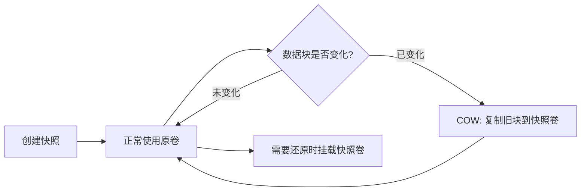

# LVM数据保护

## LVM的快照技术

### 快照原理

LVM快照采用**写时复制（Copy-On-Write，COW）**技术：

- 创建快照时**不会复制实际数据**，只创建指向原始数据的元数据映射
- 当原始卷的数据块**发生写入**时，先将该数据块的**旧值**复制到快照卷，再写入新值
- 未修改的数据块，快照和原卷**共享同一份数据**，节省空间

> [!tip] 理解COW
> 快照只是一个"时间点标记"，记录了创建时刻的数据状态。只有数据发生变化时才会占用额外空间，因此快照卷可以远小于原卷。

### 快照的生命周期



### 创建快照

```bash
## 语法：lvcreate -n 快照名 -s -L 快照大小 /dev/卷组名/逻辑卷名
## -s 表示创建快照（snapshot）
## -L 指定COW空间大小

[root@dpeak ~]# lvcreate -n lv1-snap -s -L 100M /dev/vg0/lv1
  Logical volume "lv1-snap" created.
```

查看快照状态：

```bash
[root@dpeak ~]# lvs
  LV       VG  Attr       LSize   Pool Origin Data%  Meta%  Move Log Cpy%Sync Convert
  lv1      vg0 owi-aos---   1.00g
  lv1-snap vg0 swi-a-s--- 100.00m      lv1    0.00
```

> [!info] lvs 输出字段说明
> - `s` 表示快照卷（snapshot）
> - `Origin` 指向原卷
> - `Data%` 表示COW空间使用百分比，**100%意味着快照失效**

### 快照自动扩容

当COW空间使用达到阈值时，自动扩展快照卷，防止快照因空间不足而失效：

```bash
[root@dpeak ~]# vim /etc/lvm/lvm.conf
snapshot_autoextend_threshold = 50    ## 使用到50%时触发扩容
snapshot_autoextend_percent = 50      ## 每次扩容50%的空间
```

修改后需要重启 `lvm2-monitor` 服务使配置生效：

```bash
[root@dpeak ~]# systemctl restart lvm2-monitor
```

> [!warning] 注意
> 快照卷的COW空间**不能超过原卷所在卷组的剩余空间**。扩容只是在VG有空闲空间的前提下才有效。

## LVM还原操作

### 还原步骤

1. **卸载原卷**（必须先卸载）
2. **挂载快照卷**，将数据拷贝到临时目录
3. **卸载快照卷**
4. **重新挂载原卷**，将快照数据拷贝回去

```bash
## 1. 删除原卷中的文件（模拟数据丢失）
[root@dpeak ~]# rm -rf /lv1/*
[root@dpeak ~]# umount /lv1

## 2. 挂载快照卷，备份数据到临时目录
[root@dpeak ~]# mkdir /lv1-snap /lv1-back
[root@dpeak ~]# mount /dev/vg0/lv1-snap /lv1-snap/
[root@dpeak ~]# cp -a /lv1-snap/* /lv1-back/
[root@dpeak ~]# umount /lv1-snap

## 3. 重新挂载原卷，恢复数据
[root@dpeak ~]# mount /dev/vg0/lv1 /lv1
[root@dpeak ~]# cp -a /lv1-back/* /lv1/
[root@dpeak ~]# ls /lv1
group  gshadow  passwd  shadow
```

> [!tip] -a 参数
> `cp -a` 等同于 `cp -dR --preserve=all`，保留文件的权限、属主、时间戳、链接等所有属性。

### 快照还原替代方案

也可以直接将快照卷**合并回原卷**（适用于 thin 快照）：

```bash
## 将快照合并回原卷（会覆盖原卷数据到快照时刻的状态）
[root@dpeak ~]# lvconvert --merge /dev/vg0/lv1-snap
```

> [!warning] 使用 lvconvert --merge 的条件
> - 原卷必须处于**未激活**状态（或下次激活时自动合并）
> - 合并操作**不可逆**，原卷当前数据会被覆盖

## LVM的跨主机迁移

将整个卷组从一台服务器迁移到另一台，常用于**服务器更换硬件**或**数据迁移**场景。

### 迁移步骤

#### 1. 源主机：卸载并导出卷组

```bash
## 卸载所有属于该VG的逻辑卷
[root@source ~]# umount /lv1

## 停用卷组（禁止访问）
[root@source ~]# vgchange -an vg0
  0 logical volume(s) in volume group "vg0" now active

## 导出卷组（标记为可移动）
[root@source ~]# vgexport vg0
  Volume group "vg0" successfully exported
```

#### 2. 物理拔盘

将硬盘从源主机拔出，插入目标主机。

#### 3. 目标主机：导入并激活卷组

```bash
## 扫描新磁盘
[root@target ~]# pvscan

## 导入卷组
[root@target ~]# vgimport vg0
  Volume group "vg0" successfully imported

## 激活卷组
[root@target ~]# vgchange -ay vg0
  1 logical volume(s) in volume group "vg0" now active

## 挂载使用
[root@target ~]# mkdir /lv1
[root@target ~]# mount /dev/vg0/lv1 /lv1
```

> [!info] 迁移前提
> - 两台主机的 LVM 版本需兼容
> - 磁盘接口类型需匹配（如都是 SATA 或 SAS）
> - 迁移前务必做**数据备份**

### pvmove：在线迁移物理卷数据

如果不想拔盘，可以用 `pvmove` 在**同一主机内**将数据从一个PV迁移到另一个PV：

```bash
## 将 /dev/sdb 上的数据迁移到 /dev/sdd（在线操作，不影响服务）
[root@dpeak ~]# pvmove /dev/sdb /dev/sdd
```

---

# 软链接/硬链接

## 硬链接（Hard Link）

- 多个文件名指向**同一个 inode**（同一份数据）
- 修改任意一个硬链接，其他硬链接内容同步变化
- 删除原文件后，硬链接**仍然可以访问数据**
- **不能跨文件系统**，**不能对目录创建**

```bash
## 创建硬链接
[root@dpeak ~]# ln 原文件 硬链接名
[root@dpeak ~]# ln /etc/passwd /tmp/passwd-hard

## 验证 inode 相同
[root@dpeak ~]# ls -i /etc/passwd /tmp/passwd-hard
33554501 /etc/passwd  33554501 /tmp/passwd-hard
```

## 软链接（Symbolic Link / 软链接）

- 类似 Windows 的**快捷方式**
- 存储的是**原文件的路径**，指向另一个文件
- 删除原文件后，软链接**失效**（断链）
- **可以跨文件系统**，**可以对目录创建**

```bash
## 创建软链接
[root@dpeak ~]# ln -s 原文件 软链接名
[root@dpeak ~]# ln -s /etc/passwd /tmp/passwd-soft

## 查看软链接指向
[root@dpeak ~]# ls -l /tmp/passwd-soft
lrwxrwxrwx. 1 root root 11 Sep 15 10:00 /tmp/passwd-soft -> /etc/passwd
```

## 硬链接 vs 软链接对比

| 特性 | 硬链接 | 软链接 |
| :--- | :--- | :--- |
| inode | 与原文件**相同** | **独立的** inode |
| 跨文件系统 | ❌ 不可以 | ✅ 可以 |
| 对目录 | ❌ 不可以 | ✅ 可以 |
| 原文件删除 | ✅ 仍可访问 | ❌ 失效 |
| 文件类型 | 普通文件 `-` | 链接文件 `l` |
| 占用空间 | 不额外占用（共享inode） | 占用少量空间（存储路径） |

> [!tip] 使用场景
> - **硬链接**：重要文件的冗余备份，防止误删
> - **软链接**：快捷方式、版本管理（如 `/usr/bin/python3 -> python3.11`）

---

# 软件包管理

## RPM 包管理

RPM（Red Hat Package Manager）是 Red Hat 系列发行版的软件包管理工具。

### 安装与卸载

```bash
## 安装 rpm 包
[root@dpeak ~]# rpm -ivh package.rpm
## -i: install 安装
## -v: verbose 显示详细信息
## -h: hash 显示进度条

## 卸载 rpm 包
[root@dpeak ~]# rpm -evh package_name
## -e: erase 卸载
```

### 升级与降级

```bash
## 升级（已有旧版本则升级，否则安装）
[root@dpeak ~]# rpm -Uvh package-new.rpm

## 仅升级（必须已有旧版本）
[root@dpeak ~]# rpm -Fvh package-new.rpm

## 降级
[root@dpeak ~]# rpm -Uvh --oldpackage package-old.rpm
```

### 查询

```bash
## 查询是否已安装
[root@dpeak ~]# rpm -q package_name

## 列出所有已安装的包
[root@dpeak ~]# rpm -qa

## 查询包安装后释放的配置文件
[root@dpeak ~]# rpm -qc package_name

## 查询某个文件属于哪个包
[root@dpeak ~]# rpm -qf /etc/passwd

## 查询包的详细信息
[root@dpeak ~]# rpm -qi package_name

## 查询包安装后释放的所有文件
[root@dpeak ~]# rpm -ql package_name
```

> [!warning] RPM 依赖问题
> RPM 不会自动解决依赖关系。如果安装时缺少依赖，需要**手动下载并安装**所有依赖包。这就是 YUM/DNF 存在的意义。

### rpm 常用参数速查

| 参数 | 作用 |
| :--- | :--- |
| `-i` | 安装（install） |
| `-e` | 卸载（erase） |
| `-U` | 升级或安装（upgrade） |
| `-F` | 仅升级（freshen） |
| `-v` | 显示详细信息 |
| `-h` | 显示进度条 |
| `-q` | 查询（query） |
| `-qa` | 查询所有已安装的包 |
| `-qc` | 查询配置文件 |
| `-ql` | 查询安装释放的文件列表 |
| `-qf` | 查询文件属于哪个包 |
| `--nodeps` | 忽略依赖关系（危险） |
| `--force` | 强制安装（覆盖） |

---

## YUM / DNF 包管理

YUM（Yellowdog Updater Modified）是 RPM 的前端工具，**自动解决依赖关系**。RHEL 8+ 推荐使用 DNF（YUM 的升级版，语法兼容）。

### 配置 YUM 源

```bash
## YUM 源配置文件目录
/etc/yum.repos.d/

## 本地光盘源示例
[root@dpeak ~]# vim /etc/yum.repos.d/local.repo
[BaseOS]
name=BaseOS
baseurl=file:///media/BaseOS
gpgcheck=0
enabled=1

[AppStream]
name=AppStream
baseurl=file:///media/AppStream
gpgcheck=0
enabled=1
```

> [!info] YUM 源字段说明
> - `[repo_id]`：仓库标识，必须唯一
> - `name`：仓库描述
> - `baseurl`：软件包路径（支持 `file://`、`http://`、`ftp://`）
> - `gpgcheck`：是否校验签名（0=不校验，1=校验）
> - `enabled`：是否启用（0=禁用，1=启用）

### 常用操作

```bash
## 安装软件包
[root@dpeak ~]# yum install -y package_name
## -y: 自动确认，不提示

## 卸载软件包
[root@dpeak ~]# yum remove package_name

## 更新软件包
[root@dpeak ~]# yum update package_name

## 更新所有软件包
[root@dpeak ~]# yum update

## 搜索软件包
[root@dpeak ~]# yum search keyword

## 查看软件包信息
[root@dpeak ~]# yum info package_name

## 列出所有可用的软件包
[root@dpeak ~]# yum list available

## 列出所有已安装的软件包
[root@dpeak ~]# yum list installed

## 清除缓存并重建
[root@dpeak ~]# yum clean all
[root@dpeak ~]# yum makecache

## 查看 YUM 历史记录
[root@dpeak ~]# yum history

## 撤销某次 YUM 操作
[root@dpeak ~]# yum history undo 事务ID
```

### YUM 软件包组管理

```bash
## 列出所有软件包组
[root@dpeak ~]# yum groups list

## 安装软件包组
[root@dpeak ~]# yum groupinstall "Development Tools"

## 查看软件包组信息
[root@dpeak ~]# yum groupinfo "Development Tools"
```

---

## DNF vs YUM 的区别

| 特性 | YUM | DNF |
| :--- | :--- | :--- |
| 依赖解析 | 较慢，有时不准确 | 更快更准确 |
| 内存占用 | 较高 | 较低 |
| Python 版本 | Python 2 | Python 3 |
| 插件支持 | 需要单独安装 | 内置 |
| RHEL 版本 | RHEL 7 及以下默认 | RHEL 8+ 默认 |

> [!tip] 兼容性
> RHEL 8+ 系统中 `yum` 命令实际上是 `dnf` 的软链接，两者语法完全兼容。新系统建议直接使用 `dnf`。

---

## 源码编译安装

当官方仓库没有所需软件版本时，可以通过源码编译安装。

### 三步编译法

```bash
## 1. 配置（检查编译环境，生成 Makefile）
[root@dpeak ~]# ./configure --prefix=/usr/local/nginx

## 2. 编译（将源码编译为二进制文件）
[root@dpeak ~]# make -j$(nproc)
## -j 指定并行编译线程数，$(nproc) 自动获取CPU核心数

## 3. 安装（将编译好的文件复制到指定目录）
[root@dpeak ~]# make install
```

> [!warning] 源码编译前提
> 需要安装编译工具链：
> ```bash
> [root@dpeak ~]# yum groupinstall -y "Development Tools"
> ```
> 或单独安装 `gcc`、`make`、`gcc-c++` 等。

---

## 补充知识

### LVM 条带化（Striping）

条带化将数据分散写入多个PV，提升**读写性能**：

```bash
## 创建条带化逻辑卷：数据分散到2个PV，每个条带64KB
[root@dpeak ~]# lvcreate -n lv_stripe -L 2G -i 2 -I 64k vg0
## -i: 条带数（PV数量）
## -I: 条带大小（4k/8k/16k/32k/64k/128k/256k/512k/1M）
```

### LVM 缓存（dm-cache）

用 SSD 加速 HDD：

```bash
## 创建缓存池
[root@dpeak ~]# lvcreate -L 10G -n cache_pool vg0 /dev/ssd_pv

## 将缓存池附加到数据卷
[root@dpeak ~]# lvconvert --type cache --cachepool cache_pool vg0/data_lv
```

### /etc/lvm/lvm.conf 重要配置项

```bash
## 快照自动扩容
snapshot_autoextend_threshold = 50    ## 使用率阈值
snapshot_autoextend_percent = 50      ## 扩容百分比

## 禁止分配的PV（保留给特定用途）
filter = ["a/sdb/", "a/sdc/", "r/.*/"]
```

### LVM 常用命令速查表

| 操作 | 物理卷(PV) | 卷组(VG) | 逻辑卷(LV) |
| :--- | :--- | :--- | :--- |
| 创建 | `pvcreate` | `vgcreate` | `lvcreate` |
| 查看 | `pvs` / `pvdisplay` | `vgs` / `vgdisplay` | `lvs` / `lvdisplay` |
| 扩容 | — | `vgextend` | `lvextend` |
| 缩容 | — | `vgreduce` | `lvreduce` |
| 删除 | `pvremove` | `vgremove` | `lvremove` |
| 扫描 | `pvscan` | `vgscan` | `lvscan` |
| 迁移 | `pvmove` | `vgexport`/`vgimport` | — |
| 快照 | — | — | `lvcreate -s` |
| 合并 | — | — | `lvconvert --merge` |
