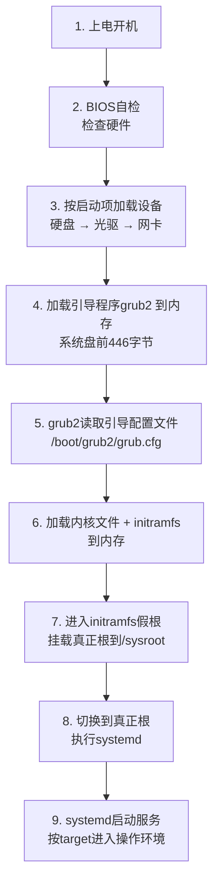

# 内核

## 内核的作用

**一个完整的操作系统 = 内核 + 应用程序**

内核的主要作用：

1. **识别硬件、初始化操作系统**
2. **分配硬件资源给程序**
3. **识别各种网络协议、支持各种安全机制**（rwx、防火墙、SELinux）

## 内核的组成

### 1. 内核文件（vmlinuz）

内核可以在同一个操作系统上存在**多个**（类似于内核的"副本"，升级后旧内核仍保留）：

```bash
[root@localhost ~]# ls /boot/
config-4.18.0-305.3.1.el8_4.x86_64
efi
grub2
initramfs-0-rescue-45d6a6a91742449b874bd1fe186aa1c3.img
initramfs-4.18.0-305.3.1.el8_4.x86_64.img
loader
System.map-4.18.0-305.3.1.el8_4.x86_64
vmlinuz-0-rescue-45d6a6a91742449b874bd1fe186aa1c3
vmlinuz-4.18.0-305.3.1.el8_4.x86_64
```

| 文件 | 说明 |
| :--- | :--- |
| `vmlinuz-*` | **内核文件**，真正加载到内存执行的部分 |
| `initramfs-*.img` | **临时根文件系统**，开机时提供驱动 |
| `config-*` | 内核编译配置信息 |
| `System.map-*` | 内核符号表 |

### 2. initramfs文件

其实是一个**特殊的压缩包文件** —> 携带着所谓的**驱动程序**，开机的时候为内核提供驱动，来让内核识别硬件以及文件系统等。

### 3. 内核模块

路径：`/lib/modules/4.18.0-305.3.1.el8_4.x86_64/kernel/`

- 内核模块在系统上以**文件**的方式存在，这些内核模块**其实就是内核的功能**
- 想要内核拥有什么功能 —> **加载对应的内核模块**
- 以 `.ko` 或 `.ko.xz` 结尾的文件，需要使用的时候会将这个内核模块文件**加载到内核中**

---

# 内核模块

## 查看已加载的内核模块

`lsmod` 列出已经加载的内核模块 —> 给内核提供了什么样的功能

```bash
[root@localhost ~]# lsmod | grep vmxnet3
vmxnet3                65536  0
```

## 查看内核模块信息

```bash
[root@localhost ~]# modinfo vmxnet3
filename:       /lib/modules/4.18.0-305.3.1.el8_4.x86_64/kernel/drivers/net/vmxnet3/vmxnet3.ko.xz
version:        1.5.0.0-k
license:        GPL v2
description:    VMware vmxnet3 virtual NIC driver
author:         VMware, Inc.
rhelversion:    8.4
srcversion:     6C6C2A48FEFF3C29D0BF6B8
alias:          pci:v000015ADd000007B0sv*sd*bc*sc*i*
depends:
intree:         Y
name:           vmxnet3
vermagic:       4.18.0-305.3.1.el8_4.x86_64 SMP mod_unload modversions
sig_id:         PKCS#7
signer:         Rocky kernel signing key
sig_key:        71:06:65:A2:E4:C8:E2:F9:C5:F6:3E:83:64:DA:6D:23:32:AE:FB:6B
sig_hashalgo:   sha256
signature:      9D:F0:DE:08:FB:F7:EC:20:E5:6A:2E:04:CF:4A:70:9E:F1:70:78:7D:
    73:47:92:C8:68:1F:D0:5F:63:49:0A:51:89:20:CF:B1:E3:BA:CA:4E:
    C2:EF:46:C2:94:32:9D:5A:53:E0:94:34:E1:05:F8:F0:7B:64:25:7D:
    ...
    A0:1D:CB:F5
```

> [!info] modinfo 关键字段
> - `filename` — 模块文件路径
> - `description` — 模块功能描述
> - `depends` — 依赖的其他模块
> - `license` — 许可证（GPL）
> - `signer` — 签名者（校验模块合法性）
> - `vermagic` — 内核版本魔数（模块与内核版本必须匹配）

## 加载和卸载内核模块

```bash
#加载内核模块
[root@localhost ~]# modprobe vmxnet3

#卸载内核模块
[root@localhost ~]# modprobe -r vmxnet3
```

| 命令 | 作用 |
| :--- | :--- |
| `lsmod` | 列出已加载的模块 |
| `modinfo 模块名` | 查看模块详细信息 |
| `modprobe 模块名` | 加载模块（自动解决依赖） |
| `modprobe -r 模块名` | 卸载模块 |
| `insmod 模块.ko` | 加载模块（需完整路径，不解决依赖） |
| `rmmod 模块名` | 卸载模块 |

## 实战案例：安装Intel网卡驱动

在Linux中安装驱动，其实就是下载对应产商的**源码文件**，进行编译得到对应的 `.ko` 内核模块文件。

- 下载intel的网卡驱动程序 —> 找到intel的官网驱动程序下载地址

- 解压缩：

```bash
[root@localhost ~]# tar -xf ice-2.6.6.tar.gz
```

- 安装依赖：

```bash
yum install make gcc kernel kernel-devel -y
yum groupinstall 'Development Tools'
```

- 进入解压后的目录下的src目录下：

```bash
make install
```

---

# 内核参数

通过调整内核参数可以让内核实现2个功能：

- **内核参数是内核功能的开关**
- **让系统内核运行更优**

`sysctl` 管理内核参数的命令：

```bash
#列出所有生效的内核参数
sysctl -a

#修改内核参数（临时生效）
[root@localhost src]# sysctl -w vm.swappiness=0
vm.swappiness = 0

#永久生效 --> /etc/sysctl.conf
[root@localhost src]# vim /etc/sysctl.conf
[root@localhost src]# sysctl -p
vm.swappiness = 0
```

## 内核参数实战：开启数据包转发

```bash
[root@localhost src]# sysctl -a | grep net.ipv4.ip_forward
net.ipv4.ip_forward = 1
net.ipv4.ip_forward_update_priority = 1
net.ipv4.ip_forward_use_pmtu = 0
```

**net.ipv4.ip_forward = 1** —> 要么是0，要么是其他数字，**0表示关闭，其他数字表示开启**

开启这个功能 —> 实现系统上**数据包转发**，可以让网卡的数据包从另外一个网卡出去和进来。


> [!tip] 数据包转发的应用场景
> - **路由器/NAT网关** — 内网主机通过服务器访问外网
> - **Docker/KVM** — 容器/虚拟机通过宿主机访问网络
> - **VPN服务器** — 转发客户端流量
>
> 永久开启：在 `/etc/sysctl.conf` 添加 `net.ipv4.ip_forward = 1`

---

# grubby管理内核

> **问题：为什么开机默认选择的是第一个正常内核？**


`grubby` 是管理内核启动项的命令，管理的信息来自 `/boot/loader/entries/`。

## 列出所有内核信息

```bash
[root@localhost ~]# grubby --info=ALL
index=0
kernel="/boot/vmlinuz-4.18.0-305.3.1.el8_4.x86_64"
args="ro resume=UUID=d4a275a9-bb0d-4a1c-bb3b-6da25414b649 rhgb quiet $tuned_params"
root="UUID=9fffc28c-7b12-4d51-b508-8993c67a6012"
initrd="/boot/initramfs-4.18.0-305.3.1.el8_4.x86_64.img $tuned_initrd"
title="Rocky Linux (4.18.0-305.3.1.el8_4.x86_64) 8.4 (Green Obsidian)"
id="45d6a6a91742449b874bd1fe186aa1c3-4.18.0-305.3.1.el8_4.x86_64"
index=1
kernel="/boot/vmlinuz-0-rescue-45d6a6a91742449b874bd1fe186aa1c3"
args="ro resume=UUID=d4a275a9-bb0d-4a1c-bb3b-6da25414b649 rhgb quiet"
root="UUID=9fffc28c-7b12-4d51-b508-8993c67a6012"
initrd="/boot/initramfs-0-rescue-45d6a6a91742449b874bd1fe186aa1c3.img"
title="Rocky Linux (0-rescue-45d6a6a91742449b874bd1fe186aa1c3) 8.4 (Green Obsidian)"
id="45d6a6a91742449b874bd1fe186aa1c3-0-rescue"
```

## 常用命令

```bash
# 查看系统默认加载的内核
[root@localhost ~]# grubby --default-index

# 修改系统启动的默认内核
[root@localhost ~]# grubby --set-default-index=1

# 修改内核的参数
[root@localhost ~]# grubby --update-kernel=/boot/vmlinuz-4.18.0-305.3.1.el8_4.x86_64 --args='net.ifnames=0 biosdevname=0'
```

修改后查看效果（args中新增了参数）：

```bash
[root@localhost ~]# grubby --info=ALL
index=0
kernel="/boot/vmlinuz-4.18.0-305.3.1.el8_4.x86_64"
args="ro resume=UUID=d4a275a9-bb0d-4a1c-bb3b-6da25414b649 rhgb quiet $tuned_params net.ifnames=0 biosdevname=0"
...
```

> [!tip] grubby 常用参数
> | 参数 | 作用 |
> | :--- | :--- |
> | `--info=ALL` | 列出所有内核信息 |
> | `--default-index` | 查看默认启动的内核索引 |
> | `--set-default-index=N` | 设置默认启动的内核 |
> | `--update-kernel=<内核路径>` | 指定要修改的内核 |
> | `--args='参数'` | 添加/修改内核启动参数 |
> | `--remove-args='参数'` | 移除内核启动参数 |

---

# Linux系统启动流程

## 完整启动流程



### 1. 上电开机

### 2. BIOS开始自检，检查硬件

- **BIOS**（基本输入输出系统）—> 看到硬件有哪些 —> 独立于主板上的一个硬件，**即使没有安装操作系统也可以进入**
- **Legacy BIOS**：传统的BIOS
- **UEFI BIOS**：现在主流版本的BIOS


### 3. BIOS根据设置好的启动项 —> 加载对应的设备


默认情况下启动顺序：

1. 第一个启动项：**硬盘**
2. 第二个启动项：**光驱**
3. 第三个启动项：**网卡**

读到哪个就是哪个。如果硬盘里面有安装操作系统 —> 说明硬盘里面拥有**引导程序** —> 引导系统启动。

### 4. BIOS加载硬盘中的引导程序读取到内存中

在Linux系统中，引导程序叫做 **grub2**，本质上就是**系统盘的前446字节**的一串代码。

磁盘**前512字节**的特殊结构：

| 字节范围 | 内容 |
| :--- | :--- |
| 前446字节 | **引导程序** |
| 64字节 | **分区表信息** |
| 2字节 | 保留部分（魔数 55 AA） |

### 5. grub2引导程序读取引导分区下的引导配置文件

- 引导分区：`/boot`
- 引导配置文件：`/boot/grub2/grub.cfg`

**为什么要加载引导配置文件？** 因为引导配置文件提供了：

- 菜单页面
- 内核文件的路径
- initramfs文件路径
- 根文件系统路径...


### 6. 选择第一个菜单进入，加载内核文件、initramfs文件到内存中

**加载内核文件的目的**：为了挂载根文件系统

- 挂载根文件系统的目的：执行根里面的 **systemd进程**
- 执行systemd进程的目的：启动系统的各种服务程序，以及根据设置好的target启动目标得到操作环境

**根文件系统在哪里？内核知道么？**

答案：**知道**，因为grub2加载的引导配置文件中就定义了。

xfs驱动程序文件：`/usr/lib/modules/xxxxx/kernel/fs/xfs/xfs.ko.xz`

**加载initramfs文件的目的**：是为了帮助内核挂载真正的根文件系统，为内核提供各种驱动程序。

- 文件本身就是一个**压缩包**，里面带有一个**小型的文件系统**，驱动程序文件就在这里

### 7. grub2进入initramfs的假根，挂载真正的根文件系统

grub2会进入到initramfs的**假根**中，然后把真正的根文件系统挂载到initramfs假根下的 **`/sysroot`** 里面。

下面的页面可以理解为在initramfs的假根中：


### 8. 切换假根到真正根，执行systemd

initramfs会将假根切换到真正的根，然后执行真正根里面的 **systemd**。

### 9. systemd启动服务，进入操作环境

systemd启动各种服务，根据设置的默认target获得对应的操作环境，于是正常进入操作系统了。

---

# 故障修复实战

## 故障一：grub.cfg引导配置文件丢失

### 模拟故障

```bash
rm -f /boot/grub2/grub.cfg
```


**问题所在**：因为grub.cfg文件丢失，导致grub2无法知道**内核文件的位置**、**initramfs文件的位置**、**真正的根文件系统路径**。

**解决办法**：手动告诉它。


### 磁盘编号规则

| 编号 | 含义 |
| :--- | :--- |
| `hd0` | 第一个磁盘 |
| `hd0,msdos1` | 第一个磁盘的第一个分区，**MBR分区** |
| `hd0,gpt1` | 第一个磁盘的第一个分区，**GPT分区** |
| `hd1` | 第二个磁盘 |
| `hd2` | 第三个磁盘 |


### 修复步骤

**第一步：指定boot分区**

```text
set root=(xx,xxx)
```


**第二步：手动指定内核文件 + 真正的根文件系统、initramfs文件**

```text
linux /vmlinuz-xxxxx 根文件系统
```


> [!info] 根文件系统路径要根据磁盘型号确定
> | 磁盘类型 | 路径格式 | 示例 |
> | :--- | :--- | :--- |
> | NVMe | `/dev/nvme0n1p3` | NVMe固态盘 |
> | SCSI/SATA | `/dev/sda3` | 普通硬盘 |
> | 逻辑卷 | `/dev/mapper/卷组-逻辑卷` | `/dev/mapper/rhel-root`<br>`/dev/mapper/oe-root`<br>`/dev/mapper/centos-root`<br>`/dev/mapper/rocky-root` |

**如果真正的根指定的不对**，那么会无法进入系统，你会看到下面的报错信息：


**第三步：修复之后，重新生成grub.cfg配置文件**

```bash
grub2-mkconfig -o /boot/grub2/grub.cfg
```

---

## 故障二：vmlinuz内核文件丢失

### 模拟故障

```bash
rm -f /boot/vmlinuz*
```


内核文件丢失导致无法加载内核，所以无法进入系统。

**解决办法**：通过重新安装 **kernel-core** 的rpm包重新得到内核文件。

**在哪里执行命令来重新安装包呢？** —> **进入到救援模式（ISO镜像的救援模式）**

### 进入救援模式步骤

1. 进入BIOS中将**光驱设置到优先级最高**


> [!tip] 修复命令
> 进入救援模式后，挂载系统并重新安装内核包：
> ```bash
> ## 挂载系统（救援模式通常自动挂载到 /mnt/sysroot）
> chroot /mnt/sysroot
>
> ## 重新安装kernel-core
> rpm -ivh --force /mnt/cdrom/BaseOS/Packages/kernel-core-*.rpm
>
> ## 或者使用yum
> yum reinstall kernel-core
> ```
> 完成后重启系统。

---

## 故障三：grub2引导程序故障

### 模拟故障

```bash
dd if=/dev/zero of=系统盘 bs=446 count=1
```

grub2引导程序故障，导致系统开机的时候读不到引导程序 —> 认为磁盘没有东西

于是就读取第二项 —> **光驱**

### 修复：生成grub2引导程序

```bash
grub2-install 系统盘
```

> [!info] dd 命令解析
> ```bash
> dd if=/dev/zero of=/dev/sda bs=446 count=1
> ```
> - `if=/dev/zero` — 输入源为全零数据
> - `of=/dev/sda` — 输出到系统盘
> - `bs=446` — 块大小446字节
> - `count=1` — 写入1个块
>
> 效果：**抹掉系统盘前446字节的引导程序**（分区表不受影响）

---

## 故障四：/boot分区文件全部丢失

### 模拟故障

```bash
rm -rf /boot/*
```

`/boot/grub2/grub.cfg` —> 记录的根文件系统和你自己当前的根文件系统


### 修复步骤

**第一步：重新安装 kernel-core 软件包，得到 vmlinuz 和 initramfs 等文件**


**第二步：生成 /boot/grub2 目录，并安装grub2引导程序**

未来grub.cfg引导配置文件需要存放到这个目录下，而且grub2引导程序也会调用这个目录下的一些文件：

```bash
grub2-install 系统盘
```


**第三步：重新生成 /boot/grub2/grub.cfg 引导配置文件**

```bash
grub2-mkconfig -o /boot/grub2/grub.cfg
```

---

## 故障五：root密码重置

root密码重置会涉及到重启系统，**必须要可以看到菜单页面**。


### 操作步骤

1. 在菜单页面按 **e** 进入编辑模式
2. 在 `linux` 行末尾添加 **`rd.break`** 参数
3. 按 **Ctrl + X** 继续引导

> [!info] rd.break 参数的作用
> 引导的过程中**中断引导**，相当于卡在 **initramfs切换到真正的根** 那一步。


> [!warning] rd.break 模式下的关键操作
> 进入后系统处于 initramfs 假根环境，真正的根文件系统挂载在 `/sysroot`（**只读**），需要重新挂载为可写：
> ```bash
> ## 1. 重新挂载 /sysroot 为可读写
> mount -o remount,rw /sysroot
>
> ## 2. 切换根到真正的系统
> chroot /sysroot
>
> ## 3. 修改root密码
> passwd root
>
> ## 4. 如果系统启用了SELinux，必须重建标签（否则无法登录）
> touch /.autorelabel
>
> ## 5. 退出并重启
> exit
> exit
> ```

---

# 补充：故障修复速查

| 故障现象 | 原因 | 修复方法 |
| :--- | :--- | :--- |
| 无菜单，进入grub>提示符 | `grub.cfg` 丢失 | 手动指定分区/内核/initramfs，然后 `grub2-mkconfig` |
| 提示找不到内核文件 | `vmlinuz` 丢失 | 进入救援模式，重装 kernel-core |
| 开机直接进光驱/网络 | grub2引导程序损坏 | `grub2-install 系统盘` |
| 系统无法引导 | `/boot` 内容全丢 | 重装kernel-core → `grub2-install` → `grub2-mkconfig` |
| 忘记root密码 | — | 菜单按e添加 `rd.break`，remount rw + chroot + passwd |

> [!tip] 关键命令速记
> | 命令 | 作用 |
> | :--- | :--- |
> | `grub2-mkconfig -o /boot/grub2/grub.cfg` | 重新生成引导配置文件 |
> | `grub2-install /dev/sda` | 安装grub2引导程序到磁盘 |
> | `grubby --info=ALL` | 查看所有内核信息 |
> | `grubby --set-default-index=N` | 设置默认启动内核 |
> | `grubby --update-kernel=ALL --args='xxx'` | 修改内核启动参数 |
> | `dracut -f` | 重建initramfs文件 |
> | `uname -r` | 查看当前运行的内核版本 |
> | `lsmod` / `modinfo` / `modprobe` | 内核模块管理三件套 |
> | `sysctl -a` / `sysctl -w` / `sysctl -p` | 内核参数管理 |
