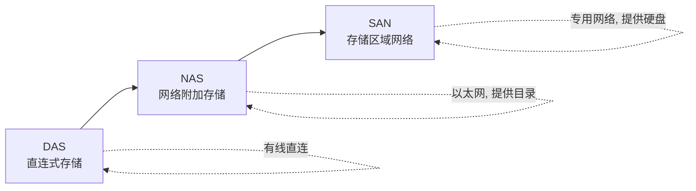
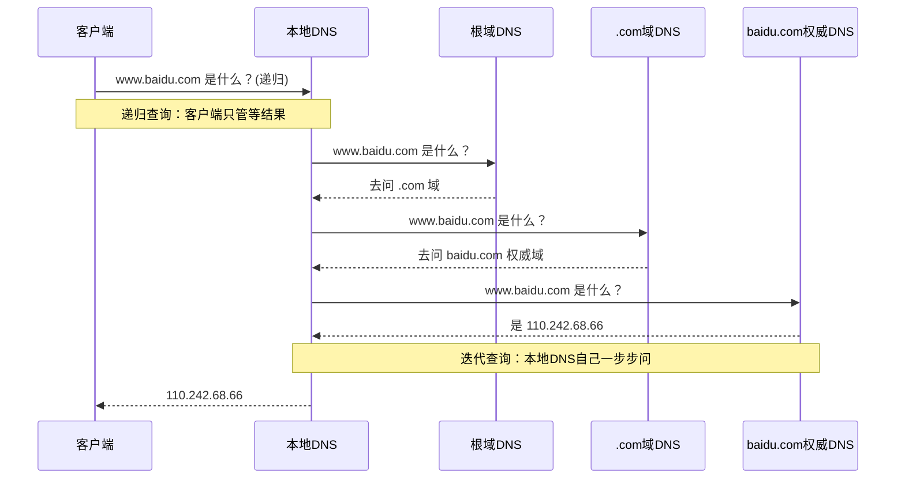

# 共享存储

## 存储设备

存储设备：**plus 版本的服务器设备**

所以存储设备实际上就是**拥有大容量存储的服务器**。

存储设备构成：分为 **2 个控制器**，1 个控制器有 1 个主板。

> [!info] 这里专门指的是**专业的存储设备**


> [!tip] 补充
> 我们也可以把一个**普通操作系统主机**当作存储设备 —— 只要它能对外提供共享存储服务（NFS/Samba/iSCSI）。

---

## 存储的发展历史



### DAS — 直连式存储

**DAS**（Direct Attached Storage 直连式存储），通过**有线介质**连接服务器和存储设备。

比如直接挂个外接硬盘、挂个U盘...


如果使用的是 DAS 存储，最终在物理服务器上看到的其实就是**多出来一块硬盘**，你需要进行分区格式化才能使用。

| 优点 | 缺点 |
| :--- | :--- |
| 可以给服务器设备提供更多的**存储资源** | 实现**共享**的时候极其不方便 |

### NAS — 网络附加存储

**NAS**（Network Attached Storage 网络附加存储），通过**网络**连接服务器和存储设备。

解决了 DAS 的两个问题：

- 解决了**距离**上的问题
- 解决了 DAS 的**共享**问题 —— 提供的是一个**共享目录**，在服务器设备上看到的就是一个目录，直接使用
- 走的是 **NFS 协议**或者 **CIFS 协议**


> [!example] 举一反三
> 现在我使用 Windows 实现目录共享，你们可以通过网络访问到这个共享目录。
>
> 那么我的 Windows 主机**也可以叫做存储设备**，在这里也可以叫做 **NAS 存储**。

### SAN — 存储区域网络

**SAN**（Storage Area Network 存储区域网络），在服务器设备和存储设备之间**构建了一套网络**，本质上还是通过网络进行连接的。

| 类型 | 通过网络提供的东西 |
| :--- | :--- |
| **NAS** | 提供的是一个**共享目录** |
| **SAN** | 提供的是一个**硬盘** |


根据中间的网络设备的不同，还可以分为 **IP-SAN** 和 **FC-SAN**：

| 类型 | 网络设备 | 传输介质 | 协议 | 成本/速度 |
| :--- | :--- | :--- | :--- | :--- |
| **IP-SAN** | 普通交换机 | 普通网线 | **iSCSI 协议** | 成本低，速度较慢 |
| **FC-SAN** | 光纤交换机 | 光纤 | **FC 协议** | 成本高，速度极快 |

---

## 存储资源使用的三种形态

### 1. 块存储（Block Storage）

- 在主机上看到的是**一个硬盘**
- 要想使用存储空间必须要进行**分区、格式化、挂载**使用
- **DAS 和 SAN** 提供的都是块存储资源 ——> 硬盘

### 2. 文件系统存储（File Storage）

- 在主机上看到的就是**一个共享目录**
- 主机直接挂载使用
- **NAS** 存储提供的就是文件系统存储资源 ——> 共享目录

### 3. 对象存储（Object Storage）

- 无法直接给主机提供存储资源，对外提供的是一个 **HTTP 地址**
- 通过这个 HTTP 地址可以实现**上传文件和下载文件**
- 默认情况下仅支持 HTTP，无法直接像块存储或者文件系统存储那样，直接在本地使用
- 但是现在的对象存储，可以借助**第三方开源工具或软件**，将其对象存储空间**映射到本机上作为一个目录**的存在

> [!tip] 三种存储对比
> | 类型 | 主机视角 | 代表技术 | 典型场景 |
> | :--- | :--- | :--- | :--- |
> | 块存储 | 硬盘 | DAS / SAN / iSCSI | 数据库、虚拟机磁盘 |
> | 文件存储 | 共享目录 | NAS / NFS / CIFS | 网站静态资源、部门共享盘 |
> | 对象存储 | HTTP 地址 | S3 / OSS / MinIO | 图片、视频、备份归档 |

---

## NFS 和 CIFS

NAS 存储实现方式：

- 通过 **NFS** 实现：通常使用在 Linux 和 Linux 之间，以及 Linux 和 Unix 之间
  - `nfs-server` 软件实现
- 通过 **CIFS** 实现：通常使用在 Windows 和 Windows 之间
  - `samba` 软件实现

> [!info] 现在时代
> Windows 和 Linux 之间**既可以使用 NFS 也可以使用 CIFS** 实现共享。
>
> **场景**：公司内部的 Linux 主机充当存储设备，部门资源文件全部共享，员工电脑是 Windows 系统，都想要访问 Linux 主机上的这个共享目录 —> **CIFS、NFS**

---

## NFS（Network File System 网络文件系统）


### 服务端操作

#### 1. 安装 nfs-utils 软件包

目的是为了将本机上的目录通过 NFS 共享出去。

```bash
[root@nas-storage ~]# yum install nfs-utils -y
Last metadata expiration check: 17:39:35 ago on Mon 21 Sep 2026 04:35:40 PM CST.
Package nfs-utils-1:2.3.3-41.el8.x86_64 is already installed.
Dependencies resolved.
Nothing to do.
Complete!
```

#### 2. 创建目录，修改 NFS 配置文件

配置文件：`/etc/exports`

```bash
[root@nas-storage ~]# ls -l /etc/exports
-rw-r--r--. 1 root root 0 Sep 10  2018 /etc/exports
[root@nas-storage ~]# cat /etc/exports
/opt 192.168.200.0/24(rw)
```

**格式**：

```text
将哪个目录共享出去  允许哪些客户端访问共享目录(共享选项)

  *                  → 允许所有人
  xxx.xxx.xxx.0/24   → 允许指定子网的IP
  xxx.xxx.xxx.xxx/32 → 允许指定IP
```

#### 3. 关闭防火墙和 SELinux

```bash
[root@nas-storage ~]# systemctl stop firewalld
[root@nas-storage ~]# setenforce 0
```

#### 4. 启动 NFS 服务

```bash
[root@nas-storage ~]# systemctl start nfs-server
```

### 客户端操作

#### 1. 安装 nfs-utils

客户端安装软件包的目的是为了**支持 NFS 协议**，这样客户端才能正常访问和使用。

#### 2. 挂载 NFS 共享目录

```bash
[root@client ~]# mount -t nfs 192.168.200.137:/opt /mnt/

[root@client ~]# df -Th
Filesystem           Type      Size  Used Avail Use% Mounted on
devtmpfs             devtmpfs  948M     0  948M   0% /dev
tmpfs                tmpfs     976M     0  976M   0% /dev/shm
tmpfs                tmpfs     976M   26M  951M   3% /run
tmpfs                tmpfs     976M     0  976M   0% /sys/fs/cgroup
/dev/sda3            xfs        48G  4.7G   43G  10% /
/dev/sda1            xfs       507M  214M  294M  43% /boot
tmpfs                tmpfs     196M  4.6M  191M   3% /run/user/0
/dev/sr0             iso9660   9.3G  9.3G     0 100% /run/media/root/Rocky-8-4-x86_64-dvd
192.168.200.137:/opt nfs4       48G  5.0G   43G  11% /mnt
```

### 挂载失败排错


如果报错的信息是上面的信息，根据以下几个方式进行排查：

> [!warning] 挂载失败排查三板斧
> 1. 是不是客户端**不支持 NFS** —— 说明没有安装 `nfs-utils` 软件包
> 2. 是不是对端 NFS 服务端**压根没有这个共享目录**
> 3. 是不是对端主机**没有启动 NFS 服务**或者**防火墙没有关闭**

### showmount — 查看服务端共享目录

**问题**：如果 NFS 服务端没有告诉我它哪个目录是共享目录，那我的客户端怎么挂载呢？

```bash
[root@client ~]# showmount -e 192.168.200.137
Export list for 192.168.200.137:
/opt 192.168.200.0/24
```

> [!info] showmount
> `showmount` 命令是来自于 `nfs-utils` 软件包的。
>
> - `-e` — 显示服务端的导出（共享）列表
> - `-a` — 显示所有已挂载的客户端

### 写入失败排错


发现报错 **permission denied**：权限拒绝。

> [!warning] 客户端写文件无法写入的排查
> 1. 先看看你的客户端挂载的时候是不是**只读挂载**？
> 2. 报错是 `permission denied`，说明是**对端服务端的共享目录没有 w 权限**
> 3. 报错是 `read only filesystem`，说明是**对端主机共享目录的共享选项是 ro**

### exportfs — NFS 服务端常用命令

```bash
[root@nas-storage ~]# exportfs -v
/opt            192.168.200.0/24(sync,wdelay,hide,no_subtree_check,sec=sys,rw,secure,root_squash,no_all_squash)
/media          */24(sync,wdelay,hide,no_subtree_check,sec=sys,rw,secure,root_squash,no_all_squash)

[root@nas-storage ~]# exportfs -a
[root@nas-storage ~]# exportfs -av
exporting 192.168.200.0/24:/opt
exporting */24:/media

# 修改配置文件之后，常见的方式就是重启 nfs-server 服务才会生效，你也可以使用 exportfs -r 来生效
[root@nas-storage ~]# exportfs -r
```

| 参数 | 作用 |
| :--- | :--- |
| `exportfs -v` | 查看已生效的共享目录及其共享选项 |
| `exportfs -a` | 导出所有 `/etc/exports` 中的目录 |
| `exportfs -av` | 导出所有并显示详细信息 |
| `exportfs -r` | **重新加载配置**（不用重启服务） |
| `exportfs -u` | 取消导出 |

### root_squash 机制


我发现，客户端 root 用户去写文件的时候，最终看到的 **UID 和 GID 都是 65534**。

而且在服务端看到的文件的拥有人和拥有组也是 **65534**。

说明 —> **客户端 root 用户访问共享目录的时候，其实会映射为服务端的 65534 用户进行访问**。


> [!important] root_squash
> **root_squash**：打压客户端 root 用户，将其客户端的 root 用户映射为服务端的 **UID 65534** 的用户（即 `nobody`）。
>
> 这是 NFS 的**安全机制** —— 防止客户端 root 用户以 root 身份任意操作服务端文件。

### 客户端永久挂载

```bash
[root@localhost ~]# vim /etc/fstab
[root@localhost ~]# mount -a
[root@localhost ~]# cat /etc/fstab

#
# /etc/fstab
#
UUID=9fffc28c-7b12-4d51-b508-8993c67a6012 /                       xfs     defaults        0 0
UUID=2cf586a1-ed30-4131-a81a-a323c482d424 /boot                   xfs     defaults        0 0
UUID=d4a275a9-bb0d-4a1c-bb3b-6da25414b649 none                    swap    defaults        0 0
192.168.200.137:/opt    /mnt    nfs     defaults 0 0
```

> [!tip] NFS 不需要 `_netdev`
> NFS 挂载**不需要**加 `_netdev` 参数，而 CIFS 需要。原因见下文 CIFS 部分。

### NFS 共享选项详解

```bash
[root@nas-storage ~]# cat /etc/exports
/opt 192.168.200.0/24(rw,no_root_squash)
/media */24(rw)
```

查看已经生效的共享目录的共享选项：

```bash
[root@nas-storage ~]# exportfs -v
/opt            192.168.200.143/32(sync,wdelay,hide,no_subtree_check,sec=sys,rw,secure,no_root_squash,no_all_squash)
/media          */24(sync,wdelay,hide,no_subtree_check,sec=sys,rw,secure,root_squash,no_all_squash)
```

**选项说明**：

| 选项 | 说明 |
| :--- | :--- |
| `async` | **异步模式** —> 写的数据先写到内存中，然后从内存中落盘磁盘里面（追求高的写性能，**允许一定的数据丢失**） |
| `sync` | **同步模式** —> 直接写入到磁盘中（好处在于**数据一致性**，坏处在于写性能较差） |
| `sec=sys` | 支持 rwx **基本权限** |
| `rw` | **读写**方式共享 |
| `ro` | **只读**方式共享 |
| `root_squash` | **打压客户端的 root**，将其 root 用户映射为服务端的 nobody（uid 为 65534）的用户 |
| `no_root_squash` | **不打压**客户端的 root |
| `no_all_squash` | **不打压客户端的普通用户**，将其普通用户映射为服务端相同 UID 的用户 |
| `all_squash` | **打压客户端的普通用户**，将其普通用户映射为服务端的 nobody（uid 为 65534）的用户 |

> [!info] secure / insecure
> - `secure`（默认）— 要求 NFS 客户端使用**小于 1024** 的端口（特权端口）
> - `insecure` — 允许使用大于 1024 的端口（某些客户端需要）

### 网站业务场景

网站业务场景，底层的存储挂的是一个 **NFS 共享存储**，保证上层网站服务器的**网页文件一致**。


> [!tip] 为什么网站要用 NFS
> 多台 Web 服务器负载均衡时，用户上传的图片/文件如果只存在某一台上，其他机器就访问不到。
> 把上传目录统一放到 NFS 共享存储上，**所有 Web 服务器看到的都是同一份文件**。

---

## CIFS（Samba）

**CIFS** 是一个协议，支持共享的。如果 Linux 主机想要通过 CIFS 实现目录共享，安装一个软件包叫做 **samba**。

### samba 和 nfs 的区别

| 对比 | NFS | Samba（CIFS） |
| :--- | :--- | :--- |
| 默认认证 | 默认**无需认证**（基于 IP/主机） | 默认**需要用户认证** |
| 匿名访问 | 支持 | **支持**（需配置） |
| 细粒度权限 | 相对粗 | **可针对共享目录设置不同用户的访问权限** |

> [!info] 命名对照
> - 软件包名：**samba**
> - 协议名字：**cifs**
> - 客户端挂载时识别的文件系统类型：**cifs**

### 服务端配置

```bash
[root@nas-storage ~]# yum install samba -y
```

**需求**：通过 CIFS 共享 `/data` 目录，允许 zhangsan 进行读写访问。

```bash
[root@nas-storage ~]# tail -5 /etc/samba/smb.conf

[share1]               # 客户端看到的目录的名字
        path = /data   # 实际上的目录
        read only = No # 是否只读。no 表示可以读写，yes 表示只读
        browseable = yes # 是否可以在目录下看到这个共享目录
        public = yes   # 匿名用户是否可以访问

# 添加一个 zhangsan 的 samba 用户
[root@nas-storage ~]# smbpasswd -a zhangsan
New SMB password:
Retype new SMB password:
Added user zhangsan.

[root@nas-storage ~]# mkdir /data
[root@nas-storage ~]# chmod 777 /data
[root@nas-storage ~]# ls -ld /data/
drwxrwxrwx. 2 root root 6 Sep 22 11:20 /data/

[root@nas-storage ~]# systemctl start smb
```

> [!warning] samba 用户必须先有系统用户
> `smbpasswd -a zhangsan` 之前，系统里必须**已经存在** `zhangsan` 这个 Linux 用户（用 `useradd` 创建）。
> samba 的密码库是**独立的**，和系统密码不通用。

### Windows 访问 Samba 共享


在 Windows 资源管理器地址栏输入 `\\192.168.200.137\share1` 即可访问。

### Linux 客户端访问

```bash
# 安装 cifs-utils —— 目的是让客户端可以识别和挂载 samba 共享目录
[root@client ~]# yum install cifs-utils -y

# 安装 samba-client —— 目的是得到 smbclient 命令
[root@client ~]# yum install samba-client -y
```

**smbclient — 查看 samba 服务端有哪些共享目录**：

```bash
[root@client ~]# smbclient -L //192.168.200.137 -U zhangsan
Enter SAMBA\zhangsan's password:

        Sharename       Type      Comment
        ---------       ----      -------
        print$          Disk      Printer Drivers
        share1          Disk      samba共享目录
        IPC$            IPC       IPC Service (Samba 4.13.3)
        zhangsan        Disk      Home Directories
SMB1 disabled -- no workgroup available
```

| 软件包 | 作用 |
| :--- | :--- |
| `cifs-utils` | 提供 CIFS 文件系统支持，**能挂载** |
| `samba-client` | 提供 `smbclient` 命令，**能浏览**共享列表 |

**挂载 samba 共享目录**：

```bash
[root@client ~]# mount -t cifs //192.168.200.137/share1 /media/ -o username=zhangsan
Password for zhangsan@//192.168.200.137/share1:  *
```

**永久挂载**：

```text
//192.168.200.137/share1 /media cifs defaults,username=zhangsan,password=1,_netdev 0 0
```

> [!tip] 参数说明
> - `username=zhangsan,password=1` —— 挂载的时候指定的 samba 用户和密码
> - **`_netdev`** —— 表示这是一个**网络设备/网络文件系统**，必须要**等待先启动网络再挂载**这个文件系统
> - ⚠️ **NFS 是不需要添加 `_netdev` 的**（systemd 会自动识别 NFS 类型）

### Samba 匿名用户配置

修改 `/etc/samba/smb.conf` 的 `[global]` 段：

```ini
[global]
        workgroup = SAMBA
        security = user

        passdb backend = tdbsam
        map to guest = bad user   --->开启匿名用户访问
        netbios name = samba linux server
        printing = cups
        printcap name = cups
        load printers = yes
        cups options = raw
```


> [!info] map to guest = bad user
> 把**认证失败的用户**当作 guest（匿名用户）处理 —— 这样不需要密码也能访问 `public = yes` 的共享目录。

### 不同用户不同权限

**需求**：允许 user1 进行读写，允许 user2 只读 samba 共享目录。

```bash
[root@nas-storage ~]# useradd user1
[root@nas-storage ~]# useradd user2
[root@nas-storage ~]# smbpasswd -a user1
New SMB password:
Retype new SMB password:
Added user user1.
[root@nas-storage ~]# smbpasswd -a user2
New SMB password:
Retype new SMB password:
Added user user2.

# 列出所有 samba 用户
[root@nas-storage ~]# pdbedit -L
zhangsan:1001:
user2:1003:
user1:1002:
```

配置文件：

```bash
[root@nas-storage ~]# tail -n 7 /etc/samba/smb.conf
[share1]
        comment = samba共享目录
        path = /data
        write list = user1      # 白名单：只有 user1 可写
        read only = yes         # 默认只读
        browseable = yes
        public = yes
```

验证：user2 只读，user1 可写。

```bash
# 通过 user2 用户进行访问，发现无法写文件
[root@localhost ~]# mount -t cifs //192.168.200.137/share1 /media -o username=user2
Password for user2@//192.168.200.137/share1:  *
[root@localhost ~]# ls /media/
123.txt  file1  file3
[root@localhost ~]# touch /media/file4
touch: cannot touch '/media/file4': Permission denied

# 通过 user1 用户进行访问，发现可以写文件
[root@client ~]# mount -t cifs //192.168.200.137/share1 /media -o username=user1
Password for user1@//192.168.200.137/share1:  *
[root@client ~]# cd /media/
[root@client media]# ls
123.txt  file1
[root@client media]# touch file3
[root@client media]# ls
123.txt  file1  file3
```

> [!tip] samba 权限关键参数
> | 参数 | 作用 |
> | :--- | :--- |
> | `write list = user1` | **写白名单**，列表内用户可写 |
> | `read only = yes/no` | 全局只读开关 |
> | `valid users = a,b` | **访问白名单**，只有列出的用户能访问 |
> | `invalid users = c` | 访问黑名单 |
> | `browseable` | 是否在网络邻居中可见 |
> | `public` / `guest ok` | 是否允许匿名访问 |
> | `create mask` / `directory mask` | 新建文件/目录的权限掩码 |

---

# DNS 服务

## DNS 基础概念

**DNS**：域名解析系统，主要做域名解析的。

- **正向解析**：将**域名/主机名**解析为 **IP 地址**
- **反向解析**：将 **IP 地址**解析为**域名/主机名**

```text
www.example.com  域名  —>  192.168.200.100  IPv4地址
```

> [!info] 主机名 vs 域名
> 真正的主机名可能叫做 `abc.yutianedu.com`

### 本地解析

最早的解析方式 —— `/etc/hosts` 文件：

```bash
[root@localhost ~]# cat /etc/hosts
127.0.0.1   localhost localhost.localdomain localhost4 localhost4.localdomain4
::1         localhost localhost.localdomain localhost6 localhost6.localdomain6
192.168.200.137 nas-storage nfs-storage samba-storage
```

### 完整的域名解析过程

`https://www.baidu.com/`

浏览器输入上面的网址，中间经过了哪些过程，最终才看到网页？


涉及的几个角色：

| 角色 | 说明 |
| :--- | :--- |
| **本地 DNS** | 你的 DNS 服务器（电信/阿里/自建） |
| **根域 DNS** | 最顶层，`.` 根域 |
| **顶级域 DNS** | TLD，如 `.com`、`.cn` |
| **权威域 DNS** | 谁帮你解析的，谁就是权威域 DNS |

> [!info] 权威应答 vs 非权威应答
> **权威域 DNS**：谁帮你解析的，谁就是权威域 DNS。
>
> 如果是**别人解析的**，然后返回给你的本地 DNS 服务器，然后你的本地 DNS 服务器再返回给你，你看到的就是**非权威应答**。

DNS 架构呈现的是**分层架构**，一级一级的分层架构，最上一层是**根域 DNS 服务器（根域）**。

> [!tip] 域名的完整写法
> `www.baidu.com` 实际上完整的写法是 **`www.baidu.com.`**（最后有一个点，代表根域）


## 递归查询 vs 迭代查询

### 递归查询

**递归查询**：是发生在**客户端和本地 DNS 服务器之间**的。

其实就是**委托别人干活**。我客户端要解析 `www.baidu.com`，我把这个解析请求丢给本地 DNS，后续都是本地 DNS 去做的。

我干嘛呢？我就**等着**本地 DNS 给我返回信息，要么就返回解析 OK，要么就返回解析失败。

### 迭代查询

**迭代查询**：是发生在**本地 DNS 服务器和其他 DNS 服务器之间**的。

其实就是**根据别人的信息，每次都是自己去干活**。

通过迭代查询，本地 DNS 知道客户端要解析什么域名，但是我不知道啊，我就找**根域**，然后根域告诉我你应该去找 **.com 域**，然后我去找 .com 域，.com 域又告诉我你应该去找 **.baidu.com 域**，然后我又去找 .baidu.com 域，最终找到了这个解析记录。



> [!tip] 一句话记忆
> **递归** = 委托别人（我等着）
> **迭代** = 自己一步步问（我知道下一步问谁）

## 实现 DNS 的软件

实现 DNS 可以借助一个叫做 **bind** 的软件，bind 软件是实现 DNS 主流的软件。

---

## 案例：自建一个本地 DNS 服务器

本地 DNS 服务器可以实现**正向解析和反向解析**。

**需求**：

正向解析，解析 `.lab999.com` 域名

- `www.lab999.com` —> `192.168.200.100`
- `mail.lab999.com` —> `192.168.200.101`

反向解析，解析 `192.168.200.0` 子网

- `192.168.200.100` —> `www.lab999.com`
- `192.168.200.101` —> `mail.lab999.com`

### 1. 安装 bind 软件包

```bash
[root@nas-storage ~]# yum install bind -y
```

### 2. 修改 bind 主配置文件

`/etc/named.conf`

```nginx
options {
        listen-on port 53 { any; }; ##修改为any，允许所有人访问我
        listen-on-v6 port 53 { ::1; };
        directory       "/var/named";
        dump-file       "/var/named/data/cache_dump.db";
        statistics-file "/var/named/data/named_stats.txt";
        memstatistics-file "/var/named/data/named_mem_stats.txt";
        secroots-file   "/var/named/data/named.secroots";
        recursing-file  "/var/named/data/named.recursing";
        allow-query     { any; }; ##修改为any，允许所有人向我查询

        recursion yes;

        dnssec-enable yes;
        dnssec-validation yes;

        managed-keys-directory "/var/named/dynamic";

        pid-file "/run/named/named.pid";
        session-keyfile "/run/named/session.key";

        include "/etc/crypto-policies/back-ends/bind.config";
};

logging {
        channel default_debug {
                file "data/named.run";
                severity dynamic;
        };
};

zone "." IN {
        type hint;
        file "named.ca";
};

include "/etc/named.rfc1912.zones";   ## 这个配置文件中记录了当前DNS的域有哪些
include "/etc/named.root.key";
```

> [!important] 两处必改
> - `listen-on port 53 { any; }` — 允许**所有人访问**我（默认只监听 127.0.0.1）
> - `allow-query { any; }` — 允许**所有人向我查询**

### 3. 修改区域配置文件

`/etc/named.rfc1912.zones` 也可以叫做**区域配置文件**，此文件中定义了当前 DNS 的域有哪些，并且也定义了这些域对应的**正向解析配置文件**和**反向解析配置文件**的位置。

```text
zone "localhost.localdomain" IN {
        type master;
        file "named.localhost";
        allow-update { none; };
};

zone "localhost" IN {
        type master;
        file "named.localhost";
        allow-update { none; };
};

zone "1.0.0.0.0.0.0.0.0.0.0.0.0.0.0.0.0.0.0.0.0.0.0.0.0.0.0.0.0.0.0.0.ip6.arpa" IN {
        type master;
        file "named.loopback";
        allow-update { none; };
};

zone "1.0.0.127.in-addr.arpa" IN {
        type master;
        file "named.loopback";
        allow-update { none; };
};

zone "0.in-addr.arpa" IN {
        type master;
        file "named.empty";
        allow-update { none; };
};
```

**新增自己的域**：

```text
//lab999.com的域，正向解析的配置
zone "lab999.com" IN {
        type master;
        file "lab999.com";
        allow-update { none; };
};

//反向解析的配置 192.168.200.0/24
zone "200.168.192.in-addr.arpa" IN {
        type master;
        file "200.168.192.in-addr.arpa";
        allow-update { none; };
};
```

> [!tip] 反向解析的域名怎么来的？
> `192.168.200.0/24` —> 把网段**倒过来写**，去掉最后的 0，再加上 `.in-addr.arpa`
>
> `192.168.200` → 倒序 → `200.168.192` → 拼接 → **`200.168.192.in-addr.arpa`**

### 4. 创建正向/反向解析配置文件

这些配置文件就定义了**解析记录**。

#### 正向解析配置模板

```text
$TTL 1D  # dns解析记录的缓存时间，单位是1天
@       IN SOA  @ rname.invalid. (    # 授权起始记录配置，定义dns的管理员邮箱是哪个、管理员是谁
                                        0       ; serial  #序列号，每一次主dns更新配置之后，从dns会跟据这个序列号来决定是否要拉取主dns的配置
                                        1D      ; refresh #从dns向主dns同步的间隔时间
                                        1H      ; retry   #从dns同步主dns配置失败了，经过多久再重试
                                        1W      ; expire  #过期时间。。TTL缓存时间
                                        3H )    ; minimum # 从dns如果解析失败，缓存失败记录的时间
        NS      @       # NS解析记录类型，指定的是DNS服务器的地址
        A       127.0.0.1  # A解析记录类型，将主机名/域名解析为ipv4地址
        AAAA    ::1  #  AAAA解析记录类型，将主机名/域名解析为ipv6地址
                    # CNAME解析记录类型，将域名解析为另一个名字 别名
                    # MX解析记录类型，指定的是邮件服务器的地址
                    # TXT解析记录类型，判断网站是你个人的
                    # PTR解析记录类型，反向解析，将IP地址解析为主机名/域名
```

**拷贝一个正向解析的配置模板并修改**：

```bash
[root@nas-storage named]# cp -a named.localhost lab999.com
[root@nas-storage named]# cat lab999.com
$TTL 1D
@       IN SOA  dns.lab999.com. admin.lab999.com. (
                                        0       ; serial
                                        1D      ; refresh
                                        1H      ; retry
                                        1W      ; expire
                                        3H )    ; minimum
        NS      dns.lab999.com.
        A       127.0.0.1
        AAAA    ::1
dns     A       192.168.200.137
www     A       192.168.200.100
mail    A       192.168.200.101
```

#### 反向解析配置

```bash
[root@nas-storage named]# cp -a named.loopback 200.168.192.in-addr.arpa
[root@nas-storage named]# cat 200.168.192.in-addr.arpa
$TTL 1D
@       IN SOA  dns.lab999.com. admin.lab999.com. (
                                        0       ; serial
                                        1D      ; refresh
                                        1H      ; retry
                                        1W      ; expire
                                        3H )    ; minimum
        NS      dns.lab999.com.
100 PTR www.lab999.com.
101 PTR mail.lab999.com.
```

> [!tip] SOA 记录五个时间参数
> | 参数 | 含义 | 常用值 |
> | :--- | :--- | :--- |
> | serial | **序列号** —— 主 DNS 更新后 +1，从 DNS 靠它判断是否要同步 | 数字，越大越新 |
> | refresh | 从 DNS 向主 DNS **同步的间隔** | 1D |
> | retry | 同步失败后**重试间隔** | 1H |
> | expire | **过期时间** —— 超过后从 DNS 认为记录不可用 | 1W |
> | minimum | **否定缓存时间** —— 解析失败记录的缓存时长 | 3H |

### 5. 关闭防火墙和 SELinux，启动 named 服务

```bash
[root@nas-storage named]# systemctl stop firewalld
[root@nas-storage named]# setenforce 0
[root@nas-storage named]# systemctl start named
```

### 6. 客户端测试

```bash
[root@localhost ~]# vim /etc/resolv.conf
[root@localhost ~]# nslookup www.lab999.com
Server:         192.168.200.137
Address:        192.168.200.137#53

Name:   www.lab999.com
Address: 192.168.200.100

[root@localhost ~]# nslookup mail.lab999.com
Server:         192.168.200.137
Address:        192.168.200.137#53

Name:   mail.lab999.com
Address: 192.168.200.101

# 反向解析测试
[root@localhost ~]# nslookup 192.168.200.100
100.200.168.192.in-addr.arpa    name = www.lab999.com.

[root@localhost ~]# nslookup 192.168.200.101
101.200.168.192.in-addr.arpa    name = mail.lab999.com.
```

---

## 检查 DNS 配置文件

### named-checkconf — 检查主配置文件语法

```bash
[root@nas-storage ~]# named-checkconf
[root@nas-storage ~]# vim /etc/named.conf
[root@nas-storage ~]# named-checkconf
/etc/named.conf:13: missing ';' before 'directory'
```

> [!tip] 好用
> 报错会**精确指出行号和问题**（如 `13:` 行的 `directory` 前少了分号），排查效率极高。

### named-checkzone — 检查区域文件语法

```bash
[root@nas-storage ~]# named-checkzone lab999.com /var/named/lab999.com
zone lab999.com/IN: loaded serial 0
OK
```

| 命令 | 检查对象 |
| :--- | :--- |
| `named-checkconf` | `/etc/named.conf` 主配置 |
| `named-checkzone 域名 区域文件` | 区域（正/反向解析）文件 |

---

## 主从 DNS / 辅助 DNS

**从 DNS** 会同步主 DNS 的区域配置文件 —— `/var/named/` 目录下的那些正向解析和反向解析的区域配置文件。

同步过来之后**无法直接通过文本查看工具查看**，它是一个数据文件，简单来说就是**二进制**。

在从 DNS 上**无法修改**同步过来的配置文件的，因为你压根就看不到有什么东西。

### 从 DNS 配置

#### 1. 安装 bind 软件包

```bash
[root@localhost ~]# yum install bind -y
```

#### 2. 修改 /etc/named.conf 配置文件

```bash
[root@localhost ~]# vim /etc/named.conf

options {
        listen-on port 53 { any; };  #--->这些需要修改，因为客户端可能也会使用你从dns的解析
        listen-on-v6 port 53 { ::1; };
        directory       "/var/named";
        dump-file       "/var/named/data/cache_dump.db";
        statistics-file "/var/named/data/named_stats.txt";
        memstatistics-file "/var/named/data/named_mem_stats.txt";
        secroots-file   "/var/named/data/named.secroots";
        recursing-file  "/var/named/data/named.recursing";
        allow-query     { any; }; #--->这些需要修改，因为客户端可能也会使用你从dns的解析
        ....
```

#### 3. 修改 /etc/named.rfc1912.zones 文件

```nginx
[root@localhost ~]# vim /etc/named.rfc1912.zones

//lab999.com的域，正向解析的配置
zone "lab999.com" IN {
        type slave;                ###slave 是从 dns 配置
        file "slaves/lab999.com";  # 同步过来的配置文件存放到哪里
        masters { 192.168.200.137;}; # 向哪一个 DNS 同步
};

//反向解析的配置 192.168.200.0/24
zone "200.168.192.in-addr.arpa" IN {
        type slave;
        file "slaves/200.168.192.in-addr.arpa";
        masters { 192.168.200.137;};
};
```

> [!info] 主从对比
> | 项 | 主 DNS（master） | 从 DNS（slave） |
> | :--- | :--- | :--- |
> | 区域类型 | `type master` | `type slave` |
> | 配置来源 | 自己写 | 从 master 同步 |
> | 存放位置 | `/var/named/` | `/var/named/slaves/` |
> | 指定对方 | `allow-update` | **`masters { IP; }`** |
> | 文件可读性 | 文本可读 | **二进制，不可直接查看** |
> | 能否修改 | 能 | **不能** |

#### 4. 重启 named 服务

```bash
[root@localhost ~]# systemctl restart named

[root@localhost ~]# ls -l /var/named/slaves/
total 8
-rw-r--r--. 1 named named 327 Sep 22 15:37 200.168.192.in-addr.arpa
-rw-r--r--. 1 named named 377 Sep 22 15:37 lab999.com
```

---

## 转发 DNS

所谓的**转发 DNS**，就是这个 DNS 服务器**不做解析，只做转发**。

### 1. 开启转发功能

修改 `/etc/named.conf` 配置文件：

```text
forward first/only

first：优先转发给其他的dns，如果其他的dns不能解析，那么我就按照自己的解析流程去解析
only ：仅转发，如果其他的dns不能解析 --> 返回无法解析
```

```nginx
forwarders { dns地址 }
```

```nginx
        forward only;
        forwarders  { 223.5.5.5;};
```

### 2. 关闭 DNSSEC 认证

**如果开启转发，记得关闭认证**：

```nginx
        dnssec-enable no;
        dnssec-validation no;
```

> [!warning] 为什么要关 dnssec
> 转发模式下，DNSSEC 校验会因为**无法验证签名链**而导致解析失败。所以转发 DNS 必须关闭 `dnssec-enable` 和 `dnssec-validation`。

---

# 补充：本篇核心知识点速查

## 存储类型对比

| 类型 | 主机看到 | 协议 | 典型软件 | 跨平台 |
| :--- | :--- | :--- | :--- | :--- |
| **DAS** | 硬盘 | — | — | — |
| **NAS** | 共享目录 | NFS / CIFS | nfs-utils / samba | NFS: Linux系，CIFS: Windows系 |
| **SAN** | 硬盘 | iSCSI / FC | targetcli / 光纤卡 | — |
| **对象存储** | HTTP 地址 | S3 兼容 API | MinIO / OSS | 全平台 |

## NFS vs Samba 关键差异

| 维度 | NFS | Samba |
| :--- | :--- | :--- |
| 默认认证 | 无（基于 IP） | 需要用户名密码 |
| 权限映射 | `root_squash` 映射为 65534 | samba 用户独立密码库 |
| `/etc/fstab` | 不需要 `_netdev` | **需要 `_netdev`** |
| 客户端包 | `nfs-utils` | `cifs-utils`（挂载）+ `samba-client`（浏览） |
| 配置文件 | `/etc/exports` | `/etc/samba/smb.conf` |
| 生效方式 | `exportfs -r` 或重启 | 重启 `smb` |

## DNS 常用记录类型

| 类型 | 全称 | 作用 | 示例 |
| :--- | :--- | :--- | :--- |
| **A** | Address | 域名 → IPv4 | `www A 192.168.200.100` |
| **AAAA** | Quad-A | 域名 → IPv6 | `www AAAA fe80::1` |
| **CNAME** | Canonical Name | 域名 → 另一个域名（别名） | `ftp CNAME www` |
| **MX** | Mail Exchanger | 邮件服务器地址 | `@ MX 10 mail` |
| **NS** | Name Server | 指定 DNS 服务器 | `@ NS dns.lab999.com.` |
| **PTR** | Pointer | IP → 域名（反向解析） | `100 PTR www.lab999.com.` |
| **TXT** | Text | 文本记录（域名验证、SPF） | `@ TXT "v=spf1 ..."` |
| **SOA** | Start of Authority | 授权起始记录（必需） | 见区域文件头部 |

## DNS 关键文件与命令

| 项目 | 路径 / 命令 |
| :--- | :--- |
| 主配置文件 | `/etc/named.conf` |
| 区域配置文件 | `/etc/named.rfc1912.zones` |
| 区域数据文件目录 | `/var/named/` |
| 从 DNS 同步目录 | `/var/named/slaves/` |
| 端口 | **53（UDP 查询 / TCP 区域传送）** |
| 客户端 DNS 配置 | `/etc/resolv.conf` |
| 服务名 | `named`（RHEL 系）/ `bind9`（Debian 系） |
| 语法检查 | `named-checkconf` / `named-checkzone` |
| 查询测试 | `nslookup` / `dig` / `host` |

## 排错思路

> [!tip] NFS 挂载失败
> 1. 客户端装了 `nfs-utils` 吗？
> 2. 服务端真的有这个共享目录吗？（`showmount -e`）
> 3. 服务端 nfs-server 起了吗？防火墙关了吗？
> 4. 能挂载但写不了？→ 看挂载是否 ro、共享选项是否 rw

> [!tip] DNS 解析失败
> 1. `named-checkconf` 检查主配置语法
> 2. `named-checkzone 域名 文件` 检查区域文件语法
> 3. `listen-on` 和 `allow-query` 是否改成 `any`
> 4. 防火墙 / SELinux 是否关闭
> 5. 服务是否启动：`systemctl status named`
> 6. 客户端 `/etc/resolv.conf` 是否指向正确
