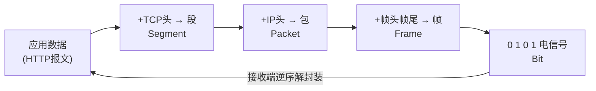
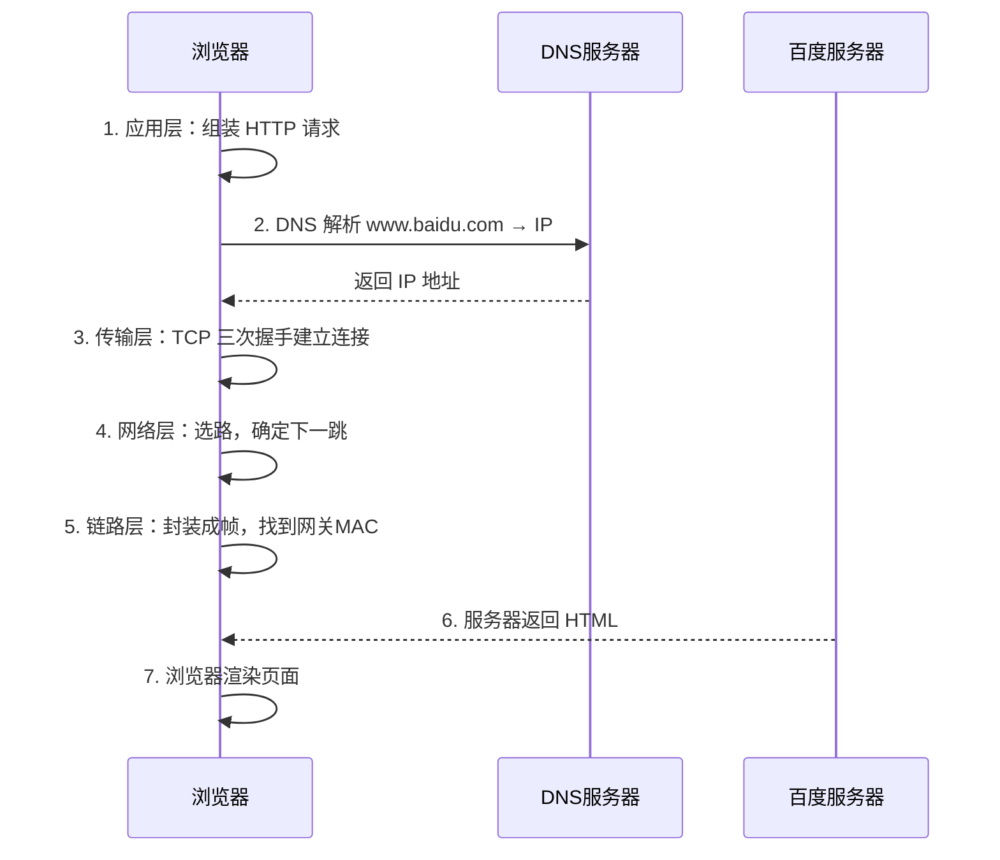
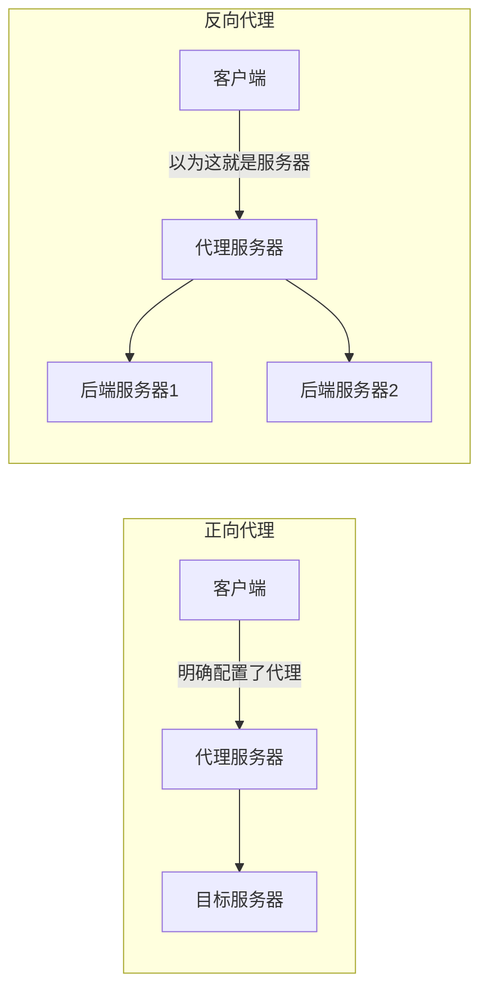

# Web 基础

## 核心概念速览

| 概念 | 说明 |
| :--- | :--- |
| **URL** | 统一资源定位符，就是浏览器地址栏里那一串 |
| **WWW** | World Wide Web 万维网，基于 HTTP 的全球信息系统 |
| **Web** | 泛指提供网页服务的应用（web 服务器 / web 服务） |
| **静态资源** | 不需要经过计算的资源：文本内容、文件、图片、视频、音频 |
| **动态资源** | 需要经过处理计算后，由服务端的动态程序进行处理 |
| **HTML** | 超文本标记语言，网页的**内容结构** |
| **HTTP** | 超文本传输协议，主要做**传输**的 |
| **HTTPS** | HTTP + 加密 |

### 静态资源 vs 动态资源

**静态资源**：不需要经过计算的资源

- 文本内容、文件、图片、视频、音频
- Web 软件（`httpd`/`nginx`）**仅能处理静态资源**

**动态资源**：需要经过处理计算后，需要经过服务端的动态程序进行处理

- 语言：**C、Java、Python、Go、PHP...**
- 比如创建用户，服务端会通过动态程序去**数据库中查询**这个用户是否存在

---

## HTTP 与 HTTPS

### HTTP — 超文本传输协议

- 主要做**传输**的
- 版本演进：**HTTP/1.0** → **HTTP/1.1** → HTTP/2 → HTTP/3
- 本身是一个**短连接**、**明文传输**的协议
- HTTP/1.1 搞了个**长连接**（`keep-alive`）


### HTTPS

HTTPS 里的 **s** 指 SSL/TLS，现在看到的 HTTPS 实际上是 **SSL/TLS**，其实就是 **TLS**。

> [!important] HTTPS 的本质
> **HTTPS 在 HTTP 的基础上做了加密。**
>
> `HTTPS = HTTP + TLS/SSL`

| 对比 | HTTP | HTTPS |
| :--- | :--- | :--- |
| 传输方式 | **明文** | **加密** |
| 默认端口 | **80** | **443** |
| 连接方式 | 短连接（1.1 起支持长连接） | 长连接 |
| 证书 | 不需要 | **需要 CA 证书** |
| 安全性 | 可被中间人窃听/篡改 | 防窃听、防篡改、防冒充 |

### 为什么有的网站显示"安全"，有的显示"不安全"


> [!tip] 浏览器地址栏的三种状态
> | 显示 | 含义 |
> | :--- | :--- |
> | 🔒 **安全** | HTTPS + **受信任 CA 签发**的有效证书 |
> | ⚠️ **不安全** | 要么是 HTTP；要么是 HTTPS 但证书**自签名/过期/域名不匹配** |
> | ❌ **危险** | 证书被吊销，或明确判定为钓鱼站 |
>
> 关键不在"有没有用 HTTPS"，而在**证书是不是被浏览器信任的 CA 签发的**。

---

## HTTP 无状态连接的两大解决方案

HTTP 还有一个特点 —> **无状态连接**，每一次请求都是新的请求。

> [!info] 无状态带来的问题
> 服务器**不记得**你是谁。第一次登录成功了，第二次请求服务器又不知道你是谁了。
>
> 采用两种解决方案解决 HTTP 的无状态连接：**Cookie** 和 **Session**

### Cookie

- 普通的**文本文件**，保存到**客户端**也就是浏览器中的
- 每一次发起请求的时候，**数据包中都会携带 Cookie 的头部信息**

### Session

- 对比于 Cookie 来说是**加密的**，不是明文的
- Session 是保存到**服务端**的
  - **session-id** —> 给客户端的，客户端每次访问都会携带这个 id
  - **session-value** —> 保存到服务端的信息，客户端携带的 ID 和它对应

### Cookie vs Session 对比

| 维度 | Cookie | Session |
| :--- | :--- | :--- |
| 存储位置 | **客户端（浏览器）** | **服务端** |
| 安全性 | 明文，可被查看/篡改 | 加密，相对安全 |
| 存储容量 | 小（约 4KB/个） | 大（受服务端资源限制） |
| 生命周期 | 可设长期（`Expires`） | 通常随会话结束/超时失效 |
| 服务器压力 | 无 | 有（需保存所有会话） |
| 典型用途 | 记住用户名、偏好设置 | 登录状态、购物车 |

> [!tip] 补充：两者的实际关系
> 实践中**两者是配合使用的**：
> 服务端把 `session-id` 通过 **Set-Cookie** 响应头发给浏览器 → 浏览器存成 Cookie → 之后每次请求自动带上这个 Cookie → 服务端用 `session-id` 找到对应的 `session-value`。
>
> **Token（如 JWT）** 是第三种方案：状态存在客户端，服务端不存储，靠签名验证 —— 适合分布式场景。

---

# 网络模型

## 为什么要有模型

OSI 和 TCP/IP 是个怎么回事 —> 都是为了**数据包传输**的。

**核心问题**：数据包到底在互联网上是怎么传输的？

## OSI 七层模型

| 层 | 名称 | 作用 | 典型协议/设备 |
| :--- | :--- | :--- | :--- |
| 7 | **应用层** | 应用层协议，主要是侧重要什么东西 | HTTP、DNS、DHCP、FTP、SMTP |
| 6 | **表示层** | 加密、解密、压缩、编码转换 | SSL/TLS、JPEG、ASCII |
| 5 | **会话层** | 和对端主机保留和建立会话 | RPC、NetBIOS |
| 4 | **传输层** | 和对端主机的**哪一个端口**建立通道连接 | TCP、UDP |
| 3 | **网络层** | 数据包**要发给谁，找谁** | IP、ICMP、路由器 |
| 2 | **数据链路层** | **从哪个网卡**发出去的 | Ethernet、MAC、交换机 |
| 1 | **物理层** | 物理网卡硬件，将数据包转化为 **0 和 1** | 网线、光缆、网卡 |

> [!info] OSI 七层模型属于**理想主义**
> 理论上的完美分层，实际工程中并没有严格按 7 层实现。

## TCP/IP 四层模型

| 层 | 名称 | 对应 OSI |
| :--- | :--- | :--- |
| 4 | **应用层** | 应用层 + 表示层 + 会话层 |
| 3 | **传输层** | 传输层 |
| 2 | **网络层** | 网络层 |
| 1 | **物理层**（网络接口层） | 数据链路层 + 物理层 |

## 两种模型对比

| OSI 七层 | TCP/IP 四层 | TCP/IP 五层（教学常用） |
| :--- | :--- | :--- |
| 应用层 | 应用层 | 应用层 |
| 表示层 | 应用层 | 应用层 |
| 会话层 | 应用层 | 应用层 |
| 传输层 | 传输层 | 传输层 |
| 网络层 | 网络层 | 网络层 |
| 数据链路层 | 物理层 | 数据链路层 |
| 物理层 | 物理层 | 物理层 |

## 数据包封装与解封装



> [!tip] 记忆要点
> **发送方：从上往下，每层加一个头（封装）**
> **接收方：从下往上，每层拆一个头（解封装）**

## 访问 www.baidu.com 的完整过程




> [!tip] 完整链路一句话
> **浏览器解析 URL → DNS 解析域名 → TCP 三次握手 → 发送 HTTP 请求 → 服务器处理并返回响应 → 浏览器渲染 → TCP 四次挥手**
>
> 中间还要经过：**ARP 找网关 MAC → 路由选路 → NAT 地址转换 → 到达目标服务器**。

---

# 实现 Web 的软件

支持 HTTP 协议处理的软件：**httpd（Apache）**、**nginx**

## LAMP vs LNMP

部署一套网站，有以下的架构选择：

### LAMP

**L**inux + **A**pache(httpd) + **M**ySQL/MariaDB + **P**HP/Python...

- 无论是 Apache 还是 MySQL 还是 PHP，其实都需要**运行在操作系统上**
- **Apache** 实现 web 功能，可以接受和处理客户端的 HTTP 请求
- **MySQL 或者 MariaDB** 是实现数据存储的**数据库软件**
- **P 开头**的动态程序就是来处理**动态资源**的，专门和数据库打交道的

### LNMP

**L**inux + **N**ginx + **M**ySQL/MariaDB + **P**HP/Python...

| 架构 | Web 服务 | 特点 |
| :--- | :--- | :--- |
| **LAMP** | Apache（httpd） | 稳定、模块丰富、`.htaccess` 灵活 |
| **LNMP** | Nginx | 高并发、低内存、静态资源快 |

> [!info] 适用场景
> 开源的**论坛/博客网站部署** —> 必须要使用**数据库** + **PHP 动态程序**。

## Apache vs Nginx

| 维度 | Apache (httpd) | Nginx |
| :--- | :--- | :--- |
| 并发模型 | 多进程/多线程（prefork/worker） | **异步非阻塞、事件驱动** |
| 静态资源 | 一般 | **快，内存占用低** |
| 高并发 | 较弱 | **强** |
| 配置方式 | 目录级 `.htaccess` 灵活 | 集中式配置文件 |
| 动态请求 | 内嵌 PHP 模块 | 通常转发给 PHP-FPM |
| 典型角色 | 传统 Web 服务器 | Web 服务器 + **反向代理/负载均衡** |

---

## Apache（httpd）安装和使用

软件包名字叫做 **httpd**，配置文件目录：**`/etc/httpd`**


```bash
[root@localhost httpd]# cd /etc/httpd/
[root@localhost httpd]# ls -l
total 0
drwxr-xr-x. 2 root root  37 Sep 23 11:12 conf
drwxr-xr-x. 2 root root  82 Sep 23 09:00 conf.d
drwxr-xr-x. 2 root root 226 Sep 23 10:45 conf.modules.d
lrwxrwxrwx. 1 root root  19 Jun 11  2021 logs -> ../../var/log/httpd
lrwxrwxrwx. 1 root root  29 Jun 11  2021 modules -> ../../usr/lib64/httpd/modules
lrwxrwxrwx. 1 root root  10 Jun 11  2021 run -> /run/httpd
lrwxrwxrwx. 1 root root  19 Jun 11  2021 state -> ../../var/lib/httpd
```

| 目录/文件 | 作用 |
| :--- | :--- |
| `/etc/httpd/conf/httpd.conf` | **主配置文件** |
| `/etc/httpd/conf.d/` | **子配置目录**（虚拟主机放这里） |
| `/etc/httpd/conf.modules.d/` | 模块加载配置 |
| `/var/www/html/` | 默认网站根目录（`DocumentRoot`） |
| `/var/log/httpd/` | 日志目录（`access_log`/`error_log`） |

## 虚拟主机

**虚拟主机**：在一台服务器上存在多个网站，每一个网站都是一个虚拟主机。

> [!example] 举例
> 你看到的 `sport.example.com`、`game.example.com`、`xinwen.example.com`，可能就是**一台服务器设备上的 3 台虚拟主机**。

### 基于域名的虚拟主机

**实现目的**：访问 `sport.example.com`、`game.example.com`、`xinwen.example.com` 将会看到不同的网站。

**配置模板**：`/usr/share/doc/httpd/httpd-vhosts.conf`

```bash
[root@localhost httpd]# cp -a /usr/share/doc/httpd/httpd-vhosts.conf conf.d/
[root@localhost httpd]# cat conf.d/httpd-vhosts.conf
# Virtual Hosts
#
# Required modules: mod_log_config
#
# You may use the command line option '-S' to verify your virtual host
# configuration.
#
<VirtualHost *:80>
    DocumentRoot "/var/www/sport"
    ServerName sport.example.com
    <Directory "/var/www/sport">
    AllowOverride None
    # Allow open access:
    Require all granted
   </Directory>
</VirtualHost>

<VirtualHost *:80>
    DocumentRoot "/var/www/game"
    ServerName game.example.com
    <Directory "/var/www/game">
    AllowOverride None
    Require all granted
     </Directory>
</VirtualHost>

<VirtualHost *:80>
    DocumentRoot "/var/www/xinwen"
    ServerName xinwen.example.com
    <Directory "/var/www/xinwen">
    AllowOverride None
    Require all granted
    </Directory>
</VirtualHost>
```

**创建网站目录和首页**：

```bash
[root@localhost httpd]# mkdir /var/www/sport
[root@localhost httpd]# mkdir /var/www/game
[root@localhost httpd]# mkdir /var/www/xinwen
[root@localhost httpd]# echo sport > /var/www/sport/index.html
[root@localhost httpd]# echo game > /var/www/game/index.html
[root@localhost httpd]# echo xinwen > /var/www/xinwen/index.html
```

> [!warning] 注意
> 主机名要能解析到这台服务器（改 `/etc/hosts` 或配 DNS），否则浏览器访问 `sport.example.com` 找不到 IP。

> [!tip] 调试利器
> `apachectl -S` / `httpd -S` —— 打印 Apache 解析后的虚拟主机配置，能直接看出 IP 和 ServerName 配错在哪。

### 基于 IP 的虚拟主机

通过访问一台主机上的**不同 IP 地址**，实现访问不同的网站。

```nginx
<VirtualHost 192.168.200.137:80>
    DocumentRoot "/var/www/sport"
    ServerName sport.example.com
    <Directory "/var/www/sport">
    AllowOverride None
    Require all granted
   </Directory>
</VirtualHost>

<VirtualHost 192.168.200.147:80>
    DocumentRoot "/var/www/game"
    ServerName game.example.com
    <Directory "/var/www/game">
    AllowOverride None
    Require all granted
   </Directory>
</VirtualHost>

<VirtualHost 192.168.200.157:80>
    DocumentRoot "/var/www/xinwen"
    ServerName xinwen.example.com
    <Directory "/var/www/xinwen">
    AllowOverride None
    Require all granted
   </Directory>
</VirtualHost>
```

> [!info] 前提
> 服务器上要**真的有这些 IP**（`ip addr add 192.168.200.147/24 dev ens160`）。

### 基于端口的虚拟主机

通过一个 IP 地址的**不同端口**实现不同网站访问。

```nginx
Listen 81
Listen 82

<VirtualHost *:80>
    DocumentRoot "/var/www/sport"
    ServerName sport.example.com
    <Directory "/var/www/sport">
    AllowOverride None
    Require all granted
   </Directory>
</VirtualHost>

<VirtualHost *:81>
    DocumentRoot "/var/www/game"
    ServerName game.example.com
    <Directory "/var/www/game">
    AllowOverride None
    Require all granted
   </Directory>
</VirtualHost>

<VirtualHost *:82>
    DocumentRoot "/var/www/xinwen"
    ServerName xinwen.example.com
    <Directory "/var/www/xinwen">
    AllowOverride None
    Require all granted
   </Directory>
</VirtualHost>
```

> [!warning] 别忘了两件事
> 1. 用 **`Listen`** 指令把新端口**监听起来**
> 2. 防火墙要**放行**这些端口（`firewall-cmd --add-port=81/tcp --permanent`）

### 三种虚拟主机对比

| 类型 | 区分依据 | 适用场景 | 优点 | 缺点 |
| :--- | :--- | :--- | :--- | :--- |
| **基于域名** | `ServerName`（HTTP Host 头） | 主流生产环境 | 一个 IP 跑多个站，省 IP | 需要 DNS/hosts 支持 |
| **基于 IP** | `VirtualHost` 里的 IP | 需要 SSL 的老场景 | 天然隔离 | 浪费 IP 地址 |
| **基于端口** | `Listen` 端口 | 内网测试 | 无需 DNS | 用户要记端口号，不友好 |

---

### 案例：部署 WordPress 博客

**要求**：访问 `wordpress.example.com` 看到的是 WordPress 博客页面。

#### 1. 安装软件包环境

```bash
yum install mysql-server php php-mysqlnd
```

#### 2. 下载 WordPress 源码（4.5 版本）

```bash
wget https://cn.wordpress.org/wordpress-4.5.33-zh_CN.tar.gz
```

#### 3. 配置虚拟主机

```nginx
[root@localhost discuz]# cat /etc/httpd/conf.d/httpd-vhosts.conf
<VirtualHost *:80>
    DocumentRoot "/var/www/wordpress"
    ServerName wordpress.example.com
    <Directory "/var/www/wordpress">
    AllowOverride None
    Require all granted
   </Directory>
   ErrorLog "/var/www/wordpress/logs/error_log"
   CustomLog "/var/www/wordpress/logs/access_log" combined
</VirtualHost>
```

#### 4. 解压缩源码文件

```bash
tar -xf wordpress-4.5.33-zh_CN.tar.gz -C /var/www/wordpress
```

#### 5. 拷贝里面的文件到 /var/www/wordpress 目录下

```bash
[root@localhost discuz]# cd /var/www/wordpress/
[root@localhost wordpress]# ls
index.php    wordpress-4.5.33-zh_CN.tar.gz  wp-config.php         wp-links-opml.php  wp-signup.php
license.txt  wp-activate.php                wp-config-sample.php  wp-load.php        wp-trackback.php
logs         wp-admin                       wp-content            wp-login.php       xmlrpc.php
readme.html  wp-blog-header.php             wp-cron.php           wp-mail.php
wordpress    wp-comments-post.php           wp-includes           wp-settings.php
[root@localhost wordpress]# cp -a wordpress/* .
```

#### 6. 启动数据库并创建库和用户

```bash
systemctl start mysqld
```

```sql
[root@localhost ~]# mysql -uroot

mysql> create database wordpress;
Query OK, 1 row affected (0.00 sec)

mysql> create user root@'%' identified by 'root';
Query OK, 1 row affected (0.00 sec)

mysql> grant all privileges on *.* to root@'%';
Query OK, 1 row affected (0.00 sec)

mysql> flush privileges;
```

> [!warning] 生产环境别这么干
> 这里为了演示用了 `root@'%'` + `all privileges on *.*` —— **任何来源都能用 root 全权限访问数据库**。
>
> 生产环境应创建**专用低权限账号**，并限制来源主机：
> ```sql
> CREATE DATABASE wordpress CHARACTER SET utf8mb4;
> CREATE USER 'wpuser'@'192.168.200.%' IDENTIFIED BY '强密码';
> GRANT ALL PRIVILEGES ON wordpress.* TO 'wpuser'@'192.168.200.%';
> FLUSH PRIVILEGES;
> ```

---

### 案例：部署 Discuz 论坛

**要求**：访问 `discuz.example.com` 看到的是 Discuz 论坛页面。

#### 1. 准备工作，安装软件包环境

```bash
yum install php-xml php-json
```

#### 2. 下载 Discuz 源码文件

上传到 Linux 主机的 `/var/www/discuz`，解压缩，将其解压后的 `upload` 目录下所有的文件拷贝到 `/var/www/discuz`。

```bash
[root@localhost discuz]# cp -a upload/* .
[root@localhost discuz]# chmod -R 777 .
```

#### 3. 创建虚拟主机配置

```nginx
[root@localhost discuz]# cat /etc/httpd/conf.d/httpd-vhosts.conf
<VirtualHost *:80>
    DocumentRoot "/var/www/discuz"
    ServerName discuz.example.com
    <Directory "/var/www/discuz">
    AllowOverride None
    Require all granted
   </Directory>
   ErrorLog "/var/www/discuz/logs/error_log"
   CustomLog "/var/www/discuz/logs/access_log" combined
</VirtualHost>
```

> [!warning] `chmod -R 777` 有安全风险
> 演示中为了省事用了 `777`，生产环境应改由 **web 用户（`apache`/`nginx`）拥有**：
> ```bash
> chown -R apache:apache /var/www/discuz
> find /var/www/discuz -type d -exec chmod 755 {} \;
> find /var/www/discuz -type f -exec chmod 644 {} \;
> ```
> 只对**需要写入的目录**（如 `data/`、`config/`）单独给 `777`。

> [!tip] 动态站点部署的三个要素
> 1. **Web 服务**（httpd）—— 接收请求
> 2. **数据库**（MySQL/MariaDB）—— 存储数据
> 3. **PHP 及扩展**（`php`、`php-mysqlnd`、`php-xml`、`php-json`、`php-gd`）—— 处理动态逻辑
>
> 缺一个最常见的报错就是 **500 Internal Server Error** 或页面显示**空白**。

---

## Nginx 安装和使用

Nginx 配置目录：


### 主配置文件内容

```nginx
[root@localhost ~]# cat /etc/nginx/nginx.conf
user nginx;
worker_processes auto;
error_log /var/log/nginx/error.log;
pid /run/nginx.pid;

# Load dynamic modules. See /usr/share/doc/nginx/README.dynamic.
include /usr/share/nginx/modules/*.conf;

events {
    worker_connections 1024;
}

http {
    log_format  main  '$remote_addr - $remote_user [$time_local] "$request" '
                      '$status $body_bytes_sent "$http_referer" '
                      '"$http_user_agent" "$http_x_forwarded_for"';

    access_log  /var/log/nginx/access.log  main;

    sendfile            on;
    tcp_nopush          on;
    tcp_nodelay         on;
    keepalive_timeout   65;
    types_hash_max_size 2048;

    include             /etc/nginx/mime.types;
    default_type        application/octet-stream;

    # Load modular configuration files from the /etc/nginx/conf.d directory.
    include /etc/nginx/conf.d/*.conf;
  ## 一个server就是一个虚拟主机
    server {
        listen       80 default_server;
        listen       [::]:80 default_server;
        server_name  _;
        root         /usr/share/nginx/html;

        # Load configuration files for the default server block.
        include /etc/nginx/default.d/*.conf;

        location / {
        }

        error_page 404 /404.html;
            location = /40x.html {
        }

        error_page 500 502 503 504 /50x.html;
            location = /50x.html {
        }
    }

# Settings for a TLS enabled server.
#
#    server {
#        listen       443 ssl http2 default_server;
#        listen       [::]:443 ssl http2 default_server;
#        server_name  _;
#        root         /usr/share/nginx/html;
#
#        ssl_certificate "/etc/pki/nginx/server.crt";
#        ssl_certificate_key "/etc/pki/nginx/private/server.key";
#        ssl_session_cache shared:SSL:1m;
#        ssl_session_timeout  10m;
#        ssl_ciphers PROFILE=SYSTEM;
#        ssl_prefer_server_ciphers on;
#
#        include /etc/nginx/default.d/*.conf;
#
#        location / {
#        }
#
#        error_page 404 /404.html;
#            location = /40x.html {
#        }
#
#        error_page 500 502 503 504 /50x.html;
#            location = /50x.html {
#        }
#    }

}
```

**关键指令说明**：

| 指令 | 作用 |
| :--- | :--- |
| `user nginx` | worker 进程运行身份 |
| `worker_processes auto` | worker 进程数，`auto` = CPU 核数 |
| `worker_connections 1024` | 每个 worker 最大连接数 |
| `include /etc/nginx/conf.d/*.conf` | **载入子配置目录的配置**（虚拟主机放这） |
| `server { }` | **一个 server 块 = 一个虚拟主机** |

### 基于域名的虚拟主机

访问 `nginx1.example.com` 看到的内容是 `nginx1`，访问 `nginx2.example.com` 看到的内容是 `nginx2`。

```nginx
[root@localhost conf.d]# pwd
/etc/nginx/conf.d

[root@localhost conf.d]# cat nginx.conf
server {
    listen       80;
    server_name  nginx1.example.com;
    root         /usr/share/nginx/nginx1;

    location / {
    }
}
server {
    listen       80;
    server_name  nginx2.example.com;
    root         /usr/share/nginx/nginx2;

    location / {
    }
}
```

```bash
[root@localhost conf.d]# mkdir /usr/share/nginx/nginx1
[root@localhost conf.d]# mkdir /usr/share/nginx/nginx2
[root@localhost conf.d]# echo nginx1 > /usr/share/nginx/nginx1/index.html
[root@localhost conf.d]# echo nginx2 > /usr/share/nginx/nginx2/index.html
```

### 基于 IP 的虚拟主机

```nginx
[root@localhost conf.d]# cat nginx.conf
server {
    listen       192.168.200.137:80;
    server_name  nginx1.example.com;
    root         /usr/share/nginx/nginx1;

    location / {
    }
}
server {
    listen       192.168.200.147:80;
    server_name  nginx2.example.com;
    root         /usr/share/nginx/nginx2;

    location / {
    }
}
```

### 基于端口的虚拟主机

```nginx
[root@localhost conf.d]# cat nginx.conf
server {
    listen       80;
    server_name  nginx1.example.com;
    root         /usr/share/nginx/nginx1;

    location / {
    }
}
server {
    listen       81;
    server_name  nginx2.example.com;
    root         /usr/share/nginx/nginx2;

    location / {
    }
}
```

> [!tip] Apache 与 Nginx 虚拟主机写法对比
> | 区分方式 | Apache | Nginx |
> | :--- | :--- | :--- |
> | 域名 | `<VirtualHost *:80>` + `ServerName` | `listen 80;` + `server_name` |
> | IP | `<VirtualHost 1.2.3.4:80>` | `listen 192.168.200.137:80;` |
> | 端口 | `Listen 81` + `<VirtualHost *:81>` | `listen 81;` |
> | 根目录 | `DocumentRoot` | `root` |
> | 目录权限 | `<Directory>` + `Require all granted` | 默认放开，用 `allow/deny` 控制 |

> [!warning] Nginx 检查配置
> 修改配置后**先测语法**再重载：
> ```bash
> nginx -t          # 检查语法
> nginx -s reload   # 平滑重载（不中断连接）
> ```

---

# 课上案例需求

准备 **2 台 RockyLinux8 虚拟机**：

- 一台充当 **web 主机和 DNS 服务器**
- 一台充当**客户端**

**要求**：

1. 一个是 **DNS 的正向解析配置**
2. 一个是 **Apache 的基于域名的虚拟主机配置**
3. 要求客户端的 **DNS 地址指向 DNS 服务器**

**基于域名的虚拟主机**：

- 访问 `apache01.lab0.cn` 的时候，网站内容显示的是 `apache01`
- 访问 `apache02.lab0.cn` 的时候，网站内容显示的是 `apache02`

**最后验证并截图**

> [!tip] 解题思路
> ```bash
> # 【服务端】1. 配 DNS 正向解析
> # /etc/named.rfc1912.zones 加：
> zone "lab0.cn" IN {
>         type master;
>         file "lab0.cn";
>         allow-update { none; };
> };
> # /var/named/lab0.cn 加：
> # apache01  A  192.168.200.137
> # apache02  A  192.168.200.137
> systemctl restart named
>
> # 【服务端】2. 配 Apache 虚拟主机
> # /etc/httpd/conf.d/httpd-vhosts.conf 加两个 <VirtualHost *:80>
> mkdir -p /var/www/apache01 /var/www/apache02
> echo apache01 > /var/www/apache01/index.html
> echo apache02 > /var/www/apache02/index.html
> systemctl restart httpd
>
> # 【客户端】3. 指向 DNS 服务器
> echo "nameserver 192.168.200.137" > /etc/resolv.conf
>
> # 【客户端】4. 验证
> nslookup apache01.lab0.cn
> curl http://apache01.lab0.cn     # 应输出 apache01
> curl http://apache02.lab0.cn     # 应输出 apache02
> ```

---

# 负载均衡器


## 什么是集群

所谓的**集群**就是 **2 台主机以及 2 台以上主机完成一个共同的目标**。

根据集群实现的目标不同，分为多种集群：

| 类型 | 全称 | 解决的问题 |
| :--- | :--- | :--- |
| **LB** | LoadBalance **负载均衡集群** | 解决**高并发**问题 |
| **HA** | HighAvailability **高可用集群** | 解决**业务连续性**问题，防止**单点故障** |

## 实现负载均衡集群的方式

- 通过**软件**实现：**nginx**、**lvs**、**haproxy**
- 通过**硬件**实现：**F5**

> [!tip] 选型思路
> 为了**节省成本** —> **软件实现**。
>
> | 方案 | 特点 |
> | :--- | :--- |
> | **nginx** | 七层（HTTP）负载均衡，配置简单，最常用 |
> | **lvs** | 四层（传输层），性能最强，内核级 |
> | **haproxy** | 四层/七层都支持，专业负载均衡器 |
> | **F5** | 硬件设备，性能最强，价格最贵 |

## 反向代理

**负载均衡实现的前提是反向代理。**


### 正向代理 vs 反向代理

| 维度 | 正向代理 | **反向代理** |
| :--- | :--- | :--- |
| 代理谁 | 代理**客户端** | 代理**服务端** |
| 客户端是否知道真实服务器 | **知道** | **不知道** |
| 服务器是否知道真实客户端 | 不知道 | 知道（可透传 `X-Forwarded-For`） |
| 典型场景 | 科学上网、公司上网审计 | **负载均衡、隐藏后端、SSL 卸载** |
| 配置位置 | 客户端 | 服务端 |

> [!info] 一句话区分
> **正向代理：客户端主动找代理，代表客户端去访问服务器。**
> **反向代理：服务器端部署代理，代表服务器接收客户端请求 —— 客户端以为代理就是真正的服务器。**



## Nginx 负载均衡配置


**场景**：准备 2 个主机，第一个主机网站内容是 `apache1`，第二个主机网站内容是 `apache2`。通过访问 `apache.lab0.cn` 来将请求丢给后端这两个网站。

```nginx
    upstream webservers {  ## 定义一组服务器
     server     192.168.200.148 weight=3;
     server     192.168.200.149 weight=1;
    }

    server {
        listen       80 default_server;
        listen       [::]:80 default_server;
        server_name  _;
        root         /usr/share/nginx/html;

        # Load configuration files for the default server block.
        include /etc/nginx/default.d/*.conf;

        location / {
            proxy_pass http://webservers;    ## 代理给这个机器
        }

        error_page 404 /404.html;
            location = /40x.html {
        }

        error_page 500 502 503 504 /50x.html;
            location = /50x.html {
        }
    }
```

> [!tip] `weight` 权重
> `weight=3` 和 `weight=1` 表示**每 4 个请求，3 个给 148，1 个给 149**。
>
> 权重适合**后端机器配置不同**的场景 —— 配置好的机器权重给大一点。

### Nginx 负载均衡策略

| 策略 | 写法 | 说明 |
| :--- | :--- | :--- |
| **轮询（默认）** | `server IP;` | 请求依次分给每台机器 |
| **权重** | `server IP weight=3;` | 按权重比例分配 |
| **IP 哈希** | `ip_hash;` | 同一客户端固定访问同一后端（**解决 session 一致性问题**） |
| **最少连接** | `least_conn;` | 优先给当前连接数最少的后端 |
| **响应时间** | `fair;` | 按后端响应时间分配（需第三方模块） |
| **一致性哈希** | `hash $request_uri;` | 相同 URL 固定到同一后端（**利于缓存**） |

> [!example] `ip_hash` 完整写法
> ```nginx
> upstream webservers {
>     ip_hash;
>     server 192.168.200.148;
>     server 192.168.200.149;
> }
> ```

### 后端健康检查与容错

```nginx
upstream webservers {
    server 192.168.200.148 weight=3 max_fails=2 fail_timeout=10s;
    server 192.168.200.149 weight=1 backup;   # 备用机，主挂才启用
}
```

| 参数 | 作用 |
| :--- | :--- |
| `max_fails=2` | 失败 2 次后标记该后端不可用 |
| `fail_timeout=10s` | 标记后 10 秒内不再尝试 |
| `backup` | **备用服务器**，只有主服务器全挂才启用 |
| `down` | 手动标记该服务器**下线**（灰度/维护用） |

### 常用代理头

```nginx
location / {
    proxy_pass http://webservers;
    proxy_set_header Host $host;
    proxy_set_header X-Real-IP $remote_addr;
    proxy_set_header X-Forwarded-For $proxy_add_x_forwarded_for;
}
```

> [!important] 为什么必须加这些头
> 后端服务器收到的请求源 IP 全都是**负载均衡器的 IP**。
> 加 `X-Forwarded-For` 后，后端才能通过日志/程序拿到**真实客户端 IP**。
>
> 否则后端的访问日志里全是代理的 IP，日志分析和封禁都没法做。

---

# 补充：本篇核心知识点速查

## HTTP 状态码

| 类别 | 含义 | 常见码 |
| :--- | :--- | :--- |
| **1xx** | 信息 | 101 Switching Protocols |
| **2xx** | 成功 | **200 OK**、204 No Content |
| **3xx** | 重定向 | **301 永久重定向**、302 临时重定向、304 Not Modified |
| **4xx** | 客户端错误 | **403 Forbidden**、**404 Not Found**、405 方法不允许 |
| **5xx** | 服务端错误 | **500 内部错误**、**502 网关错误**、**503 服务不可用**、504 超时 |

> [!tip] 排错经验
> - **403** — 权限问题/目录没配 `Require all granted`/SELinux
> - **404** — 文件路径不对/`DocumentRoot` 配错
> - **500** — PHP 报错，看 `/var/log/httpd/error_log`
> - **502** — 反代后端挂了（**负载均衡场景最常见**）
> - **503** — 后端全部不可用

## HTTP 请求方法

| 方法 | 作用 | 幂等 |
| :--- | :--- | :--- |
| **GET** | 获取资源 | ✅ |
| **POST** | 提交数据（创建） | ❌ |
| **PUT** | 更新（全量） | ✅ |
| **DELETE** | 删除 | ✅ |
| **HEAD** | 只要响应头 | ✅ |
| **PATCH** | 部分更新 | ❌ |

## 常见服务端口

| 服务 | 端口 |
| :--- | :--- |
| HTTP | **80** |
| HTTPS | **443** |
| MySQL / MariaDB | **3306** |
| DNS | **53** |
| SSH | 22 |

## Web 部署排错思路

> [!tip] 部署完网站访问不了？
> 1. **服务起了吗** —— `systemctl status httpd` / `systemctl status nginx`
> 2. **防火墙 / SELinux 关了吗** —— `systemctl stop firewalld` + `setenforce 0`
> 3. **配置语法对吗** —— `nginx -t` / `apachectl configtest`
> 4. **根目录和首页文件存在吗** —— `ls /var/www/xxx/index.html`
> 5. **域名解析对吗** —— `nslookup xxx.example.com`，或先直接 `curl http://IP`
> 6. **SELinux 上下文** —— 非标准目录要 `chcon -Rt httpd_sys_content_t /var/www/xxx`
> 7. **看日志** —— `/var/log/httpd/error_log`、`/var/log/nginx/error.log`
