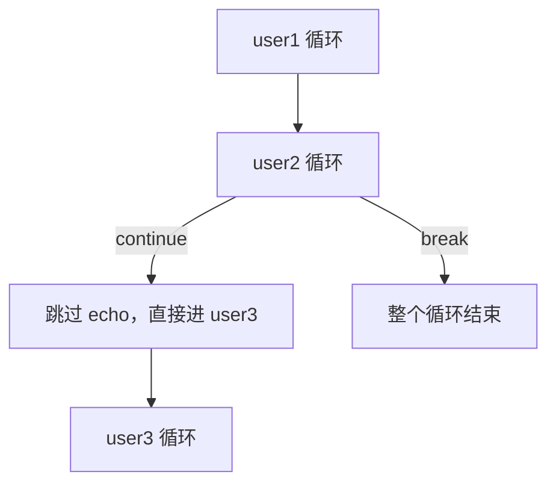

# Shell 自动化脚本

## 为什么要自动化

**自动化 vs 人工**

从 0 开始部署一套 WordPress：

1. 下载源码包
2. 解压缩
3. 配置 yum 仓库，安装依赖包
4. 修改配置文件，对接数据库的地址
5. 启动各种服务
6. 关闭防火墙和 SELinux

> [!important] 核心思想
> **重复工作 —> 交给自动化工具**
>
> 所谓的 **Shell 自动化脚本，本质上就是一个带有 Linux 命令的普通文件而已**。

### 第一个脚本

```bash
[root@lb-server ~]# vim useradd.sh
[root@lb-server ~]# cat useradd.sh
#!/bin/bash
useradd memeda
echo 1 | passwd --stdin memeda
[root@lb-server ~]# chmod a+x useradd.sh
[root@lb-server ~]# ./useradd.sh
Changing password for user memeda.
passwd: all authentication tokens updated successfully.
```

> [!tip] 自动化的价值
> **自动化可以解放人的双手，解决重复性的劳动工作。**
>
> 比如现在要求在**自动扩容**、**自动配置 yum 仓库和安装软件包**这些场景下，脚本就派上用场了。

### 如何学好 Shell 自动化脚本

> [!important] 三步走
> 1. 因为脚本本质上就是一个文件，里面的组成**全部都是 Linux 命令**组成 —— **一定要熟悉常用的 Linux 命令**
> 2. **熟悉各种常用服务的安装和配置**
> 3. 具备一定的**逻辑性** —— 支持各种变量、判断语句和循环语句

---

## Shell 是什么

**Shell 是一个命令解释器**，将用户执行的命令翻译成为内核看得懂的语言来执行操作。

**Shell 也是一门编程语言。**

### 编译型 vs 解释型

| 类型 | 代表语言 | 特点 |
| :--- | :--- | :--- |
| **编译型** | C、Go | 编写的代码，需要**编译为二进制可执行文件**，最终才能执行<br>对于二进制可执行文件来说，你是**看不到源码**的<br>**一次编译，多次执行** |
| **解释型** | **Shell、Python** | 编写的代码，**不需要编译**为二进制，直接通过**解释器**运行<br>**一边解释一边运行**<br>对于解释型来说，你看到的代码文件是**明文**的 |

> [!info] 关键区别
> 编译型 = 提前翻译好整本书
> 解释型 = 同声传译，边读边翻

---

## 什么样的文件才算是 Shell 脚本文件

> [!important] 本质
> **只要里面是 Linux 命令组成，你都可以叫做 Shell 脚本文件。**
>
> 下面这些是编写 Shell 脚本的**规范** —— **可以不遵循也可以遵循**，但建议遵循。

### 四条编写规范

#### 1. 文件后缀最好是 `.sh` 结尾

方便给别人看，一眼就知道这是脚本。

#### 2. 第一行要写上解释器 `#!/bin/bash`

表示脚本中的命令要交给 `bash` 来执行（你终端上之所以可以执行命令就是因为有 `bash` 的进程）。

> [!info] Shebang（`#!`）
> `#!/bin/bash` 这一行叫做 **shebang**，告诉系统用哪个解释器来执行这个文件。
>
> | 写法 | 说明 |
> | :--- | :--- |
> | `#!/bin/bash` | 最常用，Bash 专属功能都能用 |
> | `#!/bin/sh` | POSIX 标准 shell，兼容性最好但功能少 |
> | `#!/usr/bin/env bash` | **跨平台推荐**，自动查找 bash 路径 |
> | `#!/usr/bin/python3` | Python 脚本 |

#### 3. 支持注释

采用 `#` 做**单行注释**，被注释的内容不会参与脚本的执行。

**多行注释**：

```bash
<<EOF
被注释的内容
EOF
```

#### 4. 尽量写上个人信息以及脚本的作用

```bash
#!/bin/bash
#author:xym@yutianedu.com
#describe:useradd user and change passwd 创建用户和设置密码的
```

---

## 简单测试脚本

**要求**：脚本文件名字 `/opt/demo1.sh`

1. 可以永久关闭 SELinux 和防火墙
2. 创建一个远程登录用户 `demo1`，密码设置为 `1`
3. `demo1` 用户可以使用 sudo 提权到所有用户身份，执行所有的命令并且**不需要密码验证**

```bash
[root@lb-server ~]# cat /opt/demo1.sh
#!/bin/bash
#编辑selinux配置文件，将其永久关闭，永久关闭防火墙
sed -i  's/SELINUX=enforcing/SELINUX=disabled/' /etc/selinux/config
setenforce 0

systemctl disable firewalld
systemctl stop firewalld

#创建demo1用户，密码为1
useradd demo1
echo 1 | passwd --stdin demo1

#配置sudo提权
echo "demo1 ALL=(ALL) NOPASSWD:ALL" >> /etc/sudoers
```

> [!warning] 脚本中的三个坑
> 1. `sed -i` 只匹配 `SELINUX=enforcing`，如果配置文件里本来就是 `permissive` 或 `disabled`，脚本**不会报错但也没生效**
> 2. `useradd demo1` 如果用户已存在会**报错**，脚本应加判断或用 `id demo1 || useradd demo1`
> 3. `>> /etc/sudoers` 重复执行会**追加多行** —— 正确做法是写到 `/etc/sudoers.d/` 目录下：
>    ```bash
>    echo "demo1 ALL=(ALL) NOPASSWD:ALL" > /etc/sudoers.d/demo1
>    chmod 440 /etc/sudoers.d/demo1
>    ```

---

## 执行脚本的方式

### 1. 相对路径 / 绝对路径

```bash
./demo1.sh
```

```text
/opt/demo1.sh
```


> [!important] 特点
> **必须要有 `x` 权限，才可以执行**

### 2. 通过 bash 或者 sh 命令执行

```bash
[root@lb-server opt]# bash demo2.sh
1
2
3
[root@lb-server opt]# sh demo2.sh
1
2
3

#查看脚本执行的过程
[root@lb-server opt]# bash -x demo2.sh
+ echo 1
1
+ echo 2
2
+ echo 3
3
```


> [!important] 特点
> **不需要有 `x` 权限，但是一定要有 `r` 权限**

> [!tip] `bash -x` —— 调试神器
> `-x` 会打印出**每一条实际执行的命令**（前面带 `+`），能清楚看到变量的实际展开值。
>
> 其他常用调试选项：
> | 选项 | 作用 |
> | :--- | :--- |
> | `bash -n script.sh` | **只检查语法**，不执行 |
> | `bash -x script.sh` | **跟踪执行**，打印每条命令 |
> | `bash -v script.sh` | 执行前打印每行原始内容 |
> | `bash -e script.sh` | 任何命令失败就退出 |

**执行脚本的时候，如果写了解释器声明，那么你一定要保证写的是正确的路径。**


**bash 执行脚本的时候，压根不看你设置的解释器声明是什么。**


### 3. source 或者 `.` 执行脚本

```bash
source /opt/demo2.sh
. /opt/demo2.sh
```

> [!important] 特点
> **执行脚本不需要有 `x` 权限**

### 4. 四种方式对比总结

| 执行方式 | 需要 x 权限 | 需要 r 权限 | 执行环境 | 脚本内定义的变量能否影响当前 shell |
| :--- | :---: | :---: | :--- | :---: |
| `./script.sh` | ✅ | ✅ | **子 shell** | ❌ |
| `/opt/script.sh` | ✅ | ✅ | **子 shell** | ❌ |
| `bash script.sh` | ❌ | ✅ | **子 shell** | ❌ |
| `sh script.sh` | ❌ | ✅ | **子 shell** | ❌ |
| **`source script.sh`** | ❌ | ✅ | **当前 shell** | ✅ |
| **`. script.sh`** | ❌ | ✅ | **当前 shell** | ✅ |

> [!important] 核心结论（记住）
> **相对路径、绝对路径、bash 方式执行脚本 —> 在子 shell 中执行的**
>
> **source 或者 `.` 方式执行脚本 —> 在当前 shell 中执行的**
>
> **只要你在脚本中定义的变量想要在当前 shell 中生效的话，一定要使用 source 或者 `.` 来执行。**


> [!example] 典型用例
> - **`/etc/profile`、`~/.bashrc`** —— 必须用 source 执行，否则环境变量无法加载到当前 shell
> - 改完 `~/.bashrc` 后执行 `source ~/.bashrc`，就是为了**让变量在当前终端生效**

### 练习 1：init.sh

```bash
[root@lb-server opt]# cat /opt/init.sh
#!/bin/bash
rm -rf /tmp/*
cp -a /etc/ /opt/etc-backup-$(date +%F)
touch /opt/backup
chmod 777 /opt/backup
[root@lb-server opt]# chmod a+x /opt/init.sh
[root@lb-server opt]# ./init.sh
```

> [!warning] `rm -rf /tmp/*` 有风险
> 生产环境慎用。加个保护更稳妥：
> ```bash
> [ -d /tmp ] && rm -rf /tmp/*   # 确认目录存在再删
> ```

### 练习 2：ssh-init.sh

**编写一个自动化脚本 `/opt/ssh-init.sh`，执行脚本之后要求如下**：

1. 将系统的 SSHD 服务的**监听端口修改为 2222**，并且正常监听到**所有的 IP 地址**上
2. **拒绝来源客户端 `192.168.200.33` 的 IP 地址**来远程登录我的所有的用户

```bash
[root@lb-server opt]# cat ./ssh-init.sh
#!/bin/bash
sed -i.bak -e '$a\Port 2222' -e '$a\DenyUsers *@192.168.200.33' /etc/ssh/sshd_config
setenforce 0
systemctl restart sshd
[root@lb-server opt]# ./ssh-init.sh
```

> [!tip] sed 参数解析
> | 参数 | 作用 |
> | :--- | :--- |
> | `-i.bak` | 原地修改，同时备份原文件为 `sshd_config.bak`（**改重要配置必加**） |
> | `-e '$a\...'` | 在**文件最后一行之后追加**内容 |
> | `-e` 可重复 | 用多个 `-e` 一次执行多条编辑指令 |
>
> ⚠️ **改完 sshd 端口后别忘了防火墙放行**：
> ```bash
> firewall-cmd --add-port=2222/tcp --permanent && firewall-cmd --reload
> ```
> 否则新端口连不上，而旧端口也关了 —— 会把自己锁在外面。

---

# 特殊变量

## 位置化变量（预定义变量）

**位置化变量**：执行脚本的时候可以往脚本里面进行**传参**，加入了位置化变量之后，我们编写的脚本可以**更加灵活**的去执行。

| 变量 | 含义 |
| :--- | :--- |
| `$1` | 执行脚本传入的**第一个参数** |
| `$2` | 第二个参数 |
| `$3` | 第三个参数 |
| `$4` | 第四个参数 |
| ... | ... |
| **`${10}`** | **第十个参数必须加花括号**（因为 `$10` 会被解析成 `$1` + `0`） |
| `$0` | **脚本本身** |

### 基础示例

```bash
[root@lb-server shell]# cat useradd.sh
#!/bin/bash
#author:xym@yutianedu.com
#describe:useradd user and change passwd 创建用户和设置密码的

echo '$1' $1
echo '$2' $2
echo '$3' $3
[root@lb-server shell]# ./useradd.sh yutian huawei redhat
$1 yutian
$2 huawei
$3 redhat
```

### 实战：带参数创建用户

```bash
[root@lb-server shell]# cat useradd.sh
#!/bin/bash
#author:xym@yutianedu.com
#describe:useradd user and change passwd 创建用户和设置密码的
useradd $1
echo $2 | passwd --stdin $1
[root@lb-server shell]# ./useradd.sh zhangsan111 1
Changing password for user zhangsan111.
passwd: all authentication tokens updated successfully.
[root@lb-server shell]# ./useradd.sh zhangsan222 1
Changing password for user zhangsan222.
passwd: all authentication tokens updated successfully.
```

### `$0` 表示脚本本身

```bash
[root@lb-server shell]# cat useradd.sh
#!/bin/bash
echo $0
[root@lb-server shell]# ./useradd.sh
./useradd.sh
[root@lb-server shell]# /root/shell/useradd.sh
/root/shell/useradd.sh
```

> [!tip] `$0` 的妙用 —— 一次性脚本
> **通过 `$0` 可以实现一次性脚本，执行完脚本文件，脚本文件自动删除。**
>
> ```bash
> #!/bin/bash
> userdel -r $1
> rm -f $0        # 删除脚本自己
> ```

## 预定义变量


| 变量 | 含义 |
| :--- | :--- |
| **`$?`** | **上一条命令的返回值**（0 = 成功，非 0 = 失败） |
| **`$$`** | **当前进程的 PID** |
| `$#` | 传入参数的**个数** |
| `$*` / `$@` | 所有参数 |
| `$!` | 上一个后台进程的 PID |
| `$USER` | 当前用户名 |
| `$HOME` | 当前用户家目录 |

### 示例：判断用户是否存在

**比如：判断 `zhangsan111` 是否存在，如果不存在则创建**

```bash
#!/bin/bash
#author:xym@yutianedu.com
#describe:useradd user and change passwd 创建用户和设置密码的
id zhangsan111 &> /dev/null
if [ $? -ne 0 ];then
        useradd zhangsan111
fi
```

> [!info] `&> /dev/null` 是什么
> 把命令的**标准输出和标准错误都丢弃**，屏幕上不显示任何内容。
> 我们只关心 `$?` 的返回值，不关心 `id` 命令打印什么。

### 示例：获取自身进程的 CPU/内存占用

```bash
[root@lb-server shell]# cat userdel.sh
#!/bin/bash
cpu_status=$(ps -axu | grep $$ | head -n 1  | awk -F ' ' '{print $3}')
mem_status=$(ps -axu | grep $$ | head -n 1  | awk -F ' ' '{print $4}')
echo CPU: $cpu_status
echo MEM: $mem_status
echo pid: $$
sleep 333
echo huawei123
```

> [!tip] `$$` 的实际用途
> `$$` 拿到当前脚本的 PID，常用于：
> - **写 PID 文件**（`echo $$ > /var/run/xxx.pid`）
> - **防止脚本重复运行**（检查 PID 文件中的进程是否还活着）
> - 日志中标记是哪个实例产生的记录

### 案例需求

**创建两个脚本文件 `/opt/useradd.sh` 和 `/opt/userdel.sh`**

#### useradd.sh

执行 `useradd.sh` 脚本的时候：

- 传入的**第一个参数**作为创建的用户名
- 传入的**第二个参数**作为这个用户的密码

`/opt/useradd.sh zhangsan1 redhat` 表示创建 `zhangsan1` 用户，并且密码设置为 `redhat`

```bash
#!/bin/bash
useradd $1
echo $2 | passwd --stdin $1
```

#### userdel.sh

执行 `userdel.sh` 脚本的时候，传入的第一个参数作为删除的用户名。

`/opt/userdel.sh zhangsan1`，表示删除这个用户，并且**同时删除家目录和邮箱文件**，同时此脚本**执行完成就被删除**。

```bash
#!/bin/bash
userdel -r $1
rm -f $0
```

## 命令连接符

### `;` —— 顺序执行

`命令1; 命令2; 命令3`

**无论命令是否成功，都可以继续执行命令**

```bash
[root@lb-server shell]# ls ; cd
userdel.sh
```

### `&&` —— 逻辑与

类似于逻辑与，**左边命令返回值为 0 才会执行右边的命令**。

```bash
[root@lb-server ~]# ls /etc/passwd && ls /etc/group
/etc/passwd
/etc/group
[root@lb-server ~]# ls /etc/passwd123 && ls /etc/group
ls: cannot access '/etc/passwd123': No such file or directory
```

### `||` —— 逻辑或

类似于逻辑或，**左边命令返回值非 0 才会执行右边的命令**。

```bash
[root@lb-server ~]# id zzzz || useradd zzzz
id: 'zzzz': no such user
[root@lb-server ~]# id zzzz
uid=1006(zzzz) gid=1006(zzzz) groups=1006(zzzz)
```

> [!tip] `&&` + `||` 组合 —— Shell 的三元表达式
> ```bash
> [ 条件 ] && 条件成立时执行 || 条件不成立时执行
> ```
> 例如：`[ -d /opt/demo ] && echo 存在 || echo 不存在`

### 命令连接符对比总结

| 连接符 | 行为 | 记忆 |
| :--- | :--- | :--- |
| `;` | 无条件继续 | 顺序执行，不管成败 |
| `&&` | 左边**成功**（返回 0）才执行右边 | **与** —— 双方都要对 |
| `\|\|` | 左边**失败**（非 0）才执行右边 | **或** —— 有一个对就行 |
| `\|` | 管道 —— 左边输出作为右边输入 | 数据流传递 |

### 练习

> [!question] 思考题
> 1. 判断 `zhangsan111` 用户是否存在密码，如果不存在密码则创建密码为 `1`，如果密码存在则修改密码为 `redhat`
> 2. 判断 `zhangsan` 用户是否存在，如果存在则创建密码为 `1`，如果不存在则创建 `zhangsan` 用户

---

# 条件测试语句

通过条件测试语句**判断条件是否成立**：

- 如果成立则返回值为 **0**
- 如果不成立则返回值为**非 0**

> [!info] 为什么要学条件测试语句
> 这里的条件测试语句目的是为了后面 **if 判断语句**而学习的。
>
> 因为 if 判断语句中，需要针对于**条件表达式**做判断，而条件表达式就是这里的条件测试语句。

## 语法（三种写法）

```bash
test 条件表达式：在终端上临时测试 使用test命令比较多
[ 条件表达式 ]：在脚本中，判断语句中通常使用[ ] 这种方式
[[ 条件表达式 ]]：在[ ] 基础之上新增的一些功能，比如可以同时判断多个条件表达式
```

| 写法 | 特点 |
| :--- | :--- |
| `test 表达式` | 最早的写法 |
| `[ 表达式 ]` | **脚本中最常用**，`[` 其实是 `test` 命令的别名 |
| `[[ 表达式 ]]` | Bash 扩展，支持 `&&`/`\|\|`/正则，**不能用于 `sh`** |

> [!warning] 空格！空格！空格！
> `[` 和 `]` 前后**必须有空格**，否则报错：
> ```bash
> [ -f /etc/passwd ]   # ✅ 正确
> [-f /etc/passwd]     # ❌ 报错
> ```

## 数字比较运算符

| 运算符 | 含义 | 英文 |
| :--- | :--- | :--- |
| `-eq` | **等于** | equal |
| `-ne` | **不等于** | not equal |
| `-gt` | **大于** | greater than |
| `-ge` | **大于等于** | greater or equal |
| `-lt` | **小于** | less than |
| `-le` | **小于等于** | less or equal |

```text
       INTEGER1 -eq INTEGER2   就是等于，左右两边数字相等，条件成立，结果为真
              INTEGER1 is equal to INTEGER2

       INTEGER1 -ge INTEGER2   大于等于
              INTEGER1 is greater than or equal to INTEGER2

       INTEGER1 -gt INTEGER2   大于
              INTEGER1 is greater than INTEGER2

       INTEGER1 -le INTEGER2   小于等于
              INTEGER1 is less than or equal to INTEGER2

       INTEGER1 -lt INTEGER2   小于
              INTEGER1 is less than INTEGER2

       INTEGER1 -ne INTEGER2   不等于，左右两边数字不相等，条件才成立，结果才为真
              INTEGER1 is not equal to INTEGER2
```

> [!warning] 数字比较**不能用** `<` `>` `=`
> `[ 1 < 2 ]` 在 shell 里会被当成**重定向**！必须用 `-lt`/`-gt`/`-eq`。

### 实战：磁盘空间检查

**如果根文件系统的使用百分比大于等于 80，则输出 `disk no space`，反之输出 `disk space ok`**

```bash
[root@lb-server shell]# [ $(df | grep -w / | awk -F ' ' '{print $5}' | tr -d %) -ge 80 ] && echo disk no space || echo disk spacke ok
disk spacke ok
```

> [!tip] 命令拆解
> | 片段 | 作用 |
> | :--- | :--- |
> | `df \| grep -w /` | 取根文件系统那一行（`-w` 精确匹配整个单词 `/`） |
> | `awk -F ' ' '{print $5}'` | 取第 5 列（使用百分比，如 `10%`） |
> | `tr -d %` | **删除 `%` 号**，只留数字 |
> | `[ 数字 -ge 80 ]` | 数字比较 |

## 字符串比较运算符

| 运算符 | 含义 |
| :--- | :--- |
| `-n STRING` | 字符串**不为空**，条件成立，结果为真 |
| `-z STRING` | 字符串**为空**，条件成立，结果为真 |
| `STRING1 = STRING2` | 左右两边字符串**相等**，条件成立 |
| `STRING1 != STRING2` | 左右两边字符串**不相等**，条件成立 |

```text
       -n STRING  字符串不为空，条件成立，结果为真
              the length of STRING is nonzero

       STRING equivalent to -n STRING

       -z STRING    字符串为空，条件成立，结果为真
              the length of STRING is zero

       STRING1 = STRING2   左右两边字符串相等，条件成立，结果为真
              the strings are equal

       STRING1 != STRING2   左右两边字符串不相等，条件成立，结果为真
              the strings are not equal
```

> [!tip] `-n` / `-z` 记忆法
> **`n` = nonzero（非零长度）→ 不为空**
> **`z` = zero（零长度）→ 为空**

### 实战：判断系统是否 RHEL 系列

**今天编写了一个 `yum.sh` 自动化脚本，这个脚本主要是给 RHEL 系列的发行版使用的。**

执行脚本的时候，会自动做一个判断，判断当前系统是不是 RHEL 系列的：

- 如果是的话就**正常执行**
- 如果不是的话则**输出系统不匹配**，退出脚本

```bash
[root@lb-server shell]# [ $(grep ID_LIKE /etc/os-release | cut -d '=' -f 2 | cut -d " " -f 1 | tr -d \") = rhel ] && echo 配置yum仓库 || echo 系统不是RHEL发行版本，不兼容
配置yum仓库
```

### read 命令 —— 交互式输入

**编写一个脚本，要求在显示屏上提示输出信息，借助一个 `read` 命令。**

`read` 命令，后面通过 `-p` 选项，`-p` 后面接什么，屏幕上就会提示什么。

```bash
[root@lb-server shell]# cat useradd.sh
#!/bin/bash
echo 这是一个创建用户的脚本，请你根据下面的要求来实现用户的创建
read -p '请你输入创建的用户名字: ' user_name
[ $user_name = root ] && echo 请你不要输入root用户 && exit

id $user_name &> /dev/null
[ $? -eq 0 ] && echo $user_name用户已经存在，请你重新创建 || useradd $user_name
```

执行效果：

```bash
[root@lb-server shell]# ./useradd.sh
这是一个创建用户的脚本，请你根据下面的要求来实现用户的创建
请你输入创建的用户名字: root
请你不要输入root用户
[root@lb-server shell]# ./useradd.sh
这是一个创建用户的脚本，请你根据下面的要求来实现用户的创建
请你输入创建的用户名字: zhangsan
zhangsan用户已经存在，请你重新创建
[root@lb-server shell]# ./useradd.sh
这是一个创建用户的脚本，请你根据下面的要求来实现用户的创建
请你输入创建的用户名字: lisi
[root@lb-server shell]# id lisi
uid=1008(lisi) gid=1008(lisi) groups=1008(lisi)
```

| read 选项 | 作用 |
| :--- | :--- |
| `-p '提示文字'` | 显示提示信息 |
| `-s` | **静默输入**（输入密码时不回显） |
| `-t 5` | **超时 5 秒**未输入则退出 |
| `-n 3` | 读满 3 个字符就自动结束 |
| `-a array` | 读入到数组 |

## 文件属性运算符

```text
       FILE1 -ef FILE2
              FILE1 and FILE2 have the same device and inode numbers

       FILE1 -nt FILE2
              FILE1 is newer (modification date) than FILE2

       FILE1 -ot FILE2
              FILE1 is older than FILE2

       -b FILE
              FILE exists and is block special

       -c FILE
              FILE exists and is character special

       -d FILE
              FILE exists and is a directory

       -e FILE
              FILE exists

       -f FILE
              FILE exists and is a regular file

       -g FILE
              FILE exists and is set-group-ID

       -G FILE
              FILE exists and is owned by the effective group ID

       -h FILE
              FILE exists and is a symbolic link (same as -L)

       -k FILE
              FILE exists and has its sticky bit set

       -L FILE
              FILE exists and is a symbolic link (same as -h)

       -O FILE
              FILE exists and is owned by the effective user ID

       -p FILE
              FILE exists and is a named pipe

       -r FILE
              FILE exists and read permission is granted

       -s FILE
              FILE exists and has a size greater than zero

       -S FILE
              FILE exists and is a socket

       -t FD  file descriptor FD is opened on a terminal

       -u FILE
              FILE exists and its set-user-ID bit is set

       -w FILE
              FILE exists and write permission is granted

       -x FILE
              FILE exists and execute (or search) permission is granted
```

> [!important] 最常用的四个（记住）
> | 运算符 | 判断 |
> | :--- | :--- |
> | **`-e`** | 文件**是否存在** |
> | **`-f`** | 是否是**普通文件** |
> | **`-d`** | 是否是**目录** |
> | **`-x`** | 是否有**执行权限** |

```bash
[root@lb-server shell]# [ -d /opt/demo ] && touch /opt/demo/file.txt || mkdir /opt/demo
```

> [!example] 这行命令的意思
> **如果 `/opt/demo` 目录存在** —> 在里面创建 `file.txt`
> **如果不存在** —> 创建 `/opt/demo` 目录

## 逻辑运算符

| 运算符 | 含义 |
| :--- | :--- |
| **`-a`** | **逻辑与** |
| **`-o`** | **逻辑或** |
| **`!`** | **逻辑非** —— 对条件表达式取反 |

> [!example] 需求
> **只有当 `zhangsan` 用户存在并且密码设置了，我才需要修改密码为 `1`**
>
> ```bash
> [ 用户存在 ] -a [ 密码已设置 ] && 修改密码
> ```

> [!tip] 可以通过 `man test` 查询这些运算符

---

# 判断语句

## if 判断

### 单分支结构

当条件表达式结果为真 —> 返回值为 **0**，就会进入 if 语句中
如果条件表达式结果为假 —> 返回值为**非 0**，跳过 if 判断

> [!important] 一句话
> **条件成立则执行 if 中的内容，不成立就跳过。**

```bash
if 条件表达式;then
  执行语句
fi

或者

if 条件表达式
then
  执行语句
fi
```

```bash
[root@lb-server shell]# cat if01.sh
#!/bin/bash
if [ -f /etc/passwd ];then
        echo paswd是个普通文件
fi

echo ok1
[root@lb-server shell]# chmod a+x if01.sh
[root@lb-server shell]# ./if01.sh
paswd是个普通文件
ok1
[root@lb-server shell]# mv /etc/passwd /etc/passwd.bak
[root@lb-server shell]# ./if01.sh
ok1
```

> [!note] 上面这个演示很危险
> 演示里把 `/etc/passwd` 移走了 —— 这会让**系统里所有用户信息消失**，是个破坏性操作。
> 演示完记得移回来：`mv /etc/passwd.bak /etc/passwd`

#### 练习：if01.sh

**要求**：

1. 从键盘上接受输入，输入的内容作为 `user_name` 变量的值（`read` 命令）
2. 如果用户输入的内容对应的用户**已经存在**，则**修改用户密码为 `1`**
3. 如果用户输入的内容对应的用户**不存在**，则**跳过 if 判断**，继续执行后面的语句

```bash
read -p '输入用户名：' user_name
id $user_name &> /dev/null
if [ $? -eq 0 ];then
    echo 1 | passwd --stdin $user_name
fi
echo ok
```

**换种写法**（更简洁，推荐）：

```bash
read -p '输入用户名：' user_name
if id $user_name &> /dev/null;then
    echo 1 | passwd --stdin $user_name
fi
echo ok
```

> [!tip] 两种写法的区别
> - 第一种：**先执行命令**，再用 `$?` 判断 —— 多一步
> - 第二种：**把命令直接放进 if 条件** —— `if` 会自动判断命令的返回值
>
> **第二种更简洁，是推荐的写法。**

### 双分支结构

条件表达式成立，则执行 if 语句中的**执行语句 1**。反之，则执行 else 下面的**执行语句 2**。

> [!important] 一句话
> **判断条件，条件满足则做什么，条件不满足则做什么。**

```bash
if 条件表达式;then
  执行语句1
else
  执行语句2
fi
```

#### 练习：if02.sh

**要求**：

1. 从键盘上接受输入，输入的内容作为 `user_name` 变量的值（`read` 命令）
2. 如果用户输入的内容对应的用户**已经存在**，则**修改用户密码为 `1`**
3. 如果用户输入的内容对应的用户**不存在**，则**创建这个用户**

```bash
[root@lb-server shell]# cat ./if02.sh
#!/bin/bash
read -p '输入用户名：' user_name
id $user_name &> /dev/null
if [ $? -eq 0 ];then
    echo 正在修改密码
    echo 1 | passwd --stdin $user_name &> /dev/null && echo 密码修改成功
else
    useradd $user_name && echo $user_name创建成功！
fi

echo ok
```

执行效果：

```bash
[root@lb-server shell]# ./if02.sh
输入用户名：root
正在修改密码
密码修改成功
ok
[root@lb-server shell]# ./if02.sh
输入用户名：memeda-k8s
memeda-k8s创建成功！
ok
```

### 多分支结构

**判断多个条件表达式。**

```bash
if 条件表达式1;then
  执行语句1
elif 条件表达式2;then
  执行语句2
elif 条件表达式3;then
  执行语句3
...
else
  执行语句
fi
```

**需求**：先判断 `/etc/passwd` 文件是否是一个普通文件，如果是的话则输出 `ok`。反之则判断 `/etc/shadow` 是否是一个普通文件，如果是的话则输入 `ok`，如果不是的话再判断 `/etc/gshadow` 是否是一个普通文件... 如果上面所有的条件都不成立，那么我就输出 `error`

```bash
[root@lb-server shell]# cat if03.sh
#!/bin/bash
if [ -f /etc/passwd ];then
        echo ok
elif [ -f /etc/shadow ];then
        echo ok
elif [ -f /etc/gshadow ];then
        echo ok
else
        echo error
fi
```

#### 综合案例：自动判断系统版本配置 YUM 仓库

```bash
[root@lb-server shell]# cat if03.sh
#!/bin/bash
#此脚本适合于7 8版本的本地仓库的配置
#判断当前系统的版本
os_version=$(grep VERSION_ID /etc/os-release | cut -d '"' -f 2 | cut -d '.' -f 1)
if [ $os_version -ge 8 ];then
        #版本大于等于8，说明需要配置2个仓库 AppStream 和 BaseOS
        cat > /etc/yum.repos.d/if03.repo <<EOF
[BaseOS]
name=BaseOS
baseurl=file:///media/BaseOS
gpgcheck=0
enabled=1

[AppStream]
name=AppStream
baseurl=file:///media/AppStream
gpgcheck=0
enabled=1
EOF
elif [ $os_version -le 7 ];then
        cat > /etc/yum.repos.d/if03.repo <<EOF
[BaseOS]
name=BaseOS
baseurl=file:///media/
gpgcheck=0
enabled=1
EOF
else
        echo 请你使用正确的操作系统版本
fi
```

> [!warning] 原代码的两个问题
> 1. `elif [ $os_version -le 8 ]` 逻辑上是**错的** —— 因为第一个分支已经处理了 `>= 8`，这里应该是 `-le 7`（否则 8 会被两个分支同时匹配）
> 2. `else` 分支里直接写了中文句子，**没有 `echo`** —— 会报 `command not found`，应该改成 `echo 请你使用正确的操作系统版本`

## case 判断

**根据用户输入的内容进行判断。**

```bash
case $变量 in
  值1)
    执行语句1
    ;;
  值2)
    执行语句2
    ;;
  值3)
    执行语句3
    ;;
  ...
  *)
    执行语句
    ;;
esac
```

> [!tip] case 语法要点
> - 每个分支以 **`;;`** 结束
> - **`*)`** 相当于 `default` —— 所有值都不匹配时执行
> - 整个结构以 **`esac`** 结束（case 反过来写）
> - 支持通配符：`[0-9])` 匹配数字、`*)` 匹配任意

### 案例：功能菜单脚本

**执行脚本的时候，弹出一个表单功能**

```text
— 表单 —

1.创建用户
2.删除用户
3.设置用户密码
4.退出表单
```

```bash
[root@lb-server shell]# cat ./case.sh
#!/bin/bash
cat <<EOF
----功能菜单-----
请你选择以下的数字来实现对应的功能
------------------
1.创建用户
2.删除用户
3.设置用户密码
4.退出表单
-------------------
EOF
echo
echo
read -p '请你输入对应的数字编号：' number
case $number in
        1)
                read -p '请你输入创建的用户名：' user_name
                if id $user_name &> /dev/null;then
                        echo $user_name用户已经存在，请你重新输入
                else
                        useradd $user_name && echo $user_name创建成功！！！
                fi
                ;;
        2)
                read -p '请你输入要删除的用户名：' user_name
                if id $user_name &> /dev/null;then
                        userdel -r $user_name && echo $user_name删除成功！！！
                else
                        echo $user_name用户本身不存在，不需要删除
                fi
                ;;
        3)
                read -p '请你输入要修改的用户名：' user_name
                if id $user_name &> /dev/null;then
                        read -p '请你输出要修改的密码：' pass_name
                        echo $pass_name | passwd --stdin $user_name
                else
                        echo $user_name用户不存在，无法设置密码
                fi
                ;;
        4)
                echo 退出脚本~
                exit
                ;;
        *)
                echo 请你输入正确的数字！！
                ;;
esac
```

> [!info] `cat <<EOF ... EOF` —— Here Document
> 把 `EOF` 之间的所有内容**原样输出**（或重定向到文件）。
>
> 常见用法：
> ```bash
> cat <<EOF > /etc/yum.repos.d/dvd.repo    # 写入文件
> 内容...
> EOF
> ```
> 注意：`<<EOF` 里的内容**会做变量替换**；如果想原样输出（不替换变量），用 `<<'EOF'`（加单引号）。

---

# 循环语句

**批量安装包、批量删除用户、批量创建用户**

```bash
useradd 1
useradd 2
useradd 3
useradd 4
```

> [!important] 循环的价值
> 上面这种重复 4 次的操作，用循环 3 行就能搞定 —— 哪怕要创建 1000 个用户，代码长度也不变。

## for 循环

```bash
for 变量 in 循环的值;do
  循环体
done

或者

for 变量 in 循环的值
do
  循环体
done
```

### 基础示例

**借助 for 循环实现 user1、user2、user3，三个用户的创建**

```bash
[root@lb-server shell]# cat for01.sh
#!/bin/bash
for users in user1 user2 user3;do
        echo $users
done
[root@lb-server shell]# chmod a+x for01.sh
[root@lb-server shell]# ./for01.sh
user1
user2
user3
```

用 `bash -x` 看执行过程 —— **能清楚看到循环是怎么跑的**：

```bash
[root@lb-server shell]# bash -x ./for01.sh
+ for users in user1 user2 user3
+ echo user1
user1
+ for users in user1 user2 user3
+ echo user2
user2
+ for users in user1 user2 user3
+ echo user3
user3
```

### 循环值的三种表现方式

#### 1. 直接写上要循环的值，每个值使用空格隔开

```bash
for users in 1 2 3 4 5 6 7 8 9
```

#### 2. 通过 `{}` 来表示一个范围

```bash
for users in {1..10}
```

```bash
[root@lb-server shell]# cat for01.sh
#!/bin/bash
for users in user{1..10};do
        echo $users
done
[root@lb-server shell]# ./for01.sh
user1
user2
user3
user4
user5
user6
user7
user8
user9
user10
```

> [!tip] `{}` 的其他用法
> | 写法 | 展开结果 |
> | :--- | :--- |
> | `{1..5}` | 1 2 3 4 5 |
> | `{1..10..2}` | 1 3 5 7 9（**步长为 2**） |
> | `{a..e}` | a b c d e |
> | `{01..05}` | 01 02 03 04 05（**补零**） |

#### 3. 通过命令来进行表示

```bash
[root@lb-server shell]# cat ./for01.sh
#!/bin/bash
for users in $(ls /etc/*.conf);do
        echo $users
done
```

执行输出（部分）：

```bash
/etc/asound.conf
/etc/brltty.conf
/etc/chrony.conf
/etc/dnsmasq.conf
/etc/dracut.conf
/etc/fuse.conf
/etc/host.conf
/etc/idmapd.conf
/etc/kdump.conf
/etc/krb5.conf
/etc/ld.so.conf
/etc/libaudit.conf
/etc/locale.conf
/etc/logrotate.conf
/etc/man_db.conf
/etc/mke2fs.conf
/etc/mtools.conf
/etc/named.conf
/etc/nfs.conf
/etc/nfsmount.conf
/etc/nsswitch.conf
/etc/radvd.conf
/etc/request-key.conf
/etc/resolv.conf
/etc/rsyslog.conf
/etc/sestatus.conf
/etc/sudo.conf
/etc/sysctl.conf
/etc/updatedb.conf
/etc/vconsole.conf
/etc/xattr.conf
/etc/yum.conf
```

### 批量安装软件包

**通过 for 循环实现 `php`、`php-mysqlnd`、`httpd`、`nginx`、`mysql-server`、`bind` 软件包的安装**

```bash
for pkgs in php php-mysqlnd httpd nginx mysql-server bind;do
  yum install $pkgs -y
done
```

> [!tip] 一次 yum 装完更高效
> 循环里逐个 `yum install` 要**重复解析依赖 6 次**，直接一条命令更快：
> ```bash
> yum install php php-mysqlnd httpd nginx mysql-server bind -y
> ```
> 只在**需要逐个判断/记录结果**时才用循环。

## while 循环

while 循环是**有条件的，具备条件表达式的**，只有条件表达式结果为真，才会进入循环，当条件表达式结果为假，则跳出 while 循环。

```bash
while 条件表达式;do
  循环体
done
```

### 示例：校验 UID 是否被占用

**编写一个 `while01.sh` 脚本文件**，创建用户的时候让使用脚本的人输入用户的 UID，如果 UID 已经被使用则重新要求用户输入，直到输入的 UID 不存在，此时作为这个创建的用户的 UID。

```bash
[root@lb-server shell]# cat ./while01.sh
#!/bin/bash
read -p '输入创建的用户名：' user_name
id $user_name &> /dev/null && echo $user_name用户存在，退出脚本 && exit
read -p '输入UID：' uid_number
while id $uid_number &> /dev/null;do
        read -p '输入UID：' uid_number
done
useradd -u $uid_number $user_name
```

执行效果：

```bash
[root@lb-server shell]# ./while01.sh
输入创建的用户名：root
root用户存在，退出脚本
[root@lb-server shell]# ./while01.sh
输入创建的用户名：zzzz123
输入UID：0
输入UID：1000
输入UID：1001
输入UID：6666
[root@lb-server shell]# id zzzz123
uid=6666(zzzz123) gid=6666(zzzz123) groups=6666(zzzz123)
```

> [!info] 逻辑解读
> `while id $uid_number` —— 只要这个 UID **存在**（`id` 返回 0 为真），就**继续循环让用户重新输入**。
> 一旦输入了一个不存在的 UID，条件为假，跳出循环，然后用这个 UID 创建用户。

### while 与 for 的区别

> 你会发现，while 和 for 循环有一丝的差距，比如：
>
> - **for 循环**，循环的次数**是有限制的**，是根据循环的值的数量来决定的
> - **while 循环**，好像**没有循环次数的限制**，只看条件是否成立

**那么，能不能让 while 循环像 for 循环那样，指定次数的循环呢？**

比如循环个 3 次，循环个 4 次？

> [!important] 结论
> while 循环如果要指定循环的次数的话，**需要借助外部的文件** —— 读取的外部文件有多少行，while 就会循环多少次。

### 三种读取文件的方式

**准备一个文件**：

```bash
[root@lb-server shell]# cat number
asd
asd
asd
asd
```

#### 方式 1：`exec` 方式读取

```bash
[root@lb-server shell]# cat while02.sh
#!/bin/bash
exec < number ; while read line  ## while read是固定语法，从文件读取内容进行循环，line是变量名
do
        echo 1
done
[root@lb-server shell]# chmod a+x while02.sh
[root@lb-server shell]# ./while02.sh
1
1
1
1
```

#### 方式 2：`cat` 和管道符

```bash
[root@lb-server shell]# cat ./while02.sh
#!/bin/bash
cat number | while read line
do
        echo 1
done
[root@lb-server shell]# ./while02.sh
1
1
1
1
```

#### 方式 3：通过 `<` 读取

```bash
[root@lb-server shell]# cat ./while02.sh
#!/bin/bash
while read line
do
        echo 1
done < number
[root@lb-server shell]# ./while02.sh
1
1
1
1
```

> [!important] 课程结论
> 上面如果要使用 while 循环来指定次数的话，**建议使用 for**，因为 while 循环指定次数还需要去读取文件。

> [!warning] 一个重要差异（补充）
> **方式 2（管道）和方式 1、3 有本质区别**：
> - 方式 1、3：while 在**当前 shell** 执行，循环内修改的变量**循环结束后仍然有效**
> - 方式 2（管道）：`|` 会创建**子 shell**，循环内修改的变量**出了循环就丢失**
>
> ```bash
> # 管道方式：输出为空
> count=0; cat number | while read line; do ((count++)); done; echo $count
>
> # 重定向方式：输出 4
> count=0; while read line; do ((count++)); done < number; echo $count
> ```

## until 循环

**条件不成立，结果为假才进入循环。结果为真则跳过 until 循环。**

```bash
until 条件表达式;do
  循环体
done
```

> [!info] while vs until 一句话
> | 循环 | 进入条件 |
> | :--- | :--- |
> | **while** | 条件为**真**时循环 |
> | **until** | 条件为**假**时循环（直到为真才停） |

### 示例：等待服务恢复

**判断服务是否正常的情况下**

```bash
[root@lb-server shell]# cat until.sh
#!/bin/bash
until systemctl is-active httpd &> /dev/null;do
        echo httpd 没有正常运行
        sleep 3
done
```

执行效果：

```bash
[root@lb-server shell]# ./until.sh
httpd 没有正常运行
httpd 没有正常运行
httpd 没有正常运行
httpd 没有正常运行
httpd 没有正常运行
httpd 没有正常运行
httpd 没有正常运行
```

> [!tip] 实用场景
> **只有当你的条件成立的时候才会退出循环** —— 只有当你的服务正常恢复的时候，才不会继续发送信息。
>
> 这类脚本非常适合**服务健康检查/自动恢复**：
> ```bash
> until systemctl is-active httpd &> /dev/null; do
>     systemctl restart httpd
>     sleep 5
> done
> ```

## 三种循环对比

| 循环 | 适用场景 | 循环次数 |
| :--- | :--- | :--- |
| **for** | 已知要遍历的**列表/范围** | 由值的个数决定 |
| **while** | 条件为真时循环（**次数未知**） | 由条件决定 |
| **until** | 条件为假时循环（**等待某状态**） | 由条件决定 |

---

# 中断语句

**中断语句适合于循环语句中，仅在循环语句中有效果。**

| 语句 | 作用 |
| :--- | :--- |
| **`continue`** | 满足条件，**跳过此次循环**，直接进入下一次循环 |
| **`break`** | 满足条件，**跳出当前整个循环体**，后面的循环不会再执行了 |

## 案例：跳过 user2 的创建

**要求批量创建 user1 user2 user3 这三个用户，如果创建的用户名是 user2 的话，则跳过 user2 的创建**

### 用 continue

```bash
[root@lb-server shell]# cat ./continue.sh
#!/bin/bash
for users in user{1..3};do
        if [ $users = user2 ];then
                continue
        fi
        echo $users
done
[root@lb-server shell]# ./continue.sh
user1
user3
```

### 用 break

如果是 `break`，你将会看到以下输出信息：

```bash
[root@lb-server shell]# cat ./break.sh
#!/bin/bash
for users in user{1..3};do
        if [ $users = user2 ];then
                break
        fi
        echo $users
done
[root@lb-server shell]# ./break.sh
user1
```



> [!important] continue vs break 区别（记住）
> - **`continue`** — 只跳过**这一次**，后面的循环**继续**
> - **`break`** — 整个循环**直接结束**，后面的值**不再遍历**

---

# 实战案例

## 案例 1：网络连通性检查 `/opt/ip-check.sh`

**要求**：

1. 该脚本文件主要是**检查当前主机所在子网的网络连通性**的
2. 如果执行脚本的时候是 `/opt/ip-check.sh 1`，那么它就会检查 `xxx.xxx.xxx.1` 这个地址
3. 如果执行脚本的时候**没有传入参数**，直接使用 `/opt/ip-check.sh`，那么它会检查 `xxx.xxx.xxx.0/24` **所有 IP 地址**
4. 将**可以通信**的 IP 地址输出到屏幕上 `<ip> ok` 同时保存到 `/opt/ip-success` 文件
5. 如果 IP 地址**不可以通信**则输出到屏幕上 `<ip> error` 同时保存到 `/opt/ip-error` 文件

```bash
[root@lb-server shell]# cat /opt/ip-check.sh
#!/bin/bash
#定义变量，值为当前网络的子网地址
ip_net=$(ifconfig ens160 | grep netmask | cut -d " " -f 10 | cut -d '.' -f1-3)
#如果用户传入了参数，则访问指定参数对应的IP地址
if [ -z $1 ];then
        #说明没有传入参数，检查当前子网所有的IP地址
        for ips in {1..254};do
                ping -c2 $ip_net.$ips &> /dev/null
                if [ $? -eq 0 ];then
                        echo $ip_net.$ips ok && echo $ip_net.$ips >> /opt/ip-success
                else
                        echo $ip_net.$ips error && echo $ip_net.$ips >> /opt/ip-error
                fi
        done
else
        #传入参数，检查指定参数对应的IP地址
        ping -c2 $ip_net.$1 &> /dev/null
        if [ $? -eq 0 ];then
                echo $ip_net.$1 ok && echo $ip_net.$1 >> /opt/ip-success
        else
                echo $ip_net.$1 error && echo $ip_net.$1 >> /opt/ip-error
        fi

fi
```

> [!tip] 脚本亮点
> 这个脚本同时用到了：**变量赋值 `$()`**、**`-z` 字符串判断**、**位置化变量 `$1`**、**for 循环 `{1..254}`**、**`$?` 判断**、**`&&` 连接**、**重定向追加 `>>`**
>
> 是一个很好的**综合练习**。

> [!warning] 两个优化点
> 1. `ping -c2` 每个 IP 要等 2 个包超时，254 个 IP 要跑**很久**。可以改成 `ping -c1 -W1`（1 个包，超时 1 秒）
> 2. 用 **`fping`** 或 **`nmap -sn`** 做扫描快得多：
>    ```bash
>    nmap -sn 192.168.200.0/24 | grep report
>    ```

## 案例 2：系统资源占用 `/opt/check_system.sh`

**要求**：编辑 `/opt/check_system.sh` 脚本文件，要求显示系统上**消耗 CPU 资源排名前十的进程**，将其**进程 ID、用户名、消耗 CPU 资源、消耗内存资源、进程的命令**显示出来。

**自己编写一个命令文件 `check_pid`**

```bash
[root@lb-server shell]# cat /bin/check_pid
#!/bin/bash
ps -axo pid,user,%cpu,%mem,command --sort=-%cpu | head -n 11
```

> [!info] 命令拆解
> | 片段 | 作用 |
> | :--- | :--- |
> | `ps -axo pid,user,%cpu,%mem,command` | **自定义输出列**，`-a` 所有进程、`-x` 含无终端进程 |
> | `--sort=-%cpu` | **按 CPU 降序**排序（`-` 表示降序） |
> | `head -n 11` | 取前 11 行（**第 1 行是表头，所以是 11 不是 10**） |

## 案例 3：一键部署虚拟主机 `/opt/vhosts.sh`

```bash
[root@lb-server shell]# cat ./vhosts.sh
#!/bin/bash
#检查yum配置文件
echo 正在检查yum配置....
yum makecache &> /dev/null
if [ $? -eq 0 ];then
        echo yum仓库检查成功
else
        echo yum仓库检查失败，清理所有的yum配置文件，配置本地yum仓库
        rm -rf /etc/yum.repos.d/*
        cat > /etc/yum.repos.d/dvd.repo <<EOF
[BaseOS]
name=BaseOS
baseurl=file:///media/BaseOS
gpgcheck=0
enabled=1

[AppStream]
name=AppStream
baseurl=file:///media/AppStream
gpgcheck=0
enabled=1
EOF
        mount /dev/sr0 /media
fi

#安装httpd软件包
rpm -q httpd &> /dev/null && yum remove httpd -y
yum install httpd -y

#配置虚拟主机
cat > /etc/httpd/conf.d/vhosts.conf <<EOF
<VirtualHost *:80>
    DocumentRoot "/var/www/sport"
    ServerName sport.example.com
    <Directory "/var/www/sport">
    AllowOverride None
    # Allow open access:
    Require all granted
   </Directory>

</VirtualHost>

<VirtualHost *:80>
    DocumentRoot "/var/www/game"
    ServerName game.example.com
    <Directory "/var/www/game">
    AllowOverride None
    Require all granted
     </Directory>
</VirtualHost>

<VirtualHost *:80>
    DocumentRoot "/var/www/xinwen"
    ServerName xinwen.example.com
    <Directory "/var/www/xinwen">
    AllowOverride None
    Require all granted
    </Directory>
</VirtualHost>
EOF
mkdir -p /var/www/sport && echo sport > /var/www/sport/index.html
mkdir -p /var/www/game && echo game > /var/www/game/index.html
mkdir -p /var/www/xinwen && echo xinwen > /var/www/xinwen/index.html

#启动httpd服务
echo 正在启动httpd服务...
systemctl start httpd && echo httpd服务启动成功！！

#防火墙和SELinux关闭
echo 正在关闭防火墙服务和SELinux....
systemctl stop firewalld && setenforce 0
echo 关闭成功...
```

> [!important] 这个脚本体现了自动化的完整思路（记住）
> **检查环境 → 修环境 → 装软件 → 写配置 → 建目录 → 起服务 → 关防护**
>
> 这就是一个**生产级部署脚本的标准骨架**，可以套用到任何服务的部署上。

> [!tip] 生产环境改进建议
> 1. 加 `set -e` —— 任何命令失败立即退出，避免错误累积
> 2. 加 `set -u` —— 使用未定义变量时报错
> 3. 关键步骤加**日志记录**：`exec > >(tee -a /var/log/deploy.log) 2>&1`
> 4. 用 `systemctl enable httpd` 设为开机自启
> 5. 关防火墙/SELinux 在生产环境**应改为放行端口**，而不是整个关掉

---

# 补充：Shell 脚本核心速查

## 变量

| 语法 | 说明 | 示例 |
| :--- | :--- | :--- |
| `var=value` | 赋值（**等号两边不能有空格**） | `name=zhangsan` |
| `$var` / `${var}` | 取值 | `echo $name` |
| `$(命令)` | **命令替换**，取命令输出 | `date=$(date +%F)` |
| `$((表达式))` | **算术运算** | `sum=$((1+2))` |
| `"$var"` | **双引号** —— 变量会被展开 | `echo "你好 $name"` |
| `'$var'` | **单引号** —— 原样输出，不展开 | `echo '你好 $name'` |
| `` `命令` `` | 旧式命令替换（**不推荐**，用 `$()`） | ``d=`date` `` |

> [!warning] 赋值等号两边不能有空格
> ```bash
> name=zhangsan     # ✅
> name = zhangsan   # ❌ 会把 name 当命令执行
> ```

## 引号的区别

| 写法 | 变量展开 | 特殊字符 | 典型用途 |
| :--- | :---: | :---: | :--- |
| `"双引号"` | ✅ | ❌（除 `$ \` "`） | **最常用**，包住含空格的变量 |
| `'单引号'` | ❌ | ❌ | 原样输出 |
| `` `反引号` `` | — | — | 命令替换（旧式） |

## 常用测试运算符速查

| 类别 | 运算符 |
| :--- | :--- |
| **数字** | `-eq` `-ne` `-gt` `-ge` `-lt` `-le` |
| **字符串** | `=` `!=` `-n` `-z` |
| **文件** | `-e` `-f` `-d` `-r` `-w` `-x` `-s` `-L` |
| **逻辑** | `-a` `-o` `!`（旧） / `&&` `\|\|` `!`（`[[ ]]` 内） |

## 流程控制语法骨架

```bash
# if 单分支
if [ 条件 ]; then 命令; fi

# if 双分支
if [ 条件 ]; then 命令1; else 命令2; fi

# if 多分支
if [ 条件1 ]; then 命令1; elif [ 条件2 ]; then 命令2; else 命令3; fi

# case
case $var in
    值1) 命令1 ;;
    值2) 命令2 ;;
    *)   默认命令 ;;
esac

# for
for i in 列表; do 命令; done

# while
while [ 条件 ]; do 命令; done

# until
until [ 条件 ]; do 命令; done
```

## 调试与检查

| 命令 | 作用 |
| :--- | :--- |
| `bash -n script.sh` | **只检查语法**，不执行 |
| `bash -x script.sh` | **跟踪执行**，打印每条命令 |
| `shellcheck script.sh` | **专业静态检查工具**（需安装），能发现大量隐蔽问题 |
| `set -e` | 命令失败立即退出 |
| `set -u` | 使用未定义变量则报错 |
| `set -euxo pipefail` | **生产脚本推荐的组合** |

## 实战排错经验

> [!tip] 脚本不生效时的排查顺序
> 1. **有没有 x 权限** —— `chmod +x script.sh`
> 2. **shebang 写对了吗** —— 第一行 `#!/bin/bash`
> 3. **变量没生效？** —— 用 `source` 执行，不要用 `./`
> 4. **语法错误** —— `bash -n script.sh` 先过一遍
> 5. **逻辑不对** —— `bash -x script.sh` 看变量的实际值
> 6. **`[` 前后有空格吗** —— 这是最常见的低级错误
> 7. **数字比较用了 `<`** —— 必须用 `-lt`/`-gt`
> 8. **在 `sh` 里用了 `[[ ]]`** —— `[[ ]]` 是 Bash 专有
