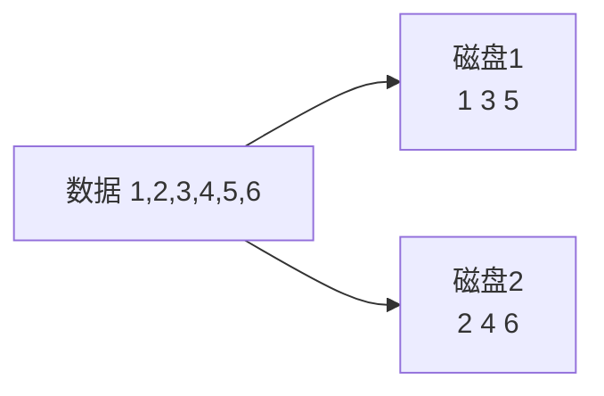
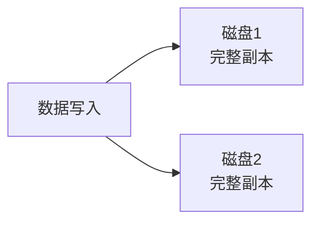
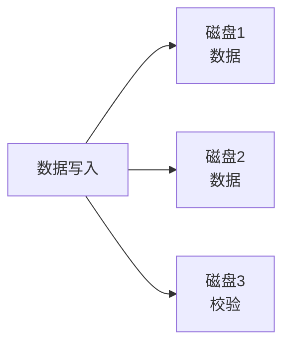
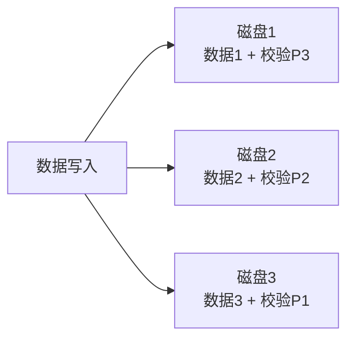
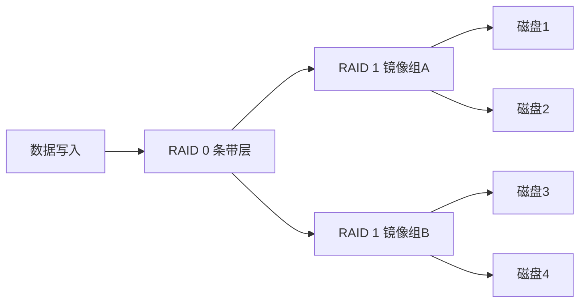
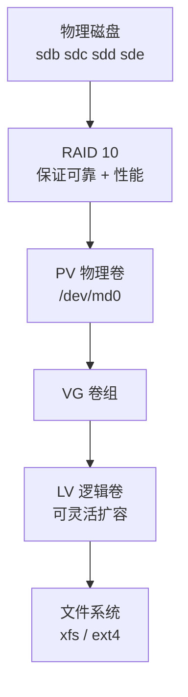

# RAID 技术

## RAID 是什么

**RAID**：**独立冗余磁盘阵列**（Redundant Array of Independent Disks），将**多块磁盘通过 RAID 虚拟为一个虚拟硬盘**。

### RAID 的两个核心目的

| 目的 | 说明 |
| :--- | :--- |
| **1. 保护数据安全** | 通过冗余（数据多存几份 / 校验信息）实现容错 |
| **2. 追求读写速度** | 多块磁盘并行读写，突破单盘性能瓶颈 |

> [!important] 核心思想（记住）
> **RAID 通过不同的"级别"来实现上面的 2 个功能。**
>
> 关键权衡：**空间利用率 ↔ 性能 ↔ 容错能力** —— 三者不可能同时最优，RAID 级别就是在做取舍。

---

## RAID 级别详解

### RAID 0 — 条带化（Striping）

- **1 块磁盘就可以做**（但至少 2 块才有意义）
- **可用空间 = 所有磁盘的总和**
- 追求**极致读写性能**，**允许数据丢失**




| 项目 | 值 |
| :--- | :--- |
| 最少磁盘数 | **1**（实际 2） |
| 可用空间 | **100%**（所有磁盘容量之和） |
| 容错能力 | **0** —— 坏任意一块，**全部数据丢失** |
| 读性能 | **极高**（并行读） |
| 写性能 | **极高**（并行写） |

> [!warning] RAID 0 不提供任何数据保护
> **任何一块盘坏掉 = 整个阵列数据全毁**。
>
> 只适合**对性能要求极高、数据可重新生成**的场景（如临时缓存、渲染中间文件）。
> **绝不能用来存唯一的数据。**

### RAID 1 — 镜像（Mirroring）

- **最少是 2 块磁盘做，必须是双倍**
- **可用空间 = 总容量 / 2**
- **只要是操作系统，都是安装到 RAID 1 上面的**



| 项目 | 值 |
| :--- | :--- |
| 最少磁盘数 | **2** |
| 可用空间 | **50%**（容量 / 2） |
| 容错能力 | **可坏一半的盘**（2 块坏 1 块，4 块坏 2 块） |
| 读性能 | **高**（可从任意一块读，并行） |
| 写性能 | **一般**（要写所有盘，以最慢的为准） |

> [!important] 为什么操作系统装在 RAID 1 上（记住）
> **系统盘追求的是"绝对可靠"，不是"最大空间"。**
>
> - 系统盘容量需求小（几十 G 就够）
> - 系统盘**坏了整台机器就起不来**，代价极高
> - RAID 1 读性能好（系统启动、程序加载快）
>
> 所以 **RAID 1 是系统盘的标准做法**。

### RAID 3 — 专用校验盘

- **最少是 3 块盘做**
- **可用空间 = 总容量 - 1 块校验盘**（即 `n-1`）
- 故障**校验盘**或数据盘，无论是校验盘还是数据盘
- **读性能好，写性能较差** —— 因为**每一次写数据的时候，都要重新去读取和计算校验值**



| 项目 | 值 |
| :--- | :--- |
| 最少磁盘数 | **3** |
| 可用空间 | **(n-1)/n** |
| 容错能力 | **可坏 1 块** |
| 读性能 | **好**（数据盘并行读） |
| 写性能 | **差**（每次写要读旧数据+算校验） |

> [!info] 为什么 RAID 3 现在很少用
> **校验盘是单点** —— 所有写操作都要写同一块校验盘，它成为性能瓶颈。
> RAID 5 就是为解决这个问题而生的。
>
> 另外 RAID 3 按**字节**条带化，在小文件场景下性能尤其差。

### RAID 5 — 分布式校验

- **把校验值拆分到了不同的磁盘上**，**最少是 3 块盘做**
- **可用空间 = 总容量 - 1 块校验盘**（即 `n-1`）
- **可以任意故障一块磁盘**
- **大部分的应用场景：文件服务器、web 网站服务器都可以采用 RAID 5**



| 项目 | 值 |
| :--- | :--- |
| 最少磁盘数 | **3** |
| 可用空间 | **(n-1)/n** |
| 容错能力 | **可坏 1 块**（任意一块） |
| 读性能 | **好** |
| 写性能 | **中等**（校验分散，不再是单点瓶颈）|

> [!important] RAID 5 是最常用的级别（记住）
> **空间利用率、性能、容错三者平衡得最好** —— 所以文件服务器、Web 服务器普遍选 RAID 5。
>
> **典型配置：3-5 块盘做 RAID 5**，坏一块能顶住，换盘后自动重建。

> [!warning] RAID 5 的风险：重建期间的二次故障
> RAID 5 在**重建（rebuild）**时要读取所有剩余磁盘来恢复数据 —— 这个过程**持续数小时到数十小时**。
>
> 如果重建期间**再坏一块盘，整个阵列数据全丢**。
>
> 磁盘容量越大，重建时间越长，风险窗口越宽。所以：
> - **大容量盘（4TB+）建议用 RAID 6**（可坏 2 块）
> - 重建期间**不要做其他高强度 IO**

### RAID 10 — 先镜像再条带

- **先做 RAID 1，再做 RAID 0**
- **必须是 4 块盘起步** —> **可用空间 = 总容量 / 2**（`n/2`）
- **既追求读写性能，又追求数据安全性**
- **数据库应用场景**



| 项目 | 值 |
| :--- | :--- |
| 最少磁盘数 | **4**（且必须是偶数） |
| 可用空间 | **50%**（n/2） |
| 容错能力 | **每组镜像各可坏 1 块**（最多坏 2 块，但要分属不同组） |
| 读性能 | **极高** |
| 写性能 | **高**（每组镜像内部并行写） |

> [!important] 为什么数据库用 RAID 10（记住）
> 数据库的特点是 **大量随机读写**：
> - RAID 5 每次写要**计算校验 → 额外读旧数据 + 写校验**，随机写性能差
> - RAID 10 **没有校验计算**，写就是纯写，随机写性能好
> - RAID 10 重建**只需拷贝一份镜像**，比 RAID 5 快得多，风险窗口小
>
> **数据库（MySQL/Oracle）的标准做法：RAID 10。**

---

## RAID 级别对比总表

| 级别 | 别名 | 最少盘 | 可用空间 | 容错 | 读性能 | 写性能 | 典型场景 |
| :--- | :--- | :---: | :--- | :---: | :--- | :--- | :--- |
| **RAID 0** | 条带化 | 1（实际2） | **100%** | **无** | 极高 | 极高 | 临时数据、缓存、渲染 |
| **RAID 1** | 镜像 | **2** | **50%** | 坏一半 | 高 | 一般 | **操作系统盘** |
| **RAID 3** | 专用校验盘 | **3** | (n-1)/n | 坏 1 块 | 好 | **差** | 已基本淘汰 |
| **RAID 5** | 分布式校验 | **3** | (n-1)/n | 坏 1 块 | 好 | 中 | **文件/Web 服务器** |
| **RAID 6** | 双校验 | **4** | (n-2)/n | **坏 2 块** | 好 | 中低 | 大容量盘阵列 |
| **RAID 10** | 镜像条带 | **4** | **50%** | 坏多块 | 极高 | 高 | **数据库** |
| **RAID 50** | 5+0 | 6 | — | 每组坏1块 | 高 | 中高 | 大规模存储 |
| **RAID 60** | 6+0 | 8 | — | 每组坏2块 | 高 | 中 | 超大容量高可靠 |

> [!tip] 快速选型口诀（记住）
> | 需求 | 选择 |
> | :--- | :--- |
> | 只要速度，数据可丢 | **RAID 0** |
> | 装系统 | **RAID 1** |
> | 存文件、跑网站，性价比 | **RAID 5** |
> | 大容量盘 + 高可靠 | **RAID 6** |
> | 数据库 | **RAID 10** |

### RAID 空间利用率对比（以 4 块相同磁盘为例）

| 级别 | 总容量 | 可用空间 | 利用率 | 容错 |
| :--- | :--- | :--- | :---: | :--- |
| RAID 0 | 4T | **4T** | 100% | 无 |
| RAID 1 | 4T | **2T** | 50% | 坏 2 块 |
| RAID 5 | 4T | **3T** | 75% | 坏 1 块 |
| RAID 6 | 4T | **2T** | 50% | 坏 2 块 |
| RAID 10 | 4T | **2T** | 50% | 坏 2 块 |

> [!info] 补充：热备盘（Hot Spare）
> **热备盘**是一块**待机的空闲磁盘**，不属于任何 RAID 组。
>
> **当阵列中某块盘故障时，系统自动用热备盘顶替并开始重建** —— 无需人工干预，大幅缩短风险窗口。
>
> 配置方式（mdadm）：
> ```bash
> mdadm /dev/md0 --add /dev/sde    # 把 sde 加入 md0 作为热备盘
> ```
> 生产环境**强烈建议配热备盘**，尤其是 RAID 5 —— 夜间坏盘没人管的话，第二天可能就来不及了。

---

## 做 RAID 的两种方式

### 1. 硬件 RAID

**插在主板上的一个硬件 RAID 卡。**

| 配置方式 | 说明 |
| :--- | :--- |
| **BIOS/RAID 卡界面** | 开机的时候提示你按什么组合键，进入 RAID 卡配置页面：**`Ctrl + R`** |
| **管理口页面** | 通过物理服务器的**管理口（IPMI/iDRAC/iLO）**页面，在浏览器上**鼠标点点点**就可以配置 |

> [!info] 硬件 RAID 的优势
> | 优势 | 说明 |
> | :--- | :--- |
> | **不消耗主机 CPU** | 校验计算由 RAID 卡上的专用处理器（ROP）完成 |
> | **有电池保护（BBU）** | 断电时缓存中的数据不丢 |
> | **对 OS 透明** | 操作系统看到的就是一块普通硬盘 |
> | **性能好** | 专用硬件加速 |
> | **支持在线扩容/迁移** | 换卡还能迁移阵列 |
>
> 常见厂商：**LSI/Broadcom（MegaRAID）**、Adaptec、HP Smart Array、Dell PERC

### 2. 软件 RAID

**通过软件实现的 RAID 技术，消耗 CPU 资源。**

> [!info] 软件 RAID 的优势
> | 优势 | 说明 |
> | :--- | :--- |
> | **零成本** | 不需要买 RAID 卡 |
> | **不依赖特定硬件** | 换机器/换主板，把盘插过去就能认 |
> | **灵活** | 支持 RAID 0/1/4/5/6/10 及各种组合 |
> | **可管理性好** | 命令行完全可控，可脚本化 |
>
> **代价**：占用主机 CPU 做校验计算（现代 CPU 有 `raid6_pq` 等优化，影响已不大）。

---

## 软件 RAID 实现：mdadm

> [!info] Linux 软件 RAID 的两种实现
> | 实现 | 说明 |
> | :--- | :--- |
> | **`mdadm`** | **传统方式**，`/dev/mdX` 设备，最常用 |
> | **`dm-raid`** | LVM 方式（`lvcreate --type raid5`），由 device-mapper 实现 |
>
> 下面以 **mdadm** 为主。

### 1. 安装 mdadm

```bash
yum install mdadm -y
```

### 2. 准备磁盘分区

**建议把磁盘分区并把类型标记为 `fd`（Linux raid autodetect）：**

```bash
[root@localhost ~]# fdisk /dev/sdb
# n 创建分区
# t 修改类型 → fd (Linux raid autodetect)
# w 保存
```

> [!tip] 也可以直接用整块盘
> 用整块盘（`/dev/sdb` 而不是 `/dev/sdb1`）**更简单也更推荐** —— 避免分区对齐问题。

### 3. 创建 RAID 阵列

```bash
# 创建 RAID 5（3 块盘，其中 1 块做校验）
[root@localhost ~]# mdadm --create /dev/md0 --level=5 --raid-devices=3 /dev/sdb /dev/sdc /dev/sdd

# 创建 RAID 1
[root@localhost ~]# mdadm --create /dev/md0 --level=1 --raid-devices=2 /dev/sdb /dev/sdc

# 创建 RAID 10（4 块盘）
[root@localhost ~]# mdadm --create /dev/md0 --level=10 --raid-devices=4 /dev/sdb /dev/sdc /dev/sdd /dev/sde
```

| 参数 | 含义 |
| :--- | :--- |
| `--create`（`-C`） | 创建阵列 |
| `--level=N`（`-l`） | **RAID 级别**（0/1/5/6/10） |
| `--raid-devices=N`（`-n`） | **活动磁盘数量** |
| `--spare-devices=N`（`-x`） | **热备盘数量** |
| `--chunk=64`（`-c`） | 条带块大小（KB），默认 512 |
| `--metadata=1.2` | 元数据版本（默认 1.2，放在盘头） |

### 4. 查看阵列状态

```bash
[root@localhost ~]# cat /proc/mdstat
Personalities : [raid1] [raid5]
md0 : active raid5 sdd[2] sdc[1] sdb[0]
      2095104 blocks super 1.2 level 5, 512k chunk, algorithm 2 [3/3] [UUU]

unused devices: <none>

[root@localhost ~]# mdadm --detail /dev/md0
```

| 输出片段 | 含义 |
| :--- | :--- |
| `[3/3]` | **3 块盘全部正常**（如果是 `[3/2]` 表示有 1 块盘故障）|
| **`[UUU]`** | **U = Up（正常），`_` = 故障** |
| `active raid5` | 阵列类型和状态 |
| `512k chunk` | 条带块大小 |

### 5. 格式化并挂载

```bash
[root@localhost ~]# mkfs.xfs /dev/md0
[root@localhost ~]# mkdir /raid5
[root@localhost ~]# mount /dev/md0 /raid5
```

### 6. 模拟磁盘故障与更换（重要）

```bash
# 1. 模拟一块盘故障（标记为 faulty）
[root@localhost ~]# mdadm /dev/md0 --fail /dev/sdb
mdadm: set /dev/sdb faulty in /dev/md0

# 2. 查看状态 —— 变成 [2/3] [U_U] 或 [_UU]
[root@localhost ~]# cat /proc/mdstat

# 3. 移除故障盘
[root@localhost ~]# mdadm /dev/md0 --remove /dev/sdb

# 4. 加入新盘（自动开始重建）
[root@localhost ~]# mdadm /dev/md0 --add /dev/sde
mdadm: added /dev/sde

# 5. 观察重建进度（会显示 recovery/resync 百分比）
[root@localhost ~]# cat /proc/mdstat
```

### 7. 保存配置（否则重启后阵列不认）

```bash
[root@localhost ~]# mdadm --detail --scan >> /etc/mdadm.conf
# 或
[root@localhost ~]# mdadm --detail --scan > /etc/mdadm.conf
```

> [!warning] 这一步千万别漏
> **不写 `/etc/mdadm.conf`，重启后系统可能认不出这个阵列**（特别是盘序变化时）。
>
> 同时还要写 `/etc/fstab` 实现自动挂载。

### mdadm 命令速查

| 命令 | 作用 |
| :--- | :--- |
| `mdadm -C /dev/md0 -l5 -n3 /dev/sdb /dev/sdc /dev/sdd` | **创建 RAID 5** |
| `mdadm --detail /dev/md0` | **查看阵列详情** |
| `cat /proc/mdstat` | **查看阵列实时状态** |
| `mdadm /dev/md0 --fail /dev/sdb` | **标记某盘故障** |
| `mdadm /dev/md0 --remove /dev/sdb` | **移除磁盘** |
| `mdadm /dev/md0 --add /dev/sde` | **加入磁盘（热备或替换）** |
| `mdadm --stop /dev/md0` | **停止阵列** |
| `mdadm --assemble /dev/md0 /dev/sdb /dev/sdc /dev/sdd` | **重新组装阵列** |
| `mdadm --create ... --grow --raid-devices=4` | **在线扩容** |

> [!tip] mdadm 命令的记忆方式
> mdadm 的参数是"**动词 + 对象**"结构，都非常直白：
> `--create` 创建、`--fail` 标记故障、`--remove` 移除、`--add` 添加、`--grow` 扩容、`--stop` 停止、`--assemble` 组装

---

## RAID 与 LVM 的关系

> [!important] 两者解决的问题不同（记住）
> | 技术 | 解决的问题 | 层次 |
> | :--- | :--- | :--- |
> | **RAID** | **磁盘坏了数据还在**（冗余）+ **读写性能** | **物理层**（盘） |
> | **LVM** | **空间不够好扩**（灵活扩容）+ **快照** | **逻辑层**（卷） |
>
> **两者经常配合使用**：先做 RAID 保证底层可靠，再在 RAID 上做 LVM 保证上层灵活。

### 典型生产架构



> [!example] 生产环境常见做法
> ```bash
> # 1. 4 块盘做 RAID 10
> mdadm -C /dev/md0 -l10 -n4 /dev/sdb /dev/sdc /dev/sdd /dev/sde
>
> # 2. 在 RAID 设备上做 PV
> pvcreate /dev/md0
>
> # 3. 创建 VG
> vgcreate vg_data /dev/md0
>
> # 4. 按需创建 LV（想分几个分几个，想扩就扩）
> lvcreate -n lv_mysql -L 100G vg_data
> lvcreate -n lv_web   -L 50G  vg_data
>
> # 5. 格式化挂载
> mkfs.xfs /dev/vg_data/lv_mysql
> ```
> 这样**既有了 RAID 的硬件级保护，又有了 LVM 的灵活扩容**。

---

# 补充：本篇核心知识点速查

## RAID 一句话总结

| 级别 | 一句话 |
| :--- | :--- |
| **RAID 0** | 数据分散放，**快但没保护** |
| **RAID 1** | 数据复制一份，**稳但费一半空间** |
| **RAID 3** | 校验集中在一盘，**写性能差，已淘汰** |
| **RAID 5** | 校验分散，**性价比之王** |
| **RAID 6** | 双重校验，**能坏两块，适合大容量盘** |
| **RAID 10** | 先镜像再条带，**又快又稳但费一半空间** |

## 容错能力对比

| 级别 | 能坏几块 | 说明 |
| :--- | :--- | :--- |
| RAID 0 | **0** | 坏一块全丢 |
| RAID 1 | **n/2** | 每组镜像各坏一块 |
| RAID 3 / 5 | **1** | 坏一块后必须立即更换 |
| RAID 6 | **2** | 大容量盘首选 |
| RAID 10 | **n/2** | 每组镜像各坏一块 |

## 关键记忆点

> [!important] 四句话（记住）
> 1. **RAID 1 装系统** —— 系统盘要稳不要大
> 2. **RAID 5 跑网站/文件服务** —— 性价比最高
> 3. **RAID 10 跑数据库** —— 随机写性能好、重建快
> 4. **RAID 不是备份** —— RAID 防的是"硬件坏"，不防"手抖删库"、不防"勒索病毒"
>
> **RAID + 定期备份 = 才叫数据安全。**

## 常见坑

> [!warning] 实操最容易踩的
> 1. **RAID 5 重建期间再坏一块** —— 全丢，风险窗口数小时到数十小时
> 2. **忘了写 `/etc/mdadm.conf`** —— 重启后阵列认不出来
> 3. **热备盘没配** —— 坏盘了没人管，风险敞口开到最大
> 4. **以为 RAID 就是备份** —— 逻辑错误/病毒/误删，RAID 一个都挡不住
> 5. **RAID 0 存重要数据** —— 一块盘坏全没
> 6. **大容量盘还用 RAID 5** —— 重建时间太长，应考虑 RAID 6
> 7. **换盘时拔错盘** —— 换盘前务必用 `mdadm --detail` / 服务器面板确认盘位
